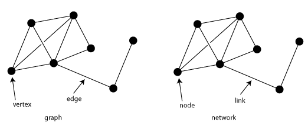

네트워크란 여러 장치가 서로 연결되어 정보를 주고받을 수 있는 통신망입니다.
네트워크는 그래프라는 노드와 노드를 연결하는 간선으로 이루어진 자료구조 모양을 띄고 있습니다.

## 네트워크 기본 구조

모든 네트워크는 노드, 노드를 연결하는 간선, 노드 간 주고 받는 메시지로 구성됩니다.
노드는 정보를 주고받을 수 있는 장치, 간선은 정보를 주고받을 수 있는 유무선 통신매체로 볼 수 있습니다.

### 호스트

네트워크의 가장자리에 위치한 노드는 네트워크를 통해 흐르는 정보를 최초로 생성 및 송신하고, 최종적으로 수신합니다.
우리가 일상에서 사용하는 네트워크 기기 대부분이 여기에 속한다고 봐도 무방합니다.
이러한 가장자리 노드를 네트워크에서 호스트라고 부릅니다.
때로는 호스트가 네트워크상에서 특정한 역할을 수행하기도 하는데, 대표적인 역할로는 서버와 클라이언트가 있습니다.

- 서버 : 어떠한 서비스를 제공하는 호스트
- 클라이언트 : 서버에게 어떠한 서비스를 요청하고 서버의 응답을 제공받는 호스트

### 네트워크 장비

네트워크 가장자리에 위치하지 않은 노드, 즉 호스트간 주고받을 정보가 중간에 거치되는 노드를 중간 노드라고 합니다.
대표적으로 이더넷 허브, 스위치, 라우터, 공유기 등이 있습니다.
네트워크 장비는 호스트 간 주고받는 정보가 원하는 수신지까지 안정적이고 안전하게 전송될 수 있도록 합니다.

> 호스트, 네트워크 장비, 서버, 클라이언트는 완전히 배타적인 개념이 아닙니다.
> 이들은 그저 노드의 역할에 따라 구분한 기준에 불과합니다. 현대 네트워크에서 이와 같은 개념들이 칼로 자르듯 명확하게 구분되지 않고 있습니다. 
> 일반적인 관점으로 기억해야 합니다. 

### 통신 매체

각 노드를 연결하는 간선이 통신 매체입니다.
통신 매체는 노드들을 유선으로 연결하는 유선 매체, 무선으로 연결하는 무선매체가 있습니다.

### 메시지

통신 매체로 연결된 노드가 주고받는 정보를 메시지라고 합니다.
네트워크는 가장자리 노드인 호스트, 중간 노드인 네트워크 장비, 노드들을 연결하는 간선인 통신 매체, 노드들이 주고받는 정보인 메시지로 구성됩니다.

## 범위에 따른 네트워크 분류

네트워크의 구성 범위가 다양한 만큼, 네트워크를 범위에 따라 구분합니다.

### LAN

LAN은 Local Area Network의 약자로, 이름 그대로 가까운 지역을 연결한 근거리 통신망을 의미합니다.

### MAN

MAN은 Metropolitan Area Network의 약자로, LAN보다 넓은 지역을 연결한 도시권 통신망을 의미합니다.

### WAN

WAN은 Wide Area Network의 약자로, 훨씬 넓은 지역을 연결한 광역 통신망을 의미합니다.
멀리 떨어진 LAN을 연결할 수 있는 네트워크가 바로 WAN입니다.
같은 LAN에 속한 호스트끼리 메시지를 주고 받아야 할 때는 인터넷 연결과 같은 WAN이 필요 없지만,
다른 LAN에 속한 호스트와 메시지를 주고 받아야 할 때에는 WAN이 필요합니다.

> 우리가 인터넷을 사용하기 위해 접속하는 WAN은 ISP(Internet Service Provider)라는 인터넷 서비스 업체가 구축하고 관리합니다. 
> 인터넷을 사용하기 위해 ISP와 계약하여 인터넷 사용 요금을 내는 것은 이러한 이유 때문입니다.

## 메시지 교환 방식에 따른 네트워크 분류

네트워크로 메시지를 주고 받는 방식은 크게 회선 교환 방식과 패킷 교환 방식으로 나눌 수 있습니다.
각 방식을 사용하는 네트워크는 각각 회선 교환 네트워크와 패킷 교환 네트워크라고 합니다.

### 회선 교환 방식

회선 교환 방식은 메시지 전송로인 회선을 설정하고 이를 통해 메시지를 주고 받는 방식입니다.
회선 교환 네트워크에서는 호스트들이 메시지를 주고 받기 전에 두 호스트를 연결한 후,
연결된 경로로 메시지를 주고 받습니다.
회선 교환 방식은 두 호스트 사이에 연결을 확보한 후에 메시지를 주고 받는 특성 때문에,
주어진 시간 동안 전송되는 정보의 양이 비교적 일정하다는 장점이 있습니다.

회선 교환 네트워크가 올바르게 동작하기 위해서는 호스트 간의 회선을 적절하게 설정해야 합니다.
이 역할을 수행하는 회선 교환 네트워크 장비로는 호스트 사이에 일대일 전송로를 확보하는 회선 스위치가 있습니다.

하지만 회선 교환 방식에는 문제가 있습니다.
회선 교환 방식에서는 가능한 모든 회선에 끊임없이 메시지가 흐르고 있어야만 회선의 이용 효율이 높아집니다.
하지만 메시지를 주고 받지 않으면서 회선을 점유하는 것은 이용 효율이 낮아진다라고 볼 수 있습니다.
따라서 모든 회선에서 끊임없이 메시지가 흐르지 않을수록 이용 효율은 낮아질 수 밖에 없습니다.

### 패킷 교환 방식

패킷 교환 방식은 회선 교환 방식의 문제점을 해결한 방식으로,
메시지를 패킷이라는 작은 단위로 쪼개어 전송합니다.
여기서 패킷은 패킷 교환 네트워크 상에서 송수신되는 메시지 단위입니다.
현재 인터넷은 대부분 이러한 패킷 교환 방식을 이용하고 있습니다.

예를 들어서 패킷 교환 방식으로 2GB 크기의 영화 파일을 다운로드 한다면,
영화 파일이 한 번에 컴퓨터로 전송되는 것이 아니라,
패킷의 크기만큼 분할되어 전송됩니다.
이렇게 쪼개진 패킷들은 수신자의 컴퓨터에 도달한 뒤 재조립됩니다.

이렇듯 패킷 교환 네트워크는 두 호스트가 하나의 전송 경로를 점유하지 않기에,
네트워크 이용 효율이 상대적으로 높습니다.

패킷 교환 방식은 정해진 경로만으로 메시지를 송수신하지 않는데,
이 과정에서 메시지는 다양한 중간 노드를 거칠 수 있습니다.
이때, 중간 노드인 패킷 스위치는 패킷이 수신지까지 올바르게
도달할 수 있도록 최적의 경로를 결정하거나 패킷의 송수신지를 식별합니다.

> 대표적인 패킷 스위치 장비로는 라우터(router)와 스위치(switch)가 있습니다.

패킷을 통해 전송하고자 하는 데이터를 페이로드(payload)라고 하고,
페이로드와 더불어 헤더(header)라는 정보도 패킷 앞에 포함됩니다.
때로는 트레일러(trailer)라는 정보가 포함되기도 합니다.
헤더와 트레일러는 패킷에 붙는 일종의 부가 정보, 내지는 제어 정보입니다.
즉, 페이로드가 택배안에 담을 물품이라면 헤더나 트레일러는 택배 상자에 붙이는 송장과 같다고 할 수 있습니다.

> 송수신지 유형에 따른 전송방식
> - 유니캐스트: 일반적인 형태의 송수신 방식으로, 하나의 수신지에 메시지를 전송하는 방식, 송신지와 수신지가 일대일로 메시지를 주고받는 경우
> - 브로드캐스트: 자신을 제외한 네트워크상의 모든 호스트에게 전송하는 방식, 브로드 캐스트가 전송되는 범위를 브로드캐스트 도메인이라고 한다. 즉, 브로드캐스트의 수신지는 브로드캐스트 도메인이며 이는 자신을 제외한 네트워크상의 모든 호스트이다.
> - 멀티캐스트: 네트워크 내의 동일 그룹에 속한 호스트에게만 전송하는 방식
> - 애니캐스트: 네트워크 내의 동일 그룹에 속한 호스트 중 가장 가까운 호스트에게 전송하는 방식

>