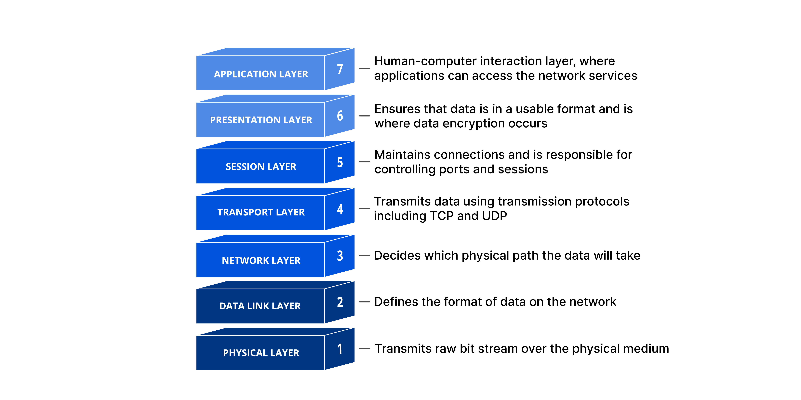
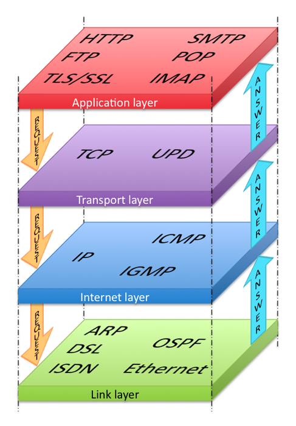
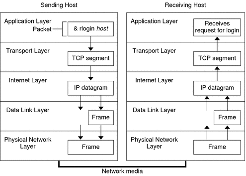
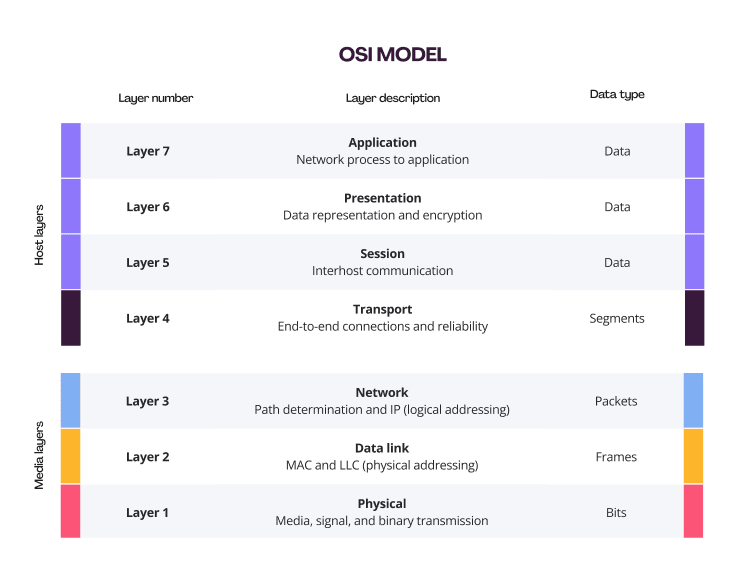

**컴퓨터 네트워크의 기본 개념**
- 📎 인터넷과 프로토콜, 데이터 전송 방식(회선/패킷 교환)
- 📎 네트워크 계층(TCP/IP, OSI 7계층), 캡슐화/비캡슐화
- 📎 네트워크 장비(L2/L3/L7 스위치, 라우터 등)와 역할
- 📎 네트워크의 분류(LAN, MAN, WAN)

## 프로토콜

현대 인터넷은 호스트 간 패킷을 교환하는 방식으로 대부분 패킷 교환 방식을 사용합니다.

언어가 정보를 주고받기 위해 사회적으로 합의된 의사소통 방식이라면 프로토콜(protocol)은
노드 간에 정보를 올바르게 주고받기 위해 합의된 규칙이나 방법을 의미합니다.

 > 서로 다른 통신 장치들이 정보를 주고받으려면 프로토콜이 통해야 합니다.

우리가 인터넷을 이용할 수 있는 것은 모두 상대 호스트와 동일한 프로토콜을 사용하기 때문입니다.
다만 일상 속 언어와는 달리 통신 과정에서는 하나의 프로토콜만 사용하지 않는다. 
일반적으로는 여러 프로토콜을 함께 사용합니다.

이처럼 모든 프로토콜에는 저마다의 목적과 특징이 있습니다.
프로토콜마다 목적과 특징이 다르기에 이에 부합하는 정보도 달라질 수 있으며, 
따라서 특정 프로토콜로 주고받는 패킷의 부가 정보(패킷의 헤더)도 달라질 수 있습니다.

## 네트워크 참조 모델

네트워크를 통해 정보를 주고 받을 때는 정형화된 여러 단계를 거칩니다. 
이 과정은 계층으로 표현할 수 있는데,
이렇게 통신이 일어나는 각 과정을 계층으로 나눈 구조를 네트워크 참조 모델이라고 합니다.

> 계층으로 표현한다는 점에서 네트워크 계층 모델이라 부르기도 합니다.

이와 같이 통신 과정을 계층으로 나눈 이유는 아래와 같이 크게 두 가지가 있습니다.

- 네트워크 구성과 설계가 용이
- 네트워크 문제 진단과 해결이 용이

### OSI 모델

OSI 모델은 국제 표준화 기구에서 만든 네트워크 참조 모델입니다.
통신 단계를 7개의 계층으로 나누어, 
최하위 계층에서 최상위 계층순으로 각각 
물리 계층, 데이터 링크 계층, 네트워크 계층, 전송 계층, 세션 계층, 표현 계층, 응용 계층으로 구분합니다.

### TCP/IP 모델

OSI 모델은 주로 네트워크를 이론적으로 기술하고 이해할 때 사용하는 반면에,
TCP/IP 모델은 이론 보다는 구현에 중점을 둔 네트워크 참조 모델입니다.
TCP/IP 모델은 TCP/IP 4계층, 인터넷 프로토콜 스위트, TCP/IP 프로토콜 스택이라고도 부릅니다.

## 캡슐화와 역캡슐화

패킷은 송신 과정에서 캡슐화가 이루어지고,
수신 과정에서 역캡슐화가 이루어집니다.
송수신하는 메시지는 송신지 입장에서는 가장높은 계층에서 시작하여,
가장 낮은 계층까지 내려가면서 각 계층의 헤더를 붙여 캡슐화됩니다.
수신지 입장에서는 가장 낮은 계층에서 시작하여,
가장 높은 계층까지 올라가면서 각 계층의 헤더를 제거하는 역캡슐화가 이루어집니다.

### 캡슐화

패킷 교환 네트워크에서 메시지는 패킷 단위로 송수신됩니다.
어떤 정보를 송신할 때 각 계층에서 상위 계층으로부터 내려받은 패킷을
페이로드로 삼아,
프로토콜에 걸맞은 헤더를 덧 붙인 후 하위 계층으로 전달합니다.
즉, 한 단계 아래 층은 바로 위의 계층으로부터 받은 패킷에 헤더를 덧붙여
자신의 페이로드로 삼아 다시 한 단계 아래 층으로 전달합니다.
이렇게 송신 과정에서 헤더를 추가해 나가는 과정을 캡슐화(encapsulation)라고 합니다.

### 역캡슐화

역캡슐화는 어떤 메시지를 수신할 떄는 캡슐화 과정에서 붙였던 헤더를 각 계층에서 확인한 후
제거하는 과정입니다.
이를 역캡슐화(de-encapsulation)라고 합니다.

### PDU

각 계층에서 송수신 되는 메시지의 단위를 PDU(Protocol Data Unit)라고 합니다.
즉, 상위 계층에서 전달받은 데이터에 현재 계층의 프로토콜 헤더를 추가하면,
현재 계층의 PDU가 됩니다.

PDU는 주로 전송 계층 이하의 메시지를 구분하기 위해 사용합니다.
전송 계층보다 높은 계층에서는 일반적으로 데이터 혹은 메시지로만 지칭하는 경우가 많습니다.
전송 계층의 PDU는 TCP 프로토콜이 사용되었을 경우에는 세그먼트(segment),
UDP 프로토콜이 사용되었을 경우에는 데이터그램(datagram)이 됩니다.

## 트래픽과 네트워크 성능 지표

트래픽(traffic)은 네트워크 내의 정보량을 의미합니다.
특정 노드에 트래픽이 몰린다는 것은 해당 노드가 특정 시간동안 처리해야 할 정보가 많음을 의미합니다.
이 경우 해당 노드에 과부화가 생길 수 있습니다.
컴퓨터에서 여러 프로그램을 동시에 실행하면 CPU가 뜨거워지며,
성능이 저하되는 것처럼, 
트래픽이 몰려 특정 노드에 과부하가 생기면 성능의 저하로 이어질 수 있습니다.

네트워크의 성능을 평가할 수 있는 대표젹인 지표로는 처리율(throughput), 대역폭(bandwidth), 패킷 손실률(packet loss)이 있습니다.

- 처리율: 네트워크를 통해 실제로 전송되는 정보의 양을 의미합니다. 이 값은 순간적인 전송 속도를 보여주며, 네트워크의 실시간 성능을 측정할 때 사용됩니다.
- 대역폭: 네트워크가 최대로 전송할 수 있는 데이터 양을 나타냅니다. 넚은 대역폭은 더 많은 데이터를 송수신할 수 있는 능력을 의미합니다.
- 패킷 손실: 네트워크에서 전송된 패킷이 목적지에 도달하지 못하는 상황을 말합니다. 이는 네트워크 과부하나 장애로 인해 발생할 수 있으며, 손실된 패킷의 비율로 표현됩니다.