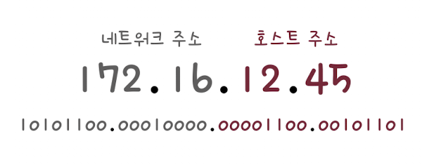
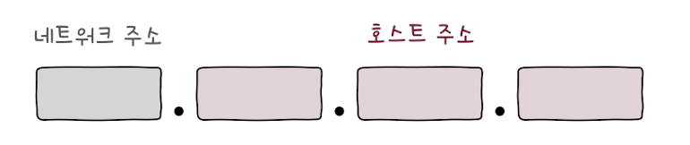
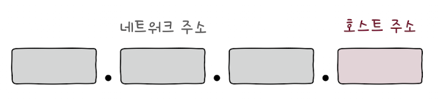

## 네트워크 주소와 호스트 주소
하나의 IP 주소는 크게 네트워크 주소와 호스트 주소로 나뉩니다.
아이피는 32비트로 구성되어있습니고, 아래 그림은 네트워크 주소가 16비트, 
호스트 주소가 16비트인 IP 주소의 예시입니다.

- 네트워크 주소 : 호스트가 속한 특정 네트워크를 식별하는 역할 
- 호스트 주소 : 네트워크 내에서 특정 호스트를 식별하는 역할

만약 네트워크 주소가 다음 그림과 같이 하나의 옥텟으로 이루어져 있습니다면, 
한 네트워크당 호스트 주소 할당에 24비트를 사용할 수 있습니어서 상대적으로 많은 호스트에 IP 주소를 할당할 수 있습니을 것입니다.

또 만약 네트워크 주소가 다음과 같이 세 개의 옥텟으로 이루어져 있습니다면, 
네트워크당 호스트 주소 할당에 8비트를 사용할 수 있습니다. 상대적으로 적은 호스트에 IP 주소를 할당할 수 있습니습니다.

- 호스트 주소 공간을 크게 할당하면 호스트가 할당되지 않은 다수의 IP 주소가 낭비될 수 있습니습니다. 
- 반대로 무조건 호스트 주소 공간을 작게 할당하면 호스트가 사용할 IP 주소가 부족해질 수 있습니습니다. 
- 이런 고민을 해결하기 위해 생겨난 개념이 바로 IP 주소의 클래스 개념입니다.

## 주소 체계

### 클래스풀 주소 체계
클래스는 네트워크 크기에 따라 IP 주소를 분류하는 기준입니다.
클래스를 이용하면 필요한 호스트 IP 개수에 따라 네트워크 크기를 가변적으로 조정해 네트워크 주소와 호스트 주소를 구획할 수 있습니다.
클래스를 기반으로 IP 주소를 관리하는 주소 체계를 클래스풀 주소 체계(classful addressing)라고 합니다.
클래스풀 주소 체계는 총 다섯 개의 클래스가 있습니다. 각각 A 클래스, B 클래스, C 클래스, D 클래스, E 클래스입니다.
이 중 D와 E는 각각 멀티캐스트를 위한 클래스, 특수한 목적을 위해 예약됩니 클래스이기 때문에, 네트워크의 크기를 나누는 데에 실질적으로 사용되는 클래스는 A, B, C입니다.

> 호스트의 주소 공간을 모두 사용할 수 있습니는 것은 아니다. 
> 호스트 주소가 전부 0인 IP 주소와 호스트 주소가 전부 1인 IP 주소는 특정 호스트를 지정하는 IP 주소로 활용할 수 없다. 
> 전자는 해당 네트워크 자체를 의미하는 네트워크 주소로 사용되고, 후자는 브로드캐스트를 위한 주소로 사용되기 때문입니다.

### A클래스
먼저 A 클래스는 B와 C 클래스에 비해 할당 가능한 호스트 주소의 수가 많습니다.

네트워크 주소는 비트 ‘0’으로 시작하고 1옥텟으로 구성되며, 호스트 주소는 3옥텟으로 구성됩니다.
즉, 이론상으로 2⁷(128)개의 A 클래스 네트워크가 존재할 수 있습니고, 2²⁴(16,777,216)개의 호스트 주소를 가질 수 있습니다.
A 클래스로 나타낼 수 있습니는 IP 주소의 최소값을 10진수로 표현하면 0.0.0.0, 최대값을 10진수로 표현하면 127.255.255.255입니다.
요컨대 가장 처음 옥텟의 주소가 0~127일 경우 A 클래스 주소임을 짐작할 수 있습니다.

### B클래스

B 클래스의 네트워크 주소는 비트 ‘10’으로 시작하고 2옥텟으로 구성되며, 호스트 주소도 2옥텟으로 구성됩니다.
이론상으로 2¹⁴(16,384)개의 B 클래스 네트워크와 각 네트워크에 속한 2¹⁶(65,534)개의 호스트 주소를 가질 수 있습니다.
B 클래스 IP 주소의 최소값을 10진수로 표현하면 128.0.0.0, 최대값을 10진수로 표현하면 191.255.255.255입니다.
따라서 가장 처음 옥텟의 주소가 128~191일 경우 B 클래스 주소임을 짐작할 수 있습니다.

### C클래스

C 클래스의 네트워크 주소는 비트 ‘110’으로 시작하고 3옥텟으로 구성되며, 호
스트 주소는 1옥텟으로 구성됩니다.
이론상으로 2²¹(2,097,152)개의 C 클래스 네트워크가 존재할 수 있습니고, 각
네트워크는 2⁸(256)개의 호스트 주소를 가질 수 있습니다.
C 클래스로 나타낼 수 있습니는 IP 주소의 최소값을 10진수로 표현하면 192.0.0.0, 
최대값을 10진수로 표현하면 223.255.255.255입니다.
가장 처음 옥텟의 주소가 192~223일 경우 C 클래스 주소임을 짐작할 수 있습니다.

## 클래스리스 주소 체계
클래스풀 주소 체계를 이용하면 네트워크의 영역을 결정하고 할당 가능한 호스트의 주소 공간을 유동적으로 관리할 수 있습니지만, 
이 방식에는 한계가 있습니다.
클래스별 네트워크의 크기가 고정되어 있습니기 때문에 여전히 다수의 IP 주소가 낭비될 가능성이 크다는 문제가 있습니다.
그래서 클래스풀 주소 체계보다 더 유동적이고 정교하게 네트워크를 구획할 수 있는
클래스리스 주소 체계(classless addressing)가 등장했습니다.
이름처럼 클래스 개념 없이(classless) 클래스에 구애받지 않고,
네트워크의 영역을 나누어서 호스트에게 IP 주소 공간을 할당하는 방식입니다.

### 서브넷 마스크
클래스풀 주소 체계는 클래스를 이용해 네트워크 주소와 호스트 주소를 구분하지만, 
클래스리스 주소 체계는 클래스를 이용하지 않기 때문에,
IP 주소상에서 네트워크 주소와 호스트 주소를 구분 짓는 지점은 임의의 지점이 될 수 있습니다.

클래스리스 주소 체계에서는 네트워크와 호스트를 구분 짓는 수단으로 서브넷 마스크를 이용합니다.

- 서브넷 마스크(subnet mask)는 IP 주소상에서 네트워크 주소는 1, 호스트 주소는 0으로 표기한 비트열을 의미합니다.
- 네트워크 내의 부분적인 네트워크(서브네트워크 subnet network)를 구분 짓는 마스크(mask) 비트열인 셈입니다.
- 서브넷 마스크를 이용해 클래스를 원하는 크기로 더 잘게 쪼개어 사용하는 것을 서브네팅(subnetting)이라고 합니다.

클래스풀 주소 체계에서 A 클래스의 네트워크 주소는 8비트, B 클래스의 네트워크 주소는 16비트, 
C 클래스의 네트워크 주소는 24비트로 이루어져 있습니다.

그러므로 A, B, C 클래스의 기본 서브넷 마스크는 다음과 같습니다.

- A 클래스: 255.0.0.0 (11111111.00000000.00000000.00000000)
- B 클래스: 255.255.0.0 (11111111.11111111.00000000.00000000)
- C 클래스: 255.255.255.0 (11111111.11111111.11111111.00000000)

192.168.219.103(255.255.255.0)이라는 IP가 있습니다고 가정할 때,
이 IP 주소와 서브넷 마스크를 2진수로 표기하면 아래와 같습니다.

- IP 주소: 11000000.10101000.11011011.01100111
- 서브넷 마스크: 11111111.11111111.11111111.00000000

이 둘에 대해 비트 AND 연산을 수행하면 아래 결과 처럼 네트워크 주소 192.168.219.0을 구할 수 있습니다.
- 네트워크 주소: 11000000.10101000.11011011.00000000(102.168.219.0)

사용됩니 서브넷 마스크에서 0이 8개이므로 호스트 주소는 8비트로 표현 가능하다.

따라서 실제로 할당 가능한 호스트 IP 주소는 호스트 주소가 모두 0인 네트워크 주소 192.168.219.0과 
호스트 주소가 모두 1인 브로드캐스트 주소 192.168.219.255를 제외한 192.168.219.1~192.168.219.254, 즉 254개가 됩니다.

정리하면, 클래스리스 주소 체계는 클래스가 아니라 서브넷 마스크를 이용해 네트워크 주소와 호스트 주소를 구분하는 IP 주소 체계입니다.
또한 서브넷 마스크와 IP 주소 간에 비트 AND 연산을 수행하면 IP 주소 내의 네트워크 주소를 알아낼 수 있습니다.

### CIDR 표기법
서브넷 마스크를 표기하는 방법은 다음과 같이 크게 두 가지가 있습니다.

- 서브넷 마스크를 ‘255.255.255.0’, ‘255.255.255.252’처럼 10진수로 직접 표기하는 방법
- ‘IP 주소/서브넷 마스크상의 1의 개수’ 형식으로 표기하는 방법

여기서 두 번째 방식인 ‘IP 주소/서브넷 마스크상의 1의 개수’로 표기하는 형식을 CIDR 표기법(CIDR: Classless Inter-Domain Routing notation)이라고 부릅니다.

예를 들어 C 클래스의 기본 서브넷 마스크는 255.255.255.0 입니다.
이때 이를 2진수로 표기하면 11111111.11111111.11111111.00000000입니다.
1이 총 24개이므로 CIDR 표기법을 따르면 다음과 같이 /24로 표기할 수 있습니다.
192.168.0.2/25라는 표기가 있습니다고 가정해 봅시다.
서브넷 마스크를 IP 주소 192.168.0.2와 비트 AND 연산을 하면 그 결과는 192.168.0.0입니다.
즉, 네트워크 주소는 192.168.0.0이 됩니다.
따라서 호스트 IP 주소의 범위는 네트워크 주소 192.168.0.0과 브로드캐스트 주소 192.168.0.127을 제외하면
192.168.0.1~192.168.0.126이 됩니다.
즉, 192.168.0.2/25는 총 126개의 호스트를 할당할 수 있습니는 192.168.0.0이라는 네트워크에 속한 2라는 호스트를 의미합니다.

## 공인 IP와 사설 IP

### 공인 IP 주소
공인 IP 주소(public IP address)는 전 세계에서 고유한 IP 주소입니다.
네트워크 간의 통신, 이를테면 인터넷을 이용할 때 사용하는 IP 주소가 바로 공인 IP 주소입니다.
공인 IP 주소는 ISP나 공인 IP 주소 할당 기관을 통해 할당받을 수 있습니다.

### 사설 IP 주소
사설 IP 주소(private IP address)란 사설 네트워크에서 사용하기 위한 IP 주소입니다.
사설 네트워크란 인터넷, 외부 네트워크에 공개되지 않은 네트워크를 의미합니다.
IP 주소 공간 중에서 사설 IP 주소로 사용하도록 특별히 예약됩니 IP 주소 공간이 있습니다.

다음 범위에 속하는 IP 주소는 사설 IP 주소로 간주하기로 약속되어 있습니다.

- 10.0.0.0/8 (10.0.0.0 ~ 10.255.255.255)
- 172.16.0.0/12 (172.16.0.0 ~ 172.31.255.255)
- 192.168.0.0/16 (192.168.0.0 ~ 192.168.255.255)

사설 IP 주소의 할당 주체는 일반적으로 라우터(공유기 등)입니다.
할당받은 사설 IP 주소는 해당 호스트가 속한 사설 네트워크상에서만 유효한 주소이므로,
얼마든지 다른 네트워크상의 사설 IP 주소와 중복될 수 있습니다.

예를 들어 위에 명시한 사설 IP 주소 범위에 속하는 192.168.0.2라는 주소도 타 사설 네트워크 내 호스트와 얼마든지 중복될 수 있습니다.

그래서 192.168.0.2라는 사설 IP 주소만으로는 일반적인 인터넷 접속을 비롯한 외부 네트워크 간의 통신이 어렵습니다.

그렇다면 사설 IP 주소를 사용하는 호스트가 외부 네트워크와 통신하려면 어떻게 해야 할까요?
이때 사용되는 기술이 NAT(Network Address Translation)입니다.

### NAT
NAT는 IP 주소를 변환하는 기술입니다.
주로 네트워크 내부에서 사용되는 사설 IP 주소와 네트워크 외부에서 사용되는 공인 IP 주소를 변환하는 데 사용됩니다.
NAT를 통해 사설 IP 주소를 사용하는 여러 호스트는 적은 수의 공인 IP 주소를 공유할 수 있습니다.

대부분의 라우터와 (가정용) 공유기는 NAT 기능을 내장하고 있습니다.
NAT는 아래와 같이 동작합니다. 
1. 우리의 사설 네트워크상에서 만들어진 패킷 속 사설 IP 주소는 공유기를 거쳐 공인 IP로 변경되고, 외부 네트워크로 전송됩니다.
2. 반대로 외부 네트워크로부터 받은 패킷 속 공인 IP 주소는 공유기를 거쳐 사설 IP 주소로 변경되어 우리의 사설 네트워크 속 호스트에 이르게 됩니다.

## 정적 IP 주소와 동적 IP주소
호스트에 IP 주소를 할당하는 방법은 크게 두 가지 방법이 있습니다.
하나는 정적 할당이고, 또 하나는 동적 할당입니다.
전자는 수작업을 통해 이루어지고, 후자는 일반적으로 DHCP라는 프로토콜을 통해 이루어집니다.

### 정적 할당
정적 할당은 호스트에 직접 수작업으로 IP 주소를 부여하는 방식입니다.
이렇게 할당됩니 IP 주소를 정적 IP 주소(static IP address)라고 부릅니다.
윈도우나 맥OS 등의 운영체제에서 네트워크 설정을 확인해 보면, 다음 화면처럼 IP 주소를 수동으로 설정할 수 있습니는 항목이 있습니다.

이곳에서 정적 IP 주소를 부여할 수 있습니다.

정적 IP 주소를 부여하기 위해 입력해야 하는 값은 대체로 유사합니다.

일반적으로 부여하고자 하는 IP 주소, 서브넷 마스크, 게이트웨이(라우터) 주소, DNS 주소를 입력합니다.

그러면 해당 호스트는 입력한 IP 주소에 해당하는 고정됩니 주소를 가지게 됩니다.

### 기본 게이트웨이
게이트웨이(gateway)의 일반적인 의미는 서로 다른 네트워크를 연결하는 하드웨어적/소프트웨어적 수단을 의미합니다.
그중에서도 기본 게이트웨이(default gateway)는 호스트가 속한 네트워크 외부로 나가기 위한 기본적인 첫 경로(첫 번째 홉)를 의미합니다.
그래서 기본 게이트웨이는 네트워크 외부와 연결됩니 라우터(공유기)의 주소를 의미하는 경우가 많습니다.

IP 할당의 맥락에서 사용됩니 ‘게이트웨이’라는 용어는 기본 게이트웨이를 의미하기 때문에, 
위 화면 속 [게이트웨이] 항목과 [라우터] 항목에는 공통적으로 기본 게이트웨이 역할을 하는 라우터(공유기)의 주소를 적어 주면 됩니다.

## 동적 할당과 DHCP
### 동적 할당
IP 주소를 정적으로만 할당하다 보면 호스트의 수가 많아질 경우 관리가 곤란해질 수 있습니다.

의도치 않게 잘못됩니 IP 주소를 입력할 수도 있습니고, 중복됩니 IP 주소를 입력할 수도 있습니다.

이럴 때 사용 가능한 IP 주소 할당 방식이 바로 동적 할당입니다.

동적 할당은 정적 할당과는 달리 IP 주소를 직접 일일이 입력하지 않아도 호스트에 IP 주소가 동적으로 할당되는 방식입니다.
이렇게 할당됩니 IP 주소를 동적 IP 주소(dynamic IP address)라고 부릅니다.
동적 IP 주소는 사용되지 않을 경우 회수되고, 할당받을 때마다 다른 주소를 받을 수 있습니다.
우리가 스마트폰이나 노트북을 이용할 때 수동으로 IP 주소를 설정하지 않고도 인터넷을 이용할 수 있습니는 것은 십중팔구 IP 주소가 동적으로 할당되었기 때문입니다.
그만큼 동적 할당과 동적 IP 주소는 아주 일상적으로 사용됩니다.

### DHCP
IP 동적 할당에 사용되는 대표적인 프로토콜이 바로 DHCP(Dynamic Host Configuration Protocol)입니다.

우리가 동적 IP 주소를 일상적으로 사용하는 만큼, DHCP 또한 빈번히 사용됩니다.

DHCP를 통해서 IP를 동적 할당 받는 과정은 아래와 같습니다.

#### ① DHCP Discover (클라이언트 → DHCP 서버)
클라이언트가 DHCP 서버를 찾기 위해 브로드캐스트로 요청 메시지를 보냅니다.
이때 클라이언트는 아직 IP가 없기 때문에 송신지는 0.0.0.0입니다.

#### ② DHCP Offer (DHCP 서버 → 클라이언트)
서버는 클라이언트에게 사용할 수 있습니는 IP 주소와 서브넷 마스크, 임대 기간 등을 제안합니다.

#### ③ DHCP Request (클라이언트 → DHCP 서버)
클라이언트가 받은 제안에 대해 "이 IP 주소를 쓰겠다"는 응답을 서버에 보냅니다.
이 메시지도 브로드캐스트 방식으로 전송됩니다.

#### ④ DHCP ACK (DHCP 서버 → 클라이언트)

서버가 클라이언트의 요청을 승인하고 IP 주소 사용을 최종 확정합니다.
클라이언트는 이때부터 임대 기간 동안 해당 IP를 사용합니다.
IP 주소의 사용 기간이 모두 끝나 IP 주소가 DHCP 서버에 반납되면 원칙적으로는 이 과정을 다시 거쳐서 IP 주소를 재할당받아야 합니다.
하지만 IP 주소 임대 기간이 끝나기 전에 임대 기간을 연장할 수도 있습니다.
이를 임대 갱신(lease renewal)이라 합니다.
임대 갱신은 IP 주소의 임대 기간이 끝나기 전에 기본적으로 두 차례 자동으로 수행됩니다.
만일 자동으로 수행되는 임대 갱신 과정이 모두 실패하면 그때 IP 주소는 DHCP 서버로 반납됩니다.

## 0.0.0.0 VS 127.0.0.1
특수한 목적을 위해 예약됩니 IP주소도 있습니다.
### 루프백 주소(127.0.0.1)

루프백 주소는 자기 자신을 가리키는 특별한 주소입니다.
가장 일반적으로 사용되는 주소는 127.0.0.1이며, 로컬호스트(localhost) 라고도 부릅니다.
루프백 주소로 전송됩니 패킷은 자기 자신에게 되돌아오기 때문에, 자신을 마치 다른 호스트처럼 간주하여 패킷을 전송할 수 있습니다.
이는 주로 테스트나 디버깅 용도로 활용됩니다.

### 0.0.0.0/8

0.0.0.0/8은 DHCP Discover 과정에서도 아직 IP를 할당받지 못한 클라이언트는 
송신지 주소를 0.0.0.0으로 설정하여 DHCP 서버를 찾습니다.
즉, IP가 없을 때 임시로 자신을 표현하기 위해 0.0.0.0을 사용하는 경우가 많습니다.

### 0.0.0.0/0

0.0.0.0/8과 유사하지만 의미가 다른 주소로 0.0.0.0/0이 있습니다.
이는 "모든 임의의 IP 주소" 를 의미하는 주소이며, 주로 라우팅에서 기본 경로(Default Route) 를 나타낼 때 사용됩니다.
기본 경로란 패킷이 도달할 정확한 목적지를 찾지 못했을 때, 기본적으로 해당 경로(보통 라우터)를 통해 패킷을 전달하라는 의미입니다.
즉, 명확한 목적지가 없으면 우선 이쪽으로 보내라는 라우팅 규칙입니다.
