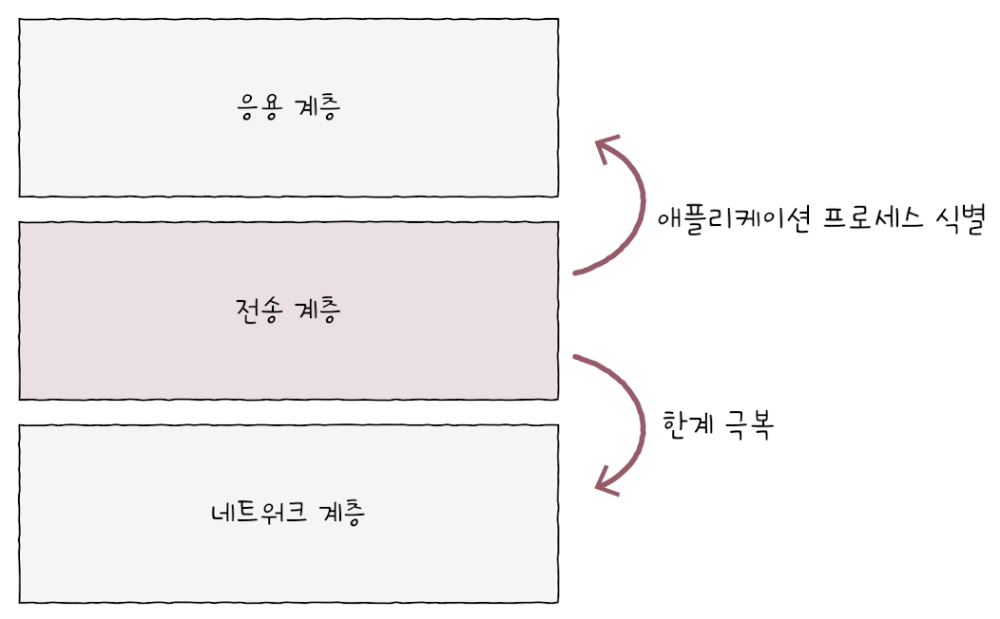
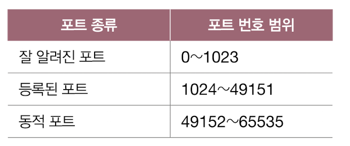
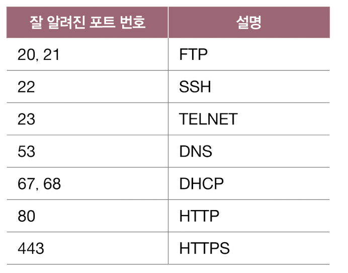
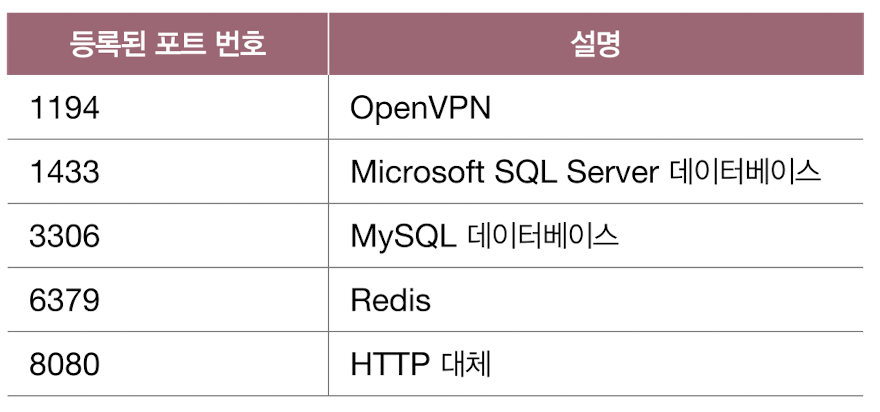
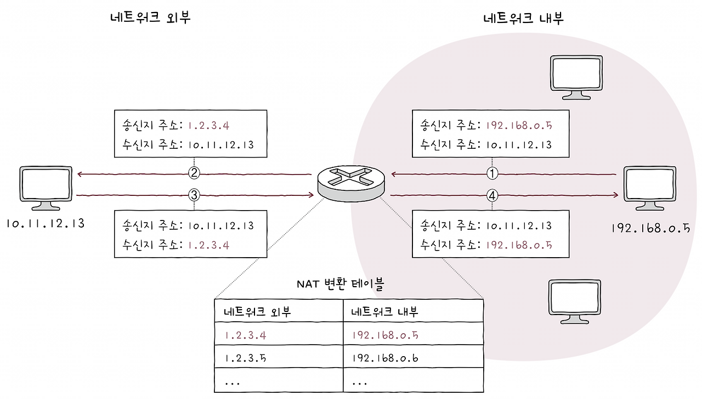

네트워크 계층의 IP는 신뢰할 수 없는 통신과 비연결형 통신을 수행한다는 한계가 있습니다.

네트워크 계층과 응용 계층 사이에 위치한 전송 계층은 신뢰할 수 있는 통신과 연결형 통신을 가능하게 하여 이러한 IP의 한계를 극복하고, 
포트 번호를 통해 응용 계층의 애플리케이션 프로세스들을 식별하는 역할을 수행합니다.

## IP의 한계

IP의 한계라고 볼 수 있는 두 가지 중요한 특징이 있습니다.

### 신뢰할 수 없는 통신과 비연결형 통신

IP는 신뢰할 수 없는(비신뢰성) 프로토콜이자 비연결형 프로토콜이라는 점입니다.
달리 표현하면, IP를 통한 패킷의 전달은 신뢰성이 없는 통신이자 연결을 수립하는 과정이 없는 통신입니다.
이는 전송 계층이 존재하는 이유와도 직결됩니다.

#### 신뢰할 수 없는 통신

IP 프로토콜이 패킷이 수신지까지 제대로 전송되었다는 보장을 하지 않는 특징을 일컫습니다.
이는 통신 과정에서 패킷의 데이터가 손상되거나 중복된 패킷이 전송되더라도 이를 확인하지 않고, 
재전송도 하지 않으며, 순서대로 패킷이 도착할 것이라는 보장도 하지 않는다는 의미입니다.
이러한 전송 특성을 다른 말로는 최선형 전달(best effort delivery)이라고 부릅니다.
최선형 전달이라는 말은 언뜻 들으면 믿음직하게 들릴 수도 있으나, 사실 본뜻은 ‘최선을 다해 보겠지만,
전송 결과에 대해서는 어떠한 보장도 하지 않겠다’라는 것을 의미한다.

#### 비연결형 통신

이름 그대로 송수신 호스트 간에 사전 연결 수립 작업을 거치지 않는 특징을 의미합니다.
그저 수신지를 향해 패킷을 보내기만 할 뿐입니다.

> IP는 왜 어떠한 보장도 없이 신뢰할 수 없는, 비연결형 통신을 할까요?
> 주요한 이유는 성능 때문입니다. 
> 모든 패킷이 제대로 전송되었는지 일일이 확인하고, 
> 호스트 간에 연결을 수립하는 작업은 일반적으로 패킷의 '빠른' 송신과는 배치되는 작업입니다.
> 더 많은 시간, 대역폭, 부하가 요구되고, 이는 곧 성능상 악영향으로 이어질 수 있습니다. 
> 인터넷상에서 돌아다니는 패킷의 종류와 개수는 매우 다양합니다. 
> 그중에는 금융 서비스처럼 반드시 신뢰성 있는 전송을 보장해야 하는 경우도 있지만, 
> 동영상 스트리밍 서비스나 실시간 영상 통화처럼 한두 개의 패킷 손실은 감수하더라도 빠른 전송이 우선시되는 경우도 존재합니다.
> 실제로 실시간 동영상 스트리밍 서비스는 패킷이 한두 개 손실되더라도 일시적으로 화질에 다소 악영향이 생길 수는 있어도, 일반적으로 시청에 큰 지장을 주지는 않습니다.
> 이처럼 신뢰성 있는 전송이 모든 경우에 필요한 것은 아닙니다.

## IP의 한계를 보완하는 전송 계층
네트워크 계층의 핵심 프로토콜인 IP의 한계를 전송 계층이 이를 보완하는 역할을 합니다.

### 전송 계층은 연결형 통신을 가능하게 합니다.
연결형 통신을 지원하는 대표적인 전송 프로토콜로 TCP가 있습니다.
전송 계층의 연결형 프로토콜인 TCP는 회선 교환 네트워크와 유사하게 두 호스트가 정보를 주고받기 전에 마치 가상의 회선을 설정하듯이 연결을 수립합니다.
송수신하는 동안에는 연결을 유지하고, 송수신이 끝나면 연결을 종료할 수 있습니다.
전송 계층은 신뢰성 있는 통신을 가능하게 합니다.

### TCP
신뢰성 있는 통신 또한 TCP를 통해 가능합니다.
TCP는 패킷이 수신지까지 올바른 순서대로 확실히 전달된다는 것을 보장하기 위해 재전송을 통한 오류 제어, 흐름 제어, 혼잡 제어 등 다양한 기능들을 제공합니다.

### UDP
연결형 통신과 신뢰성 있는 통신이 그렇지 않은 통신에 비해 무조건 좋은 것만은 아닙니다.
때로는 비교적 높은 성능을 위해 신뢰할 수 없는 통신, 비연결형 통신을 지원하는 프로토콜이 필요할 때가 있습니다.
그래서 전송 계층에는 UDP라는 프로토콜도 존재합니다.
UDP는 신뢰할 수 없는 통신, 비연결형 통신을 가능하게 하는 전송 계층의 프로토콜로 TCP보다는 비교적 빠른 전송이 가능합니다.

## 포트(Port)

### 포트의 정의
이런 상황을 가정해봅시다.
네트워크 외부에서 사용자가 전송받으려는 사진 파일을 구성하는 패킷들이 라우팅되어 사용자의 컴퓨터로 도착했습니다.
그리고 사용자는 컴퓨터로 웹 브라우저, 게임, 메신저 프로그램을 실행하고 있습니다.
이 패킷들은 웹 브라우저에 전달되어야 할 수도 있고, 게임 혹은 메신저 프로그램에 전달되어야 할 수도 있습니다.
즉, 패킷은 실행 중인 특정 애플리케이션 프로세스까지 전달되어야만 합니다.
패킷을 전송할 때도 마찬가지입니다.
수신지 호스트의 주소까지 전달되었다고 해서 전송이 끝난 것이 아니고, 실행 중인 특정 애플리케이션 프로세스까지 전달되어야 합니다.
결국 패킷의 최종 수신 대상은 특정 애플리케이션 프로세스입니다.
만약 어떤 패킷을 수신할 애플리케이션에 대한 정보가 패킷에 포함되어 있지 않다면 해당 패킷을 어떤 애플리케이션에 전달해야 할지 알 수 없을 것입니다.
즉, 패킷이 실행 중인 특정 애플리케이션까지 전달되려면 패킷에 특정 애플리케이션을 식별할 수 있는 정보가 포함되어 있어야 합니다.
이러한 정보를 포트(port)라고 합니다.

### 포트의 분류
전송 계층에서는 포트 번호를 통해 특정 애플리케이션을 식별합니다.
정확히는 패킷 내 수신지 포트와 송신지 포트를 통해 송수신지 호스트의 애플리케이션을 식별합니다.
전송 계층의 핵심 프로토콜인 TCP와 UDP는 모두 포트 번호 필드인 송신지 포트 번호와 수신지 포트 번호를 포함합니다.
포트 번호는 16비트로 표현 가능하며, 사용 가능한 포트의 수는 2¹⁶, 즉 65536개입니다.
할당 가능한 포트 번호는 0번부터 65535번까지 총 65536개가 존재합니다.
0번부터 65535번까지의 포트 번호는 번호의 범위에 따라 세 종류로 나뉩니다.

### 잘 알려진 포트(well known port)
영문 그대로 '웰 노운 포트'라고 지칭하는 경우가 많으며, 시스템 포트(system port)라 부르기도 합니다.
잘 알려진 포트는 이름 그대로 범용적으로 사용되는 애플리케이션 프로토콜이 일반적으로 사용하는 ‘널리 알려진, 유명한’ 포트 번호를 의미합니다.
대표적인 예시는 다음과 같습니다.

#### 등록된 포트

잘 알려진 포트에 비해서는 덜 범용적이지만, 흔히 사용되는 애플리케이션 프로토콜에 할당하기 위해 사용됩니다.

### 동적 포트(Dynamic Port)
포트 번호 49152번부터 65535번까지는 동적 포트(dynamic port), 사설 포트(private port), 임시 포트(ephemeral port)라고 부릅니다.
인터넷 할당 번호 관리 기관에 의해 할당된 애플리케이션 프로토콜이 없고, 특별히 관리되지 않는 포트 번호인 만큼 자유롭게 사용할 수 있습니다.
클라이언트로서 동작하는 프로그램은 동적 포트 번호 중에서 임의의 번호가 할당되는 경우가 많습니다.
대표적인 예시가 웹 브라우저입니다.

웹 브라우저를 통해 특정 웹 사이트에 접속하는 상황을 생각해 보면 웹 브라우저 프로그램과 서버 프로그램이 서로 패킷을 주고받는 것과 같으며, 
이때 웹 브라우저 프로그램에는 동적 포트 내의 임의의 포트 번호가 자동으로 할당됩니다.
포트 번호를 통해 실행 중인 특정 애플리케이션을 식별할 수 있기 때문에, 
IP 주소와 포트 번호에 대한 정보가 함께 주어진다면 특정 호스트에서 실행 중인 특정 애플리케이션 프로세스를 식별할 수 있습니다.

그래서 포트 번호는 일반적으로 IP 주소:포트 번호 형식으로 IP 주소와 함께 표기되는 경우가 많습니다.

## 포트 기반 NAT
NAT란 IP 주소를 변환하는 기술이며, 주로 네트워크 내부에서 사용되는 사설 IP 주소와 네트워크 외부에서 사용되는 공인 IP 주소를 변환하는 데 사용됩니다.
이러한 변환을 위해 주로 사용되는 것이 NAT 변환 테이블입니다.

### NAT 변환 테이블
NAT 변환 테이블(이하 NAT 테이블)에는 다음 그림처럼 변환의 대상이 되는 IP 주소 쌍이 명시되어 있습니다.

- ① 네트워크 내부에 192.168.0.5라는 사설 IP 주소를 가진 호스트가 있고, 수신지 주소가 10.11.12.13인 네트워크 외부의 호스트에게 패킷을 전송한다고 가정하면,
- ② 패킷이 NAT 기능을 갖춘 라우터를 거쳐 네트워크 외부로 나가게 되면, 패킷의 송신지 주소는 네트워크 외부에서 사용되는 공인 IP 주소인 1.2.3.4가 됩니다.

반대의 경우도 마찬가지입니다.

- ③ 수신지 주소가 1.2.3.4인 패킷이 네트워크 외부에서 네트워크 내부로 전송되는 상황일 때,
- ④ 이 패킷의 수신지 주소는 NAT 라우터를 거쳐 192.168.0.5가 됩니다.

위 그림에서 NAT 테이블을 자세히 보면, 변환의 대상이 되는 IP 주소가 일대일로 대응되어 있습니다.
사설 IP 주소 하나당 공인 IP 주소 하나가 대응된 셈입니다.
이처럼 NAT 테이블의 항목을 일대일로 대응해 NAT를 활용하는 것이 가능하기는 하지만,
이 방식만으로 많은 사설 IP 주소를 변환하기에는 무리가 있습니다.
이러한 이유로 오늘날 대중적으로 활용되는 NAT는 변환하고자 하는 IP 주소를 일대일로 대응하지 않는 경우가 많습니다.

### NAPT
포트 기반의 NAT를 NAPT(Network Address Port Translation)라 합니다.
APT(Address Port Translation)라고 부르기도 합니다.
NAPT는 포트를 활용해 하나의 공인 IP 주소를 여러 사설 IP 주소가 공유할 수 있도록 하는 NAT의 일종입니다.
NAPT는 NAT 테이블에 변환할 IP 주소 쌍과 더불어 포트 번호도 함께 기록하고 변환합니다.
같은 1.2.3.4라는 공인 IP 주소로 변환되더라도 포트 번호 6200번으로 변환되느냐, 
6201번으로 변환되느냐에 따라 내부 IP 주소를 구분지을 수 있습니다.

이처럼 네트워크 외부에서 사용한 IP 주소가 같더라도 포트 번호가 다르면 네트워크 내부의 호스트를 특정할 수 있기 때문에,
다수의 사설 IP주소를 그보다 적은 수의 공인 IP 주소로 변환할 수 있게 됩니다.

즉, NAPT를 이용하면 네트워크 내부에서 사용할 IP 주소와 네트워크 외부에서 사용할 IP 주소를 N:1로 관리할 수 있습니다.
이러한 점에서 NAPT는 공인 IP 주소 수 부족 문제를 개선한 기술로도 간주됩니다.

## 포트 포워딩
포트 포워딩이란 네트워크 내 특정 호스트에 IP 주소와 포트 번호를 미리 할당하고, 
해당 IP 주소:포트 번호로써 해당 호스트에게 패킷을 전달하는 기능입니다.
예를 들어 네트워크 내부의 여러 호스트가 공인 IP 주소를 공유하는 상황에서, 
네트워크 외부에서 내부로(원격 접속을 시도하는 등) 통신을 시작하는 상황을 가정해보면,
네트워크 외부의 호스트가 네트워크 내부의 특정 호스트에게 패킷을 전달하고 싶어도, 
네트워크 내에서는 사설 IP 주소를 사용하고 있고 여러 호스트가 하나의 공인 IP 주소를 공유하고 있습니다.
이런 경우 처음 패킷을 보내는 네트워크 외부 호스트 입장에서는 어떤 IP 주소(및 포트)를 수신지 주소로 삼을지 결정하기 어려울 수 있습니다.

이때 주로 사용되는 것이 포트 포워딩입니다.
특정 IP 주소와 포트 번호 쌍을 특정 호스트에게 할당한 뒤,
외부에서 통신을 시작할 호스트에게 해당 접속 정보(IP 주소:포트 번호 쌍)를 알려 주면 됩니다.
그럼 네트워크 외부 호스트는 그 IP 주소:포트 번호로 통신을 시작할 수 있습니다.
이처럼 포트 포워딩은 주로 네트워크 외부에서 네트워크 내부로 통신을 시작할 때,
네트워크 내부의 서버를 외부에서 접속할 수 있도록 접속 정보를 공개하기 위해 자주 사용됩니다.

> ICMP 
> IP의 신뢰할 수 없는 전송 특성과 비연결형 전송 특성을 보완하기 위한 네트워크 계층의 프로토콜로 ICMP가 있습니다. 
> ICMP(Internet Control Message Protocol)는 IP 패킷의 전송 과정에 대한 피드백 메시지(이하 ICMP 메시지)를 얻기 위해 사용하는 프로토콜입니다. 
> ICMP 메시지의 종류로는 크게 전송 과정에서 발생한 문제 상황에 대한 오류 보고와 
> 네트워크에 대한 진단 정보(네트워크상의 정보 제공) 가 있습니다.
> 