## TCP 통신 단계와 세그먼트 구조

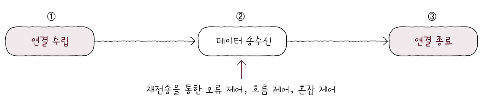

TCP는 통신(데이터 송수신)하기 전에 연결을 수립하고 통신이 끝나면 연결을 종료합니다.
그리고 데이터 송수신 과정에서 재전송을 통한 오류 제어, 흐름 제어, 혼잡 제어 등의 기능을 제공합니다.

### MSS

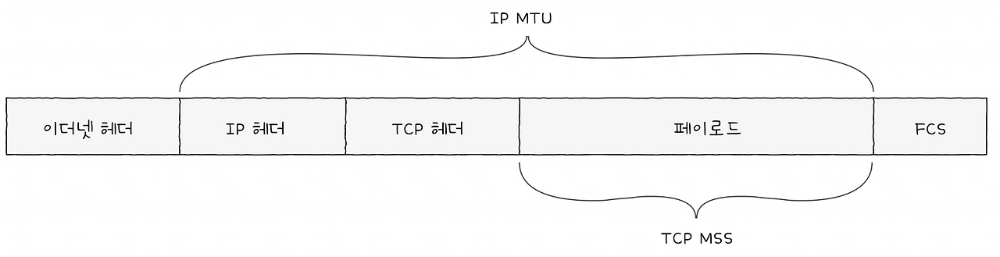

TCP의 연결 수립과 종료를 이해하려면,
가장 먼저 MSS라는 단위와 TCP의 세그먼트 구조를 이해해야 합니다.
MSS는 Maximum Segment Size의 약자로, 
TCP로 전송할 수 있는 최대 페이로드 크기를 의미합니다.
MSS의 크기를 고려할 때 헤더 크기는 제외한다. 
헤더의 크기까지 포함했던 단위인 MTU와는 대조적입니다.

#### TCP 세그먼트 헤더

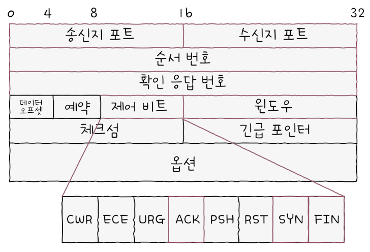

- 송신지 포트(source port)와 수신지 포트(destination port): 송신지 또는 수신지 애플리케이션을 식별하는 포트 번호가 명시되는 필드입니다.
- 순서 번호(sequence number): 순서 번호가 명시되는 필드입니다. 순서 번호란 송수신되는 세그먼트의 올바른 순서를 보장하기 위해 세그먼트 데이터의 첫 바이트에 부여되는 번호입니다.
- 확인 응답 번호(acknowledgment number): 상대 호스트가 보낸 세그먼트에 대한 응답으로, 다음으로 수신하기를 기대하는 순서 번호가 명시됩니다.
- 제어 비트(control bits): 플래그 비트(flag bits)라고도 부르며, 현재 세그먼트에 대한 부가 정보를 나타냅니다.
- 윈도우(window): 수신 윈도우의 크기가 명시됩니다. 수신 윈도우란 한 번에 수신하고자 하는 데이터의 양을 나타냅니다.

꼭 기억해야 하는 필드는 순서 번호 필드, 확인 응답 번호 필드, 그리고 관련된 제어 비트(ACK, SYN, FIN)입니다.

### 제어 비트
순서 번호 필드와 확인 응답 번호 필드를 학습하려면 먼저 제어 비트 필드에 대한 간략한 이해가 필요합니다.
제어 비트 필드는 기본적으로 8비트로 구성됩니다.
각 자리의 비트는 각각 다른 의미를 가지며, 
TCP의 기본 동작을 논할 때 가장 자주 언급되는 세 개의 제어 비트는 다음과 같습니다.
- ACK: 세그먼트의 승인을 나타내기 위한 비트
- SYN: 연결을 수립하기 위한 비트
- FIN: 연결을 종료하기 위한 비트

참고로 'ACK 비트가 1로 설정된 세그먼트', 'SYN 비트가 1로 설정된 세그먼트', 'FIN 비트가 1로 설정된 세그먼트'는 편의상 각각 'ACK 세그먼트', 'SYN 세그먼트', 'FIN 세그먼트'라 줄여서 칭하는 경우가 많습니다.

- ACK 비트가 1로 설정된 세그먼트 -> ACK 세그먼트
- SYN 비트가 1로 설정된 세그먼트 -> SYN 세그먼트
- FIN 비트가 1로 설정된 세그먼트 -> FIN 세그먼트

### 순서 번호와 확인 응답 번호
순서 번호 필드와 확인 응답 번호 필드는 TCP의 신뢰성을 보장하기 위해 사용되는 중요한 필드입니다. 
한 쌍으로 묶어서 기억하는 것이 좋습니다. 
이 두 필드에는 각각 순서 번호와 확인 응답 번호가 명시됩니다.

#### 순서 번호
순서 번호 필드에 명시되는 순서 번호는 세그먼트의 올바른 송수신 순서를 보장하기 위한 번호로, 
세그먼트 데이터의 첫 바이트에 부여되는 번호입니다.
예를 들어 아래 그림처럼 전송 계층이 응용 계층으로부터 전송해야 하는 1900바이트 크기의 데이터를 전달받았다고 가정해봅시다.

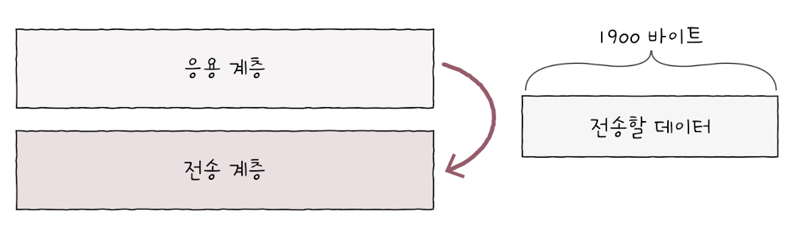

이는 MSS 단위로 전송될 수 있습니다. 
편의상 MSS가 500바이트라고 가정했을 때, 
1900바이트짜리 데이터를 덩어리를 MSS 단위로 쪼개면 네 개의 세그먼트로 쪼갤 수 있을 것입니다. 
다음 그림처럼 세그먼트 A, B, C, D 순으로 전송된다고 가정해봅시다.

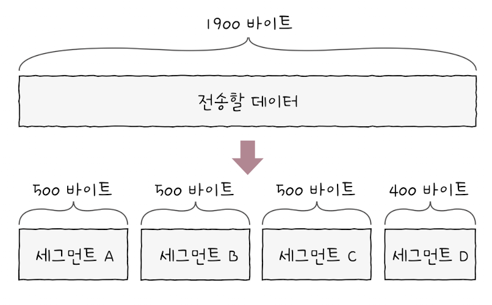

처음 통신을 위해 연결을 수립한 경우, 
즉 제어 비트에서 연결을 수립하기 위한 비트인 SYN 플래그가 1로 설정된 세그먼트의 경우 순서 번호는 무작위 값이 됩니다. 
이를 초기 순서 번호(ISN: Initial Sequence Number)라고 합니다.
예를 들어 초기 순서 번호가 100이라면 가장 먼저 보내게 될 세그먼트 A의 순서 번호가 초기 순서 번호인 100이 되는 것입니다.

연결 수립 이후 데이터를 송신하는 동안 순서 번호는 송신한 바이트를 더해 가는 형태로 누적값을 가집니다.
즉, 순서 번호는 초기 순서 번호 + 송신한 바이트 수가 되는 셈입니다. 
쉽게 말해 ‘초기 순서 번호 + 떨어진 바이트 수’라고 생각해도 좋습니다.

> 순서 번호는 세그먼트상에서 32비트(4바이트)로 표현됩니다. 
> 만약 순서 번호가 이 비트 수로 표현 가능한 수를 넘어서면 0부터 다시 증가합니다.

초기 순서 번호가 100이고 세그먼트 A에서 500바이트를 송신했다면, 
그다음 순서 번호는 600이 됩니다. 
마찬가지로 세그먼트 C의 순서 번호는 초기 순서 번호에서 1000바이트 떨어진 1100이 되고, 
세그먼트 D의 순서 번호는 초기 순서 번호로부터 1500바이트 떨어진 1600이 됩니다.

#### 확인 응답 번호
확인 응답 번호 필드에 명시되는 확인 응답 번호는 순서 번호에 대한 응답입니다.
'다음에는 이걸 보내 주세요', '다음으로 제가 받을 순서 번호는 이것입니다'를 나타내는 값입니다.
즉, 확인 응답 번호는 수신자가 다음으로 받기를 기대하는 순서 번호입니다. 
일반적으로 ‘수신한 순서 번호 + 1’로 설정됩니다.

확인 응답 번호 값을 보내기 위해서는 제어 비트에서 승인을 나타내는 비트인 ACK 플래그를 1로 설정해야 합니다.
예를 들어, 호스트가 순서 번호가 8000인 세그먼트를 잘 수신한 뒤, 다음으로 8001번 세그먼트를 받기를 원한다고 가정해봅시다.
이 경우 해당 호스트는 ACK 플래그를 1로 설정하고, 
확인 응답 번호로 8001을 명시한 세그먼트를 전송하게 됩니다.

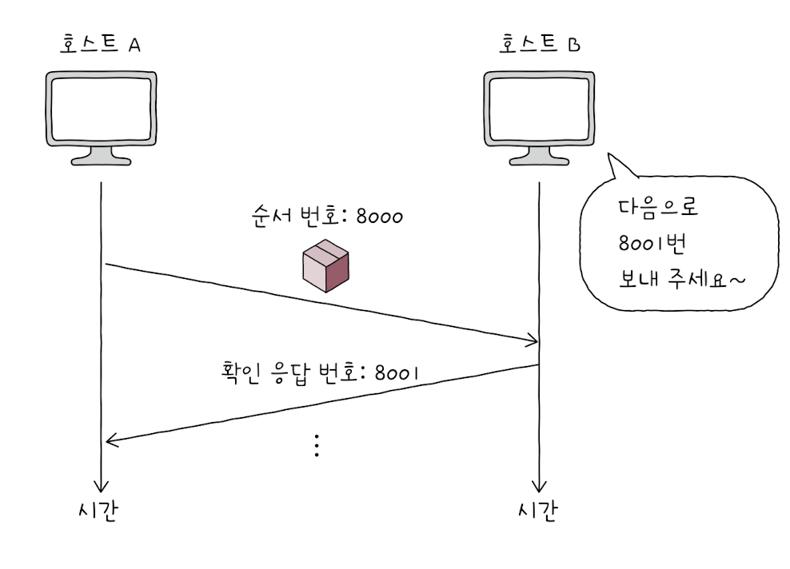

### TCP 연결 수립과 종료
TCP는 통신 이전에는 연결을 수립하고, 통신 이후에는 연결을 종료합니다.

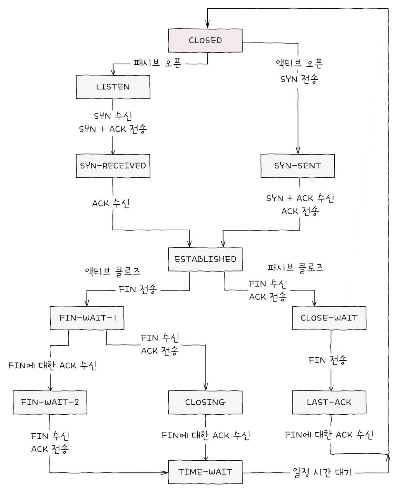

#### 연결 수립: three-way handshake
TCP의 연결 수립은 쓰리 웨이 핸드셰이크(three-way handshake)를 통해 이루어집니다.
이 용어 그대로 세 개의 단계로 이루어진 TCP의 연결 수립 과정을 의미합니다.
예를 들어 호스트 A와 B가 쓰리 웨이 핸드셰이크를 한다고 가정했을 때, 
다음 그림처럼 세 단계를 거친 뒤 본격적인 송수신이 시작되는 셈입니다.

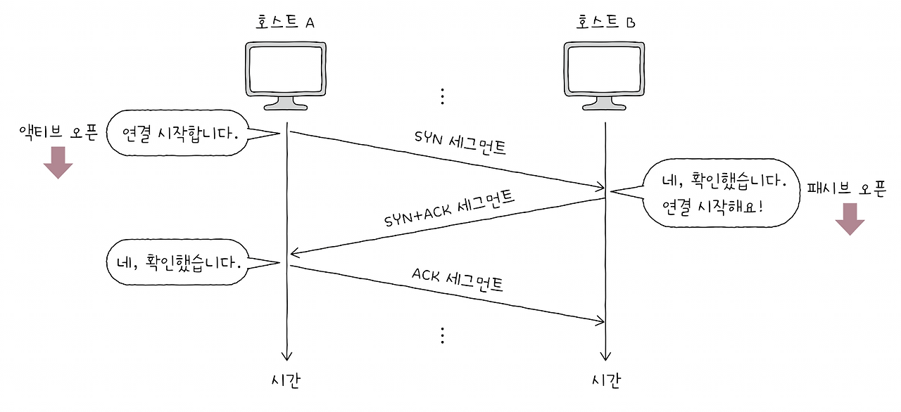
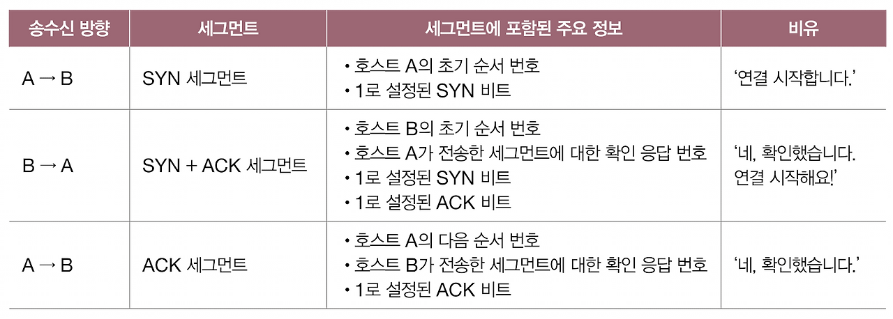

- 액티브 오픈(active open) : 연결을 처음 요청하는 측의 동작(과정)
  - 액티브 오픈은 주로 서버-클라이언트 관계에서 클라이언트에 의해 수행됩니다. 
  - 위의 예시에서는 호스트 A의 동작이 액티브 오픈이라 할 수 있습니다.
- 패시브 오픈(passive open) : 연결을 수락하는 측의 동작(과정)
  - 액티브 오픈은 주로 서버-클라이언트 관계에서 서버에 의해 수행됩니다.
  - 위의 예시에서는 호스트 B의 동작이 패시브 오픈입니다.

#### 연결 종료: four-way handshake
TCP가 연결을 종료하는 과정은 송수신 호스트가 각각 한 번씩 FIN과 ACK를 주고받으며 이루어집니다.
호스트 A와 B가 연결을 종료하는 각 단계를 그림으로 설명하면 다음과 같습니다.

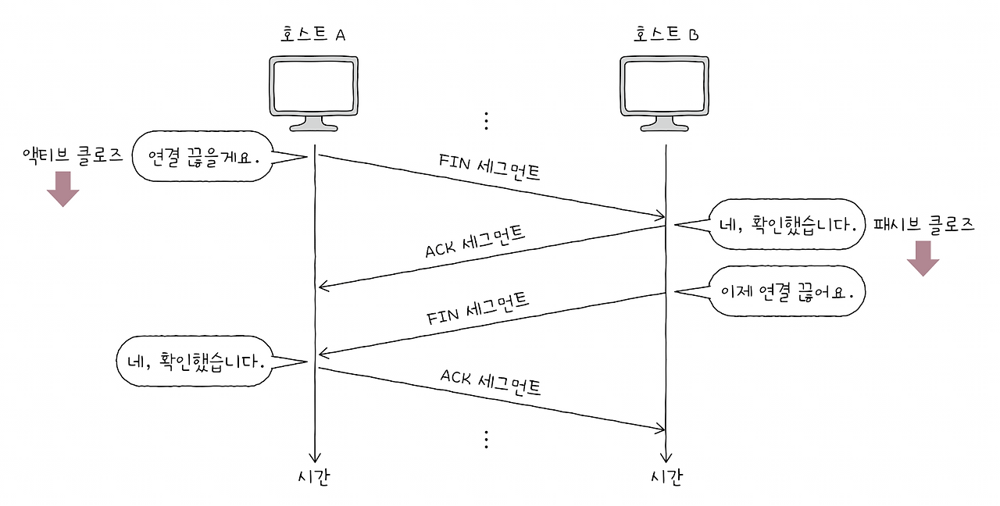
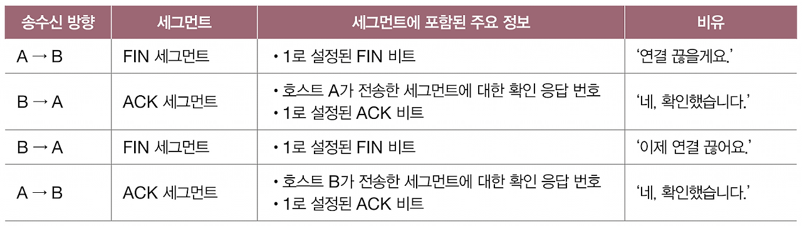

- 액티브 클로즈 : 먼저 연결을 종료하려는 호스트에 의해 수행됩니다. 그림에서는 FIN 세그먼트를 먼저 보낸 호스트 A가 액티브 클로즈를 수행한 셈입니다.
- 패시브 클로즈 : 연결 종료 요청을 받아들이는 호스트에 의해 수행된다. 그림에서는 호스트 B의 동작이 패시브 클로즈이다.

### TCP 상태
TCP는 연결형 통신과 신뢰할 수 있는 통신을 유지하기 위해 다양한 상태(state)를 유지합니다.
상태란 현재 어떤 통신 과정에 있는지를 나타내는 정보이며, 
TCP는 이러한 상태를 유지하고 활용한다는 점에서 스테이트풀(stateful) 프로토콜이라 부릅니다.
TCP의 상태는 크게 다음 세 가지로 나눌 수 있습니다.

1. 연결이 수립되지 않은 상태
2. 연결 수립 과정에서 주로 볼 수 있는 상태
3. 연결 종료 과정에서 주로 볼 수 있는 상태

#### 연결이 수립되지 않은 상태
아직 연결 수립이 이루어지기 전의 호스트는 주로 CLOSED나 LISTEN 상태를 유지하고 있습니다.
- CLOSED: 아무런 연결이 없는 상태입니다.
- LISTEN: 일정의 연결 대기 상태입니다. 

일반적으로 서버로 동작하는 패시브 오픈 호스트는 LISTEN 상태를 유지합니다.
쓰리 웨이 핸드셰이크의 첫 단계는 액티브 오픈 호스트의 연결 요청인 SYN 세그먼트입니다.
LISTEN 상태는 그 SYN 세그먼트를 기다리는 상태입니다.
즉, 액티브 오픈 호스트(일반적으로 클라이언트)가 
LISTEN 상태인 호스트(일반적으로 서버)에게 SYN 세그먼트를 보내면 쓰리 웨이 핸드셰이크가 시작됩니다.

#### 연결 수립 상태
TCP 연결 수립 과정에서는 주로 SYN-SENT, SYN-RECEIVED, ESTABLISHED 상태를 볼 수 있습니다.

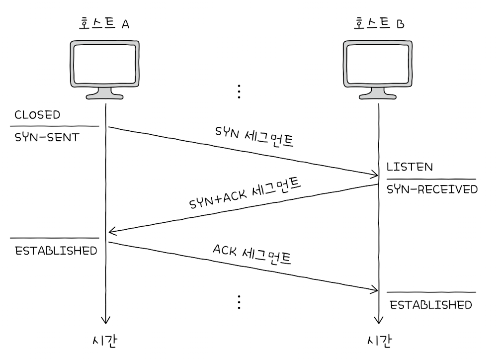

- SYN-SENT: 액티브 오픈 호스트가 SYN 세그먼트를 보낸 뒤, 그에 대한 응답인 SYN+ACK 세그먼트를 기다리는 상태입니다. 연결 요청을 보낸 뒤 대기하는 상태라 보면 됩니다.
- SYN-RECEIVED: 패시브 오픈 호스트가 SYN+ACK 세그먼트를 보낸 뒤, 그에 대한 ACK 세그먼트를 기다리는 상태입니다.
- ESTABLISHED: 연결이 확립되었음을 나타내는 상태입니다. 데이터를 송수신할 수 있는 상태를 의미합니다. 쓰리 웨이 핸드셰이크 과정에서 두 호스트가 마지막 ACK 세그먼트를 주고받으면 ESTABLISHED 상태로 접어들게 됩니다.

#### 연결 종료 상태

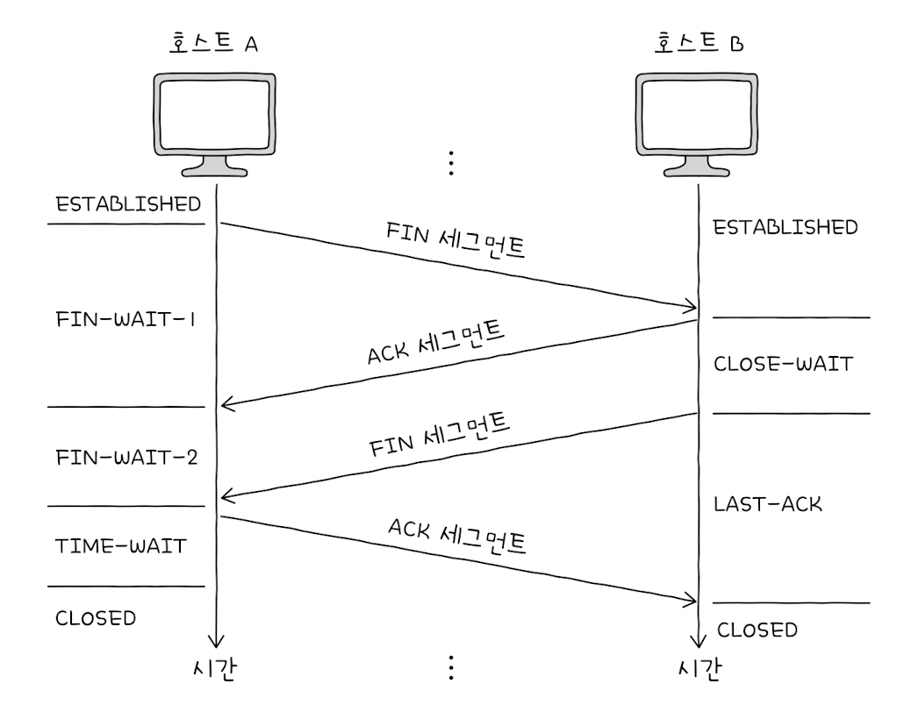

- FIN-WAIT-1: 일반적인 TCP 연결 종료 과정의 첫 단계로, FIN 세그먼트로 종료 요청을 보낸 액티브 클로즈 호스트가 진입하는 상태입니다.
- CLOSE-WAIT: 종료 요청인 FIN 세그먼트를 받은 패시브 클로즈 호스트가 응답으로 ACK 세그먼트를 보낸 뒤, 종료 요청을 준비하며 대기하는 상태입니다.
- FIN-WAIT-2: FIN-WAIT-1 상태에서 ACK 세그먼트를 받은 뒤 상대 호스트의 FIN 세그먼트를 기다리는 상태입니다.
- LAST-ACK: CLOSE-WAIT 상태에서 FIN 세그먼트를 보낸 후, 이에 대한 ACK 세그먼트를 기다리는 상태입니다.
- TIME-WAIT: 액티브 클로즈 호스트가 FIN 세그먼트를 수신한 뒤, ACK 세그먼트를 전송하고 일정 시간을 기다리는 상태입니다.
- CLOSED: 패시브 클로즈 호스트는 마지막 ACK 세그먼트를 수신하면 바로 CLOSED 상태로 전이되지만, 액티브 클로즈 호스트는 TIME-WAIT 상태에 머물렀다가 일정 시간이 지난 후에야 CLOSED 상태로 전이됩니다.

> TIME-WAIT 상태가 필요한 이유
> TIME-WAIT 상태에 접어든 액티브 클로즈 호스트는 일정 시간을 기다린 뒤 CLOSED 상태로 전이됩니다. 
> 가장 중요한 이유는 상대 호스트가 받아야 할 마지막 ACK 세그먼트가 제대로 전송되지 않았을 가능성 때문입니다. 
> TCP 송수신 과정에서는 세그먼트가 정확히 전송되지 않았을 경우 해당 세그먼트를 재전송해야 합니다. 
> 만약 TIME-WAIT 상태를 거치지 않고 곧바로 연결을 종료하면, 
> 상대 호스트 입장에서는 마지막 ACK 세그먼트를 받지 못한 것이 되어 재전송을 받을 수 없게 됩니다. 
> 또 다른 이유는 연결 종료 후 다른 연결이 재수립되는 상황에서 패킷 충돌을 방지하기 위함입니다.
> 대기 시간이 없다면 이전 연결의 잔여 패킷이 새로운 연결에 혼란을 줄 수 있습니다.

참고로 CLOSING 상태는 보통 양쪽 호스트가 동시에 연결을 종료하려 할 때 전이되는 상태입니다.
서로가 FIN 세그먼트를 보낸 후, 각자가 그에 대한 ACK 세그먼트를 전송했지만,
자신이 보낸 FIN에 대한 ACK를 아직 받지 못했을 때 접어드는 상태입니다.
즉, 양쪽 모두 종료 요청을 보내고 종료 응답을 기다리는 상태가 바로 CLOSING입니다.
이 경우 ACK 세그먼트를 수신하면 각각 TIME-WAIT 상태로 접어든 뒤 종료하게 됩니다.

## UDP 데이터그램 구조
UDP는 TCP와 달리 비연결형 통신을 수행하는 신뢰할 수 없는 프로토콜입니다.
그래서 연결 수립 및 해제, 재전송을 통한 오류 제어, 혼잡 제어, 흐름 제어 등을 수행하지 않습니다.
TCP처럼 상태를 유지하지도 않으며, 상태를 유지하지도, 
활용하지도 않는다는 점에서 UDP를 스테이트리스(stateless) 프로토콜의 일종이라고도 합니다.

### UDP 데이터그램 구조

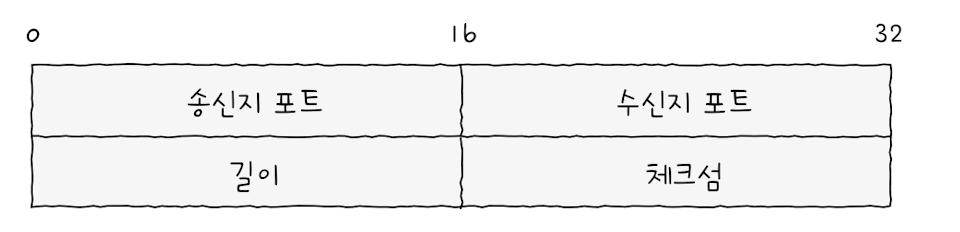

- 송신지 포트와 수신지 포트: 송수신지의 포트 번호가 담깁니다.
- 길이: 헤더를 포함한 UDP 데이터그램의 바이트가 담깁니다.
- 체크섬: 데이터그램 전송 과정에서 오류가 발생했는지 검사하기 위한 필드입니다.

수신지는 이 필드의 값을 토대로 데이터그램의 정보가 훼손되었는지를 판단하고, 
문제가 있다고 판단한 데이터그램은 폐기합니다.
참고로 데이터그램이 훼손되었는지를 나타내는 정보라는 점에서
이 필드는 ‘수신지까지 잘 도달했는지’를 나타내는 신뢰성/비신뢰성과는 관련이 없습니다.

UDP는 TCP에 비해 적은 오버헤드로 패킷을 빠르게 처리할 수 있습니다.
그래서 주로 실시간 스트리밍 서비스, 
인터넷 전화처럼 실시간성이 강조되는 상황에서 TCP보다 더 많이 쓰입니다.