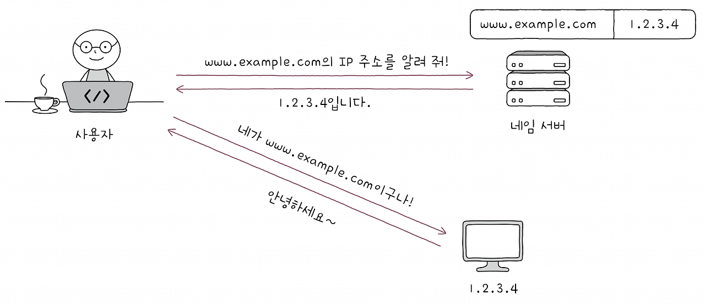
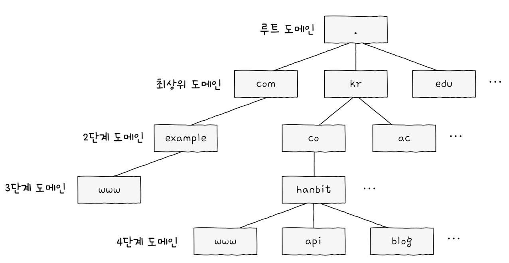
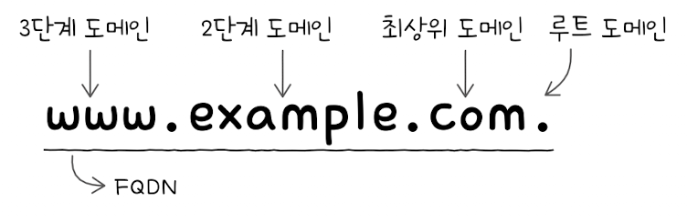
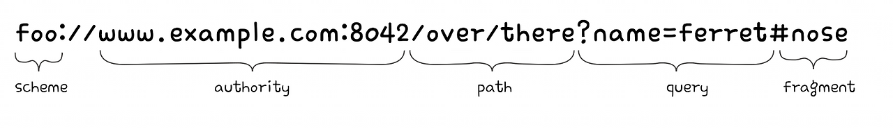
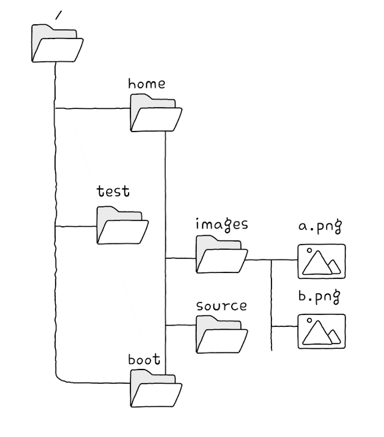
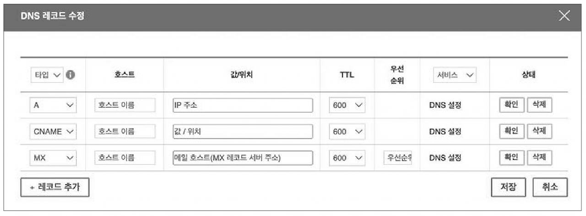
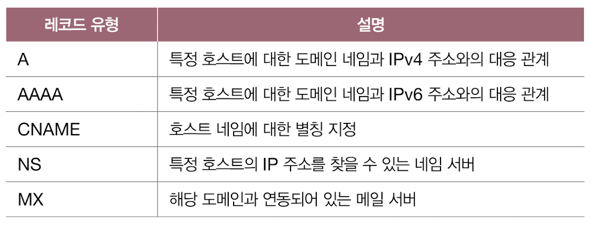
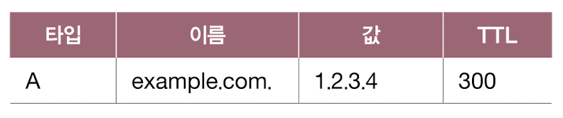
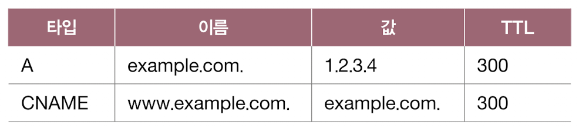

## 도메인 네임과 네임 서버
네트워크상의 어떤 호스트를 특정하기 위해 IP 주소를 사용합니다.
하지만 오로지 IP 주소만 사용하기에는 번거롭습니다. 
통신하고자 하는 모든 호스트의 IP 주소를 기억하고 있기도 어렵기 때문입니다.
호스트의 IP 주소는 언제든지 바뀔 수 있기도 합니다.

그래서 일반적으로 사용자는 상대 호스트를 특정하기 위해 IP 주소보다는 도메인 네임을 많이 사용합니다.
도메인 네임은 호스트의 IP 주소와 대응되는 문자열 형태의 호스트 특정 정보입니다.
예를 들어 http://www.example.com, developers.naver.com, git.kernel.org와 같은 문자열이 도메인 네임입니다.
도메인 네임과 IP 주소는 네임 서버에서 관리한다. 도메인 네임을 관리하는 네임 서버는 DNS 서버라고도 부릅니다.

아래 그림처럼 도메인 네임을 네임 서버에 질의하면 해당 도메인 네임에 대한 IP 주소를 알려주는 방식으로 도메인 네임을 통해 IP 주소를 알아낼 수 있습니다.

도메인 네임은 점(.)을 기준으로 계층적으로 분류됩니다.
최상단에 루트 도메인이 있고, 그다음 단계인 최상위 도메인이 있으며, 계속 그다음 단계의 도메인이 있는 식입니다.

우리가 일반적으로 알고 있는 도메인 네임의 마지막 부분은 최상위 도메인, 줄여서 TLD라고 합니다.
예를 들어, http://www.example.com의 최상위 도메인은 ‘com’입니다. 
최상위 도메인의 종류는 다양하지만, 
대표적으로 com, net, org, kr(대한민국), jp(일본), cn(중국), us(미국) 등이 있습니다.
doctor, lawyer, company와 같은 색다른 최상위 도메인도 있습니다.

> 최상위 도메인 
> 흔히 최상위 도메인을 도메인 네임의 마지막 부분이라고 생각하기 쉽지만, 사실 루트 도메인도 도메인 네임의 일부입니다. 
> 루트 도메인은 점(.)으로 표현되며 도메인 네임의 마지막에 점이 찍힌 형태로 표기됩니다. 
> 일례로 웹 브라우저에서 http://www.google.com.과 같은 도메인 네임으로 접속해도 웹사이트에 잘 접속됩니다. 
> 다만 일반적으로는 루트 도메인을 생략해서 표기하기에 대개 최상위 도메인을 ‘도메인 네임의 마지막 부분’으로 간주합니다.

- 루트 도메인 : .
- 최상위 도메인(TLD) : 루트 도메인의 하위 도메인
- 2단계 도메인 : 최상위 도메인의 하부 도메인
- 3단계 도메인 : 2단계 도메인의 하부 도메인
- N단계 도메인 : N-1단계 도메인의 하부 도메인
- 전체 도메인 네임(FQDN) : www.example.com.

도메인을 모두 포함하는 도메인 네임을 전체 주소 도메인 네임이라 한다.

> 호스트 네임(서브 도메인)
> http://www.example.com 의 첫 번째 부분(www)을 호스트 네임(서브 도메인)이라 부르기도 합니다.

계층적인 도메인 네임을 효율적으로 관리하기 위해 네임 서버 또한 계층적인 형태를 이룹니다. 
또 네임 서버는 여러 개 존재하며 전 세계 여러 군데에 위치해 있습니다.
이렇게 계층적이고, 분산된 도메인 네임에 대한 관리 체계를 도메인 네임 시스템, 줄여서 DNS라고 부릅니다.

### 계층적 네임 서버
IP 주소를 모르는 상태에서 도메인 네임에 대응되는 IP 주소를 알아내는 과정을  ‘리졸빙한다’라고도 표현합니다.
이 과정에서 다양한 네임 서버들이 사용되는데, 
중요한 역할을 담당하는 네임 서버의 유형은 크게 네 가지가 있습니다. 

- 로컬 네임 서버
- 루트 네임 서버
- TLD(최상위 도메인) 네임 서버
- 책임 네임 서버

#### 로컬 네임 서버
클라이언트와 맞닿아 있는 네임 서버로, 
클라이언트가 도메인 네임을 통해 IP 주소를 알아내고자 할 때 가장 먼저 찾게 되는 네임 서버입니다.
클라이언트가 로컬 네임 서버를 찾을 수 있으려면 로컬 네임 서버의 주소를 알고 있어야 합니다.
로컬 네임 서버의 주소는 일반적으로 ISP에서 할당해 주는 경우가 많습니다. 
다만 ISP에서 할당해 주는 로컬 네임 서버 주소가 아닌,
공개 DNS 서버를 이용할 수도 있습니다. 
공개 DNS 서버의 대표적인 예로는 구글의 8.8.8.8, 8.8.4.4와 클라우드플레어의 1.1.1.1이 있습니다.

#### 계층적 네임 서버
만약 로컬 네임 서버가 대응되는 IP 주소를 모른다면 루트 네임 서버에게 해당 도메인 네임을 질의하게 됩니다.
루트 네임 서버는 루트 도메인을 관장하는 네임 서버로, 
질의에 대해 TLD 네임 서버의 IP 주소를 반환할 수 있습니다.

TLD 네임 서버는 TLD를 관리하는 네임 서버입니다.
TLD 네임 서버는 같이 질의에 대해 TLD의 하위 도메인 네임을 관리하는 네임 서버 주소를 반환할 수 있습니다.
하위 도메인 네임을 관리하는 네임 서버는 마찬가지로 그보다 하위 도메인 네임을 관리하는 네임 서버 주소를 반환할 수 있습니다.

책임 네임 서버는 특정 도메인 영역을 관리하는 네임 서버로, 
자신이 관리하는 도메인 영역의 질의에 대해서는 다른 네임 서버에게 떠넘기지 않고 곧바로 답할 수 있는 네임 서버입니다.
쉽게 말해, 책임 네임 서버는 로컬 네임 서버가 마지막으로 질의하는 네임 서버입니다.
일반적으로 로컬 네임 서버는 책임 네임 서버로부터 원하는 IP 주소를 얻어냅니다.
이처럼 루트 도메인을 관리하는 루트 네임 서버부터 TLD를 관리하는 TLD 네임 서버, 
최종 IP 주소를 답해 주는 책임 네임 서버에 이르기까지, 네임 서버들은 계층적인 구조를 띠고 있습니다.

로컬 네임 서버가 네임 서버들에게 질의하는 방법에는 크게 ‘재귀적 질의’와 ‘반복적 질의’라는 두 가지 방법이 있습니다.

### 재귀적 질의와 반복적 질의
#### 재귀적 질의

재귀적 질의는 클라이언트가 로컬 네임 서버에게 도메인 네임을 질의하면, 
로컬 네임 서버가 루트 네임 서버에게 질의하고, 
루트 네임 서버가 TLD 네임 서버에게 질의하고,
TLD 네임 서버가 다음 단계에 질의하는 과정을 반복하며 최종 응답 결과를 역순으로 전달받는 방식입니다.

#### 반복적 질의

반복적 질의란 클라이언트가 로컬 네임 서버에게 IP 주소를 알고 싶은 도메인 네임을 질의하면, 
로컬 네임 서버는 루트 도메인 서버에게 질의해서 다음으로 질의할 네임 서버의 주소를 응답받고, 
다음으로 TLD 네임 서버에게 질의해서 다음으로 질의할 네임 서버의 주소를 응답받는 과정을 반복하다가 
최종 응답 결과를 클라이언트에게 알려 주는 방식입니다.

> DNS 캐시
> 지금까지 설명한 도메인 네임 리졸빙 과정에는 약간의 문제가 있습니다. 
> 하나의 도메인 네임을 리졸빙하기 위해 여러 단계를 거쳐야 하는 것처럼,
> 시간이 오래 걸리고 네트워크상의 메시지 수가 지나치게 늘어날 수 있다는 점입니다. 
> 만약 전 세계 모든 호스트가 도메인 네임 리졸빙을 위해 루트 네임 서버에 도메인 네임을 한꺼번에 질의한다면,
> 루트 네임 서버에 과부하가 생길 것입니다.
> 그래서 실제로는 네임 서버들이 기존에 응답받은 결과를 임시로 저장했다가,
> 추후 같은 질의에 이를 활용하는 경우가 많습니다. 
> 이를 DNS 캐시라고 합니다.
> DNS 캐시를 저장하는 용도로만 사용되는 서버도 있습니다.
> DNS 캐시를 활용하면 더 짧은 시간 안에 원하는 IP 주소를 얻어낼 수 있습니다.
> 참고로 DNS 캐시는 영원히 남아있는 것은 아닙니다. 
> 임시 저장된 값은 TTL이라는 값과 함께 저장되는데, 이 값은 캐시가 유지될 수 있는 시간을 뜻합니다.
> 여기서 TTL은 IP 패킷의 TTL과는 다른 개념입니다. 
> DNS 캐시의 TTL은 도메인 네임의 네임의 질의 결과를 임시로 저장하는 시간을 의미합니다.

## URI

URI는 URL과 URN으로 나뉜다.
- URL: 위치를 이용해 자원을 식별하는 방식
- URN: 이름을 이용해 자원을 식별하는 방식

URN보다 URL이 훨씬 많이 쓰인다.

### URL

#### scheme

URL의 첫 부분은 scheme입니다. 
scheme은 ‘자원에 접근하는 방법’을 의미합니다. 
일반적으로 사용한 프로토콜이 명시됩니다.
HTTP를 사용하여 자원에 접근할 때는 http://를 사용하고,
HTTPS를 사용하여 자원에 접근할 때는 https://를 사용합니다.

#### authority

authority에는 ‘호스트를 특정할 수 있는 정보’, IP 주소 혹은 도메인 네임이 명시됩니다. 
콜론(:) 뒤에 포트 번호를 덧붙일 수도 있습니다.

#### path

path에는 ‘자원이 위치한 경로’가 명시됩니다. 
자원의 위치는 슬래시(/)를 기준으로 계층적으로 표현되고, 최상위 경로 또한 슬래시로 표현됩니다.

예를 들어 여러분이 원하는 자원의 이름이 a.png이고, 
a.png는 다음 쪽의 그림과 같은 위치에 존재한다고 가정해봅시다.
a.png는 최상위 경로 아래(/), home 아래(/home), images 아래(/home/images)에 있습니다. 
따라서 a.png의 path는 /home/images/a.png가 됩니다.
URL에서의 경로도 이와 같다. 
http 프로토콜로 접근 가능한 도메인 네임 example.com의 자원 중, 
/home/images/a.png의 자원은 다음과 같은 URL로 표현할 수 있습니다.
- http://example.com/home/images/a.png

#### query

때로는 더 많은 정보가 필요할 수 있습니다.
예를 들어, 수많은 정보 중에서 ‘특정 단어를 검색한 결과’에 해당하는 자원이나 수많은 상품 중에서 
‘특정 상품을 검색한 뒤 그 결과를 내림차순으로 정렬한 결과’에 
해당하는 자원을 scheme, authority, path만으로 모두 표현하기란 어렵습니다.

이럴 때 사용할 수 있는 것이 쿼리 문자열입니다. 
쿼리 파라미터라고도 부릅니다.
쿼리 문자열은 물음표(?)로 시작되는 ‘키=값’ 형태의 데이터로, 
앰퍼샌드(&)를 사용하여 여러 쿼리 문자열을 연결할 수 있습니다. 
다음은 query=value, query2=value2라는 쿼리 문자열이 포함된 URL 예시입니다.

#### fragment

fragment는 ‘자원의 한 조각을 가리키기 위한 정보’입니다. 
흔히 HTML 파일과 같은 자원에서 특정 부분을 가리키기 위해 사용됩니다.
예를 들어 아래의 URL은 위의 HTML 파일 자원 내의 특정 부분을 나타냅니다.
- https://datatracker.ietf.org/doc/html/rfc3986#section-1.1.2

위 URL은 HTML 자원의 특정 부분을 가리키기에 브라우저로 접속해 보면 HTML 파일의 특정 부분으로 이동하여 보일 것입니다.

### URN
URL은 위치를 기반으로 자원을 식별합다.
그런데 자원의 위치는 언제든 변할 수 있습니다. 
자원의 위치가 변한다면 URL은 유효해지지 않을 수 있습니다.
다시 말해 자원의 위치가 변경되면 기존 URL로는 자원을 식별할 수 없게 됩니다. 
이것은 URL의 고질적인 문제 중 하나입니다.
반면, URN은 자원에 고유한 이름을 붙이는 이름 기반 식별자이기에 자원의 위치와 무관하게 자원을 식별할 수 있다는 장점이 있습니다.

### DNS 레코드 타입
네임 서버는 DNS 자원 레코드라 불리는 정보를 저장하고 관리합니다.
단순히 DNS 레코드라 부르기도 하는데, 다음 화면에서 각 행이 DNS 레코드입니다.
이러한 레코드는 도메인 네임을 구입한 뒤, 웹 사이트에 도메인 네임을 적용시킬 때 자주 접하게 됩니다.

예를 들어, 우리가 IP 주소 1.2.3.4인 호스트를 접속 가능한 웹 서비스로 만들었다고 가정해 보겠습니다. 
즉, 다른 사용자들은 1.2.3.4로 접속하면 우리의 웹 서비스를 이용할 수 있다.

그리고 우리는 example.com이라는 도메인 네임을 구입하여 이를 1.2.3.4에 대응시키고자 한다고 해봅시다.
그런데 도메인 네임 example.com이 1.2.3.4에 대응된다는 사실을 네임 서버에게 알리지 않는다면,
당연히 네임 서버는 그 사실을 알 수 없습니다.
그래서 우리는 ‘도메인 네임 example.com이 1.2.3.4에 대응된다’는 사실을 네임 서버에게 알리기 위해
도메인 레코드를 추가해야 합니다. 

### 레코드 유형
각 레코드에는 유형이 정해져 있기에 레코드의 유형이 달라지면 레코드의 이름과 값의 의미가 달라집니다. 
다양한 레코드 유형이 있지만, 자주 접할 레코드 유형은 주로 다음과 같습니다.

예를 들어 다음과 같은 레코드는 example.com.이 1.2.3.4에 대응되어 있다는 것을 보여줍니다.
즉, 다음과 같은 레코드를 저장하는 네임 서버에 example.com.을 질의하면 1.2.3.4를 응답받을 수 있습니다.

여기에 다음과 같은 레코드가 추가되었다고 가정해봅시다.

추가된 레코드는 example.com.에 대한 별칭으로 http://www.example.com.을 사용하겠다는 의미입니다.
따라서 http://www.example.com.을 질의하면 같은 IP 주소인 1.2.3.4를 응답받게 됩니다.

### TTL
DNS 레코드에서 TTL(Time To Live)은 캐시 유효 시간을 의미합니다.
좀 더 정확히 말하면, TTL은 네임 서버나 클라이언트(예: 브라우저, 로컬 DNS 캐시)가 
특정 DNS 레코드를 얼마나 오래 저장해둘 수 있는지를 초 단위로 정의한 값입니다.
예를 들어, TTL = 3600이라면 해당 DNS 레코드는 3600초(=1시간) 동안 캐시됩니다.
이 시간 동안은 같은 질의에 대해 네임 서버가 재질의 없이 캐시된 응답을 그대로 사용합니다.
