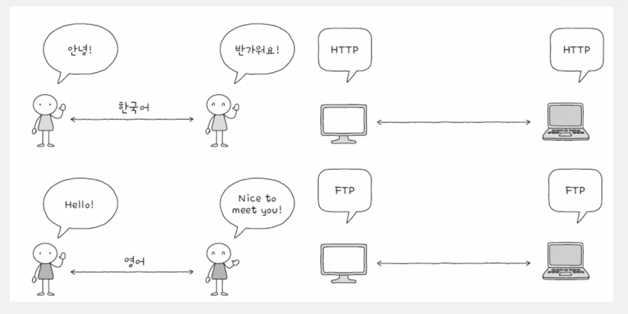

## 네트워크란?

---

네트워크란 여러개의 장치가 그물처럼 서로 연결되어 정보를 주고받을 수 있는 통신망을 **네트워크***라고 합니다.

 

### 인터넷

우리가 흔히 말하는 **인터넷**이란 용어는 이러한 네트워크들의 집합입니다.
여러 네트워크를 연결하고 서로 통신할 수 있게 도와주는 '네트워크의 네트워크'를 인터넷이라고 표현합니다.

 
 

### 네트워크의 구조

**네트워크**는 **노드**와 **간선**의 연결된 **그래프**구조입니다.

 
 

## 프로토콜

---

프로토콜이란 **네트워크의 구조**인 **노드**가 정보를 주고 받기 위해 합의된 규칙이나 방법을 **프로토콜**이라고 합니다.

예를들어,

> IP는 패킷을 수신지까지 전달하기 위해 사용되는 프로토콜이다.

> HTTPS는 HTTP에 비해 보안상 더안전한 프로토콜이다.

와 같은 프로토콜의 예시가 있습니다.
이처럼 프로토콜은 각자의 목적과 특징이 있다는 것에 중점을 두게 됩니다.

 

## 메시지 교환 방식으로 인한 네트워크 분류

---

네트워크 분류 기준중 메시지를 어떻게 교환하는지 여부에 따라 분류 하는 방식이 있습니다.

1. 회선교환방식
2. 패킷교환방식

 

## 회선 교환 방식

---

**회선 교환 방식**은 메시지 전송로인 **회선**을 설정하고 이를 통해 메시지를 주고받는 방식입니다.
'회선을 설정한다'라는 말은 '호스트 간 연결되었다'라는 말이 됩니다.

이처럼 **회선 교환 방식**은 메시지를 주고받기전에 서로 **회선**을 연결하는 것이 선행되어야 합니다.

이러한 방식은 각각 장,단점을 가지고 있습니다.

장점
- 연결을 선행한 메시지 교환방식이기 때문에 정보의 전송이 비교적 일정함

단점
- 회선의 이용 효율이 낮아질 수 있음

이러한 회선 교환 방식에서 **효율**적인 측면을 조금 더 설명하자면

그림에서 A <-> B 가 메시지를 주고받는 상황에서, 메시지를 하나만 주고 받은 후 회선을 계속 이어두게 되면
해당 회선은 연결은 되었지만 쉬고있는 상황입니다. 이러한 상황 때문에 다른 노드들은 해당 회선을 점유 할 수도 없고
막상 연결된 회선은 쉬고있는 상황이 발생하고 이러한 문제를 **이용 효율**이 떨어졌다고 표현합니다.

 
 

## 패킷 교환 방식

---

**패킷 교환 방식**은 메시지를 **패킷**단위로 쪼개고, 쪼개어진 패킷을 수신지에서 재조립하는 방법을 이용합니다.
현대 인터넷은 대부분 패킷 교환 방식을 이용합니다.

이러한 패킷 교환 방식은 회선 방식과 다르게 해당 전송로를 점유하지 않습니다. 그림을 통해 확인 가능하며, 중간 **패킷 스위치**가
패킷이 갈방향을 지정해주기 떄문입니다.

 

## 패킷

---

패킷은 택배 박스와 비슷합니다. 택배박스 안에 내용물도 있고, 해당 택배가 잘도착할 수 있는 정보를 담고있는 송장도 있습니다.
패킷의 내용물을 페이로더, 그리고 패킷의 정보를 담는 부분을 헤더 혹은 트레일러라고 합니다.

- 헤더: 패킷의 메타 정보를 가지고 있다. 패킷의 길이, 번호, 네트워크 프로토콜, 수신자 및 발신자의 IP 주소 등 데이터가 잘 전달되기 위해 필요한 정보가 있다.
- 페이로더: 수신자가 요청한 데이터이다.
- 트레일러: 패킷의 끝을 나타내며 패킷간의 사이를 뚜렷하게 구분하는 역할을 한다.

 

송신측 컴퓨터에서 헤더라는 정보를 붙여 패킷 교환기로 패킷 교환 네트워크로 패킷을 보냅니다.

헤더에는 수신 컴퓨터 정보, 데이터중 몇번째에 해당하는 패킷인지에 관한 정보 등 다양한 정보가 있습니다.

송신측에서 헤더를 생성하고, 수신측에서 헤더를 기반으로 데이터를 복원합니다.

이러한 방식은 필요할 때만 데이터를 전달 할 수 있기 때문에 이전 회선 방식에 비해 효율적이고, 같은 회선을 사용해도 다른 사용자가 데이터를 전송할 수 있기 때문에 회선 효율 적이다.

 
 

## 범위에 따른 네트워크 분류

---

네트워크는 범위에 따라서도 나누기도 합니다.
예를들어, 가정내에서 사용되는 범위가 있는 반면 기업과 기업을 이어주는 범위도 있습니다.
혹은 세계와 세계를 이어줄수도 있습니다.

이처럼 네트워크는 물리적 거리에 의해서도 나눠집니다.

크게 4가지로 나눠볼 수 있습니다.

 

### LAN(Local Area Network)

가까운 지역을 잇는 근거리 네트워크를 **LAN**이라고 부릅니다.
흔히 컴퓨터 주변기기를 **LAN**으로 구성하는 것을 보게 될것입니다.

예시로는 어릴적 컴퓨터실에서 하던 스타크래프트가 대표적인 **LAN**지원 네트워크 게임입니다.

 
 

### WAN(Wide Area Network)

먼지역을 연결하는 광역 통신망입니다. **LAN**끼리 연결된 통신망은 인터넷 연결이 필요없습니다.
하지만 특정 **LAN**네트워크에서 또 다른 네트워크로 요청을 할때는 인터넷 연결이 필요합니다.
이러한 인터넷을 **WAN**으로 구분합니다.

대표적인 **WAN**에 인터넷이 있지만, 지역마다 회사를 두고있는 글로벌 기업에서 지사를 이어주는 네트워크를 구축할 수 도 있습니다.
이러한 경우 특정 회사의 **WAN**이 됩니다.

 
 

### CAN(Campus Area Network), MAN(Metropolitian Area Network)

각각 학교 또는 회사의 여러 건물 단위로 연결되는 규모의 네트워크를 의미하고, 도시나 대도시 단위로 연결되는 규모의
네트워크를 의미합니다.

