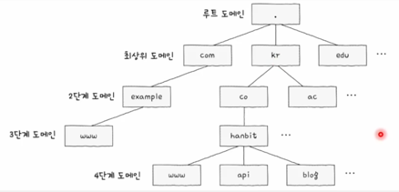
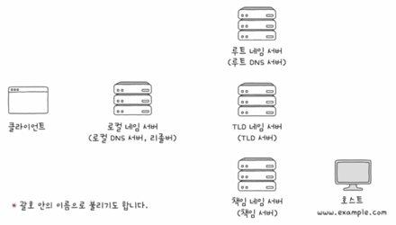
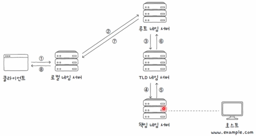
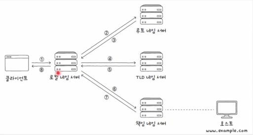

## 도메인 네임과 네임 서버

---

호스트를 특정하기 위해 **IP**를 많이 사용합니다. 하지만, 이러한 **IP**는 실용성이 떨어집니다.
모든 전화번호를 기억하고 사용하지 않는것처럼 **IP**에 고유한 이름을 부여하고 **IP**대신 사용하는
도메인 네임이라는 개념이 있습니다.

이러한 **도메인 네임**을 **IP**와 묶어서 관리하는 주체는 **도메인 네임 서버**입니다.

 

> www.google.com.

이라는 주소를 기준으로 도메인 네임을 생각해보겠습니다.

이곳에는 .(dot)을 기준으로 도메인 네임을 계층으로 구분합니다. 최상단에는 루트 도메인이 있고, 그 다음 단계인
**최상위 도메인**이 있습니다. 

 

그림처럼 레이어 형식으로 이루어져 있고, 루트 도메인 기준 하위를 최상위 도메인 또 그 하위를 2단계 도메인이라고 부르며
이는 일반적으로 3~5단계 까지 있습니다.

이러한 **전체 주소 도메인 네임**을 **FQDN**이라고 합니다.

그리고 계층적이고, 분산된 도메인 네임에 대한 관리 체계를 **도메인 네임 시스템**이라고 합니다.

 
 

## 계층적 네임 서버

---

**도메인 네임**에 해당하는 **IP**주소를 알아내는 과정을 **리졸빙**이라고 합니다.

대표적인 네임서버는 그림과같이 **로컬네임서버**, **루트 네임서버**, **TLD 네임서버**, **책임 네임 서버**가
있습니다.

이런 네임서버가 **도메인 네임**을 통해 **IP**를 반환하는데는 두가지 방법이 있습니다.

 

### 재귀적 질의

클라이언트가 로컬 네임 서버에게 도메인 네임을 질의하면, 로컬 네임서버는 루트 네임서버에게 질의하고 이과정을
최종 **IP**를 찾는과정까지 반복후 클라이언트에게 돌려주는 방식입니다.

 

### 반복적 질의

**반복적 질의**는 **로컬 네임서버**와 기타 네임서버가 요청 호출을 반복하는 방식입니다.

