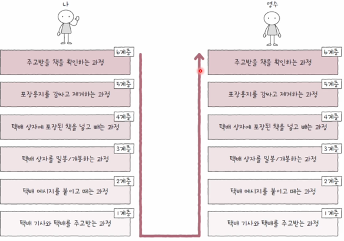
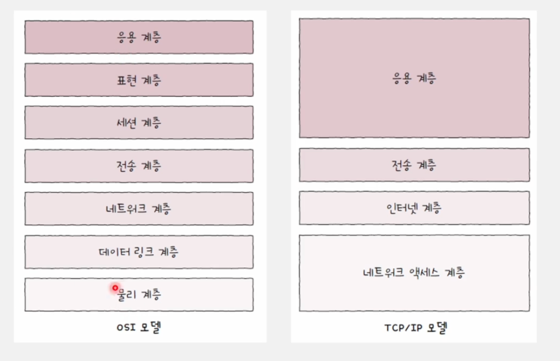
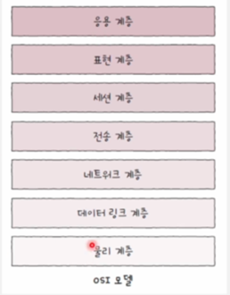
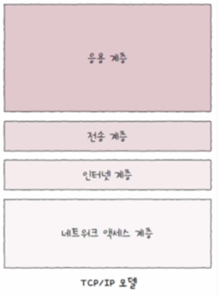
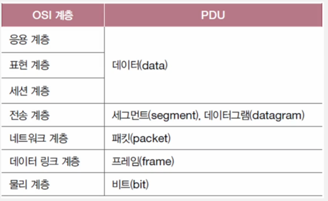
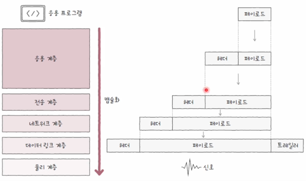

# 네트워크 참조 모델

---

네트워크로 메시지를 주고 받는 다는것을 다른 말로 풀어내면, 패킷을 주고 받는 과정이라고 할 수 있습니다.
패킷이란 택배와 같으며 택배에 내용물을 담고 포장하고, 전달하여 상대방이 내용물을 얻고 이해하는 과정까지
네트워크 상 패킷의 전송과정이라고 할 수 있습니다.

이러한 과정을 정형화된 단계를 거쳐서 나누게 되고 이를 계층으로 표현하는것이 **네트워크 참조 모델**이라고 부르게 됩니다.

해당 그림은 패킷을 송, 수신 하는 과정을 비유를 통해 나타낸 것입니다.

이러한 과정을 **계층화**하는 이유는 크게 두가지가 있습니다.

### 1. 네트워크 구성과 설계가 쉬워진다.

특정 계층의 역할을 부여할 수 있다면, 해당 계층에서 해야 하는 일을 통해서 **프로토콜**과 **장비**를 도입하기가 쉬워집니다.
이러한 장점으로 인해 네트워크 송,수신 과정을 **계층화**하여 구분하게 됩니다.

다만, 이러한 모델은 정답이 없고 모든 레이어가 고유한 특징을 지닌것도 아닙니다.
예를 들어 L7 로드밸런서는 아래 계층에 역할까지도 수행할 수 있는 것이 이에 대한 사례입니다.

이처럼 명확히 구분된 계층을 나누기보다 구성과 설계를 위한 구분정도로 사용됩니다.

 
 

### 2. 네트워크 문제 진단과 해결이 용이하다.

계층이 존재한다는 것은 가이드가 존재하는 것과 같습니다. 특정 문제에 대해 의심 레이어를 바로 확인할 수도 있고,
아래 계층부터 차근차근 확인하며 진행하는것도 가능하게 해줍니다.
이처럼, 레이어 방식은 문제가 발생했을 때 문제를 해결하기 위해 가이드라인을 제시하는 것과 같습니다.

 

## 네트워크 참조 모델 종류

---

이러한 네트워크 참조 모델은 대표적으로 **두가지**가 있습니다.

그림에서 볼 수 있듯이, **OSI 7계층**, **TCP/IP** 모델이 있습니다.

 
 

## OSI 계층

---

**OSI** 계층은 국제 표준화 기구에서 만든 네트워크 참조 모델입니다. 7 계층으로 나누게 되고, 차례대로 물리, 데이터링크,
네트워크, 전송, 세션, 표현, 응용계층이 있습니다.

 

### 물리 계층

물리 계층은 1과 0으로 표현되는 비트 신호를 주고 받는 계층입니다. 다양한 통신 매체를 통해 다양한 신호로 정보가 전달 될 수 있습니다.
그렇기 떄문에 해당 계층에서는 전기, 빛, 전파 등의 신호로 정보를 변환하게 됩니다.

 

### 데이터 링크 계층

네트워크 내 주변 장치 간의 정보를 올바르게 주고받기 위한 계층입니다. 이너뎃을 비롯한 많은 **LAN**기술이 데이터 링크 계층에 속해있습니다.
해당 계층은 물리 계층을 통해 주고받은 정보의 오류를 검출하고, **MAC**주소를 통해 네트워크 내 송수신지를 특정할 수 있습니다.

 

### 네트워크 계층

메시지를 수신지까지 전달하는 계층입니다. 데이터 링크 계층에서 네트워크 내의 주변 장치 간의 통신이 이루어진다면,
네트워크 계층에서는 네트워크 간의 통신이 이루어집니다. **IP**주소라는 주소를 통해 수신지 호스트와 네트워크를 식별하고, 원하는 수신지에 도달하기 위한
최적 경로를 설정합니다.

 

### 전송 계층

**신뢰성**, **안정성**있는 전송을 하기위한 계층입니다. 패킷이 정상적으로 보내졌는지와 유실된 정보가 없는지, 순서를 고려하는 작업을 진행합니다.
패킷의 흐름을 제어하거나 전송 오류를 점검해 안정적인 전송이 가능하게 합니다. 포트라는 정보를 통해 실행 중인 응용프로그램의
식별을 이루기도 합니다.

 

### 세션 계층

**세션**을 관리하기 위한 계층입니다. 응용프로그램간 연결 상태를 생성, 유지, 관리, 종료하는 역할을 수행합니다.

 

### 표현 계층

사람이 이해하는 문자를 컴퓨터가 이해하는 코드로 변환하거나, 압축, 암호화 같은 작업을 수행합니다.

 

### 응용 계층

실제로 사용자가 사용하게 되는 계층입니다. 웹페이지, 이메일 등과 같은 실질적인 네트워크 서비스를 제공합니다.

 
 

## TCP/IP 모델

---

TCP/IP계층은 하위 계층부터 네트워크 엑세스 계층, 인터넷 계층, 전송 계층, 응용 계층이 있습니다.

**OSI**계층에서 물리계층, 데이터링크 계층을 네트워크 엑세스 계층과 유사하고,

네트워크 계층을 인터넷 계층과 유사하고,

트랜스 포트 계층을 전송 계층과 유사하고,

세션, 표현, 응용 계층을 응용 계층과 유사하다고 합니다.

 

### 왜 OSI, TCP/IP는 나눠서 표현할까?

---

그렇다면 유사한 계층에 연속인 OSI와 TCP/IP는 왜 나눠서 생각하게 될까요?

이유는 **OSI**계층은 이론적으로 **이상적 설계**에 가깝고, **TCP/IP**는 **실용적 구현**에 가깝기 떄문입니다.

조금더 쉽게 설명하자면 **OSI**계층이 7계층으로 조금 더 세밀하게 나누어지며 더 많은 것을 구분짓고 있습니다.

만약 세션부분에서 문제가 발생하였다면 **TCP/IP**에서는 응용 계층의 문제로 인식해버리게 되지만, **OSI**는 세션이라는
계층을 문제로 파악할 수 있습니다. 이 말은 명확한 문제 파악이 가능하다는 특징이 있습니다.

하지만, 실제 구현을 **OSI** 기준으로 하게되면 레이어마다 명확하게 구분되는 부분들만 있는것도 아니고 비효율적이기 떄문에
실용적인 모델인 **TCP/IP**를 기준삼아 구현하게 됩니다.

그렇기 때문에 각각 **이상적 설계**, **실용적 구현**을 위한 참조라고 표현합니다.

 
 

## PDU(Protocol Data Unit)

---

**PDU**란 각 계층에서 송수된되는 메시지를 부르는 용어입니다. 상위 계층에서 메시지를 전달받았으면 해당 메시지에
자신의 레이어에 해당하는 헤더를 붙이게 됩니다. 이렇게 만들어진 데이터 단위를 **PDU**라고 부릅니다.

> PDU = 상위계층 메시지 + 자신의 계층 헤더 or 트레일러

그렇기 때문에 각 계층은 **PDU**를 지칭하는 명칭이 다르게 됩니다.

 
 

## 캡슐화와 역캡슐화

---

**PDU**를 먼저 설명한 이유는 **캡슐화**, **역캡슐화**는 메시지를 송,수신지에 전달하기 위해 **PDU**를 조합 하거나 해체 하는 과정이기 때문입니다.

캡슐화를 설명하기 위해 그림에 대한 플로우를 지정해보겠습니다.

1. 사용자는 응용프로그램에서 데이터를 입력합니다.
2. 해당 페이로드는 L7레이어의 페이로드가 될것이고, 해당 계층의 헤더를 붙이게 됩니다. -> 데이터 완성
3. L4레이어에 도착한 데이터는 페이로드가 되고, L4계층의 헤더가 붙습니다. -> 세그먼트 or 데이터그램 완성
4. L3레이어에 도착한 세그 or 데이터그램은 페이로드가 되고, L3계층의 헤더가 붙습니다. -> 패킷 완성
5. L2레이어에 도착한 패킷은 페이로드가 되고, L2계층의 헤더와 트레일러가 붙습니다. -> 프레임 완성
6. L1레이어에 도착한 프레임은 페이로드가 되고, L1계층의 헤더가 붙습니다. -> 비트 완성

이런 방식으로 **캡슐화**는 자신의 레이어에 맞는 헤더나 트레일러를 붙이면서 새로운 PDU를 만드는 구조입니다.

**역캡슐화**는 **헤더** 혹은 **트레일러**를 제거하는 방향으로 이루어지기 때문에 해당순서에서 반대로 진행하면 됩니다.

 
 

## 출처

---

[이미지 출처](https://www.inflearn.com/course/%ED%98%BC%EC%9E%90-%EA%B3%B5%EB%B6%80%ED%95%98%EB%8A%94-%EC%BB%B4%ED%93%A8%ED%84%B0%EA%B5%AC%EC%A1%B0-%EC%9A%B4%EC%98%81%EC%B2%B4%EC%A0%9C/dashboard)

