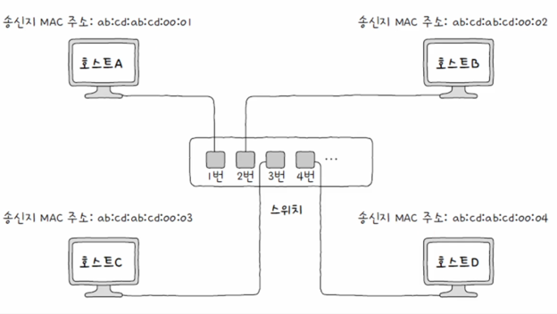

## NIC

---

통신 매체에는 전기, 빛 등 다양한 신호가 흐를 수 있습니다. 호스트가 이를 제대로 이해하려면 통신매체를 통해 전달되는
신호와 컴퓨터가 이해할 수 있는 정보 간에 변환이 이루어져야 합니다. 호스트와 유무선 통신 매체를 연결하고 이러한 변환을 담당하는 네트워크 장비가
**NIC**입니다.

요약하면 호스틀르 **LAN**에 연결하기 위한 하드웨어입니다.

 

## 허브

---

통신매체를 통해 송수신되 메시지는 다른 호스트에게 전달되는 과정에서 네트워크 장비를 거칠 수 있습니다.
물리계층에서는 **허브**이고, 데이터링크 계층은 **스위치**입니다.

 

### 물리 계층은 주소가 없다.

송수신지를 특정하는 주소는 **데이터링크**계층부터 존재합니다. 그렇기때문에 물리 계층의 장비들은 송수신되는 정보에 대한
어떠한 조작이나 판단을 하지 않습니다.
**데이터링크**계층의 주소는 **MAC**을 통해서 파악합니다.

다시돌아와서 **허브**는 여러 대의 호스트를 연결하는 장치입니다.

 

## 허브의 특징

허브는 오늘날 인터넷 환경에서 잘 사용되지 않는데 아래에 해당하는 이유때문입니다.

 

### 1. 전달받은 신호를 다른 모든 포트로 보냅니다.

허브는 물리계층에 속하기 때문에 주소를 식별할 방법이 없습니다. 그렇기 떄문에 허브를 통해 전달받은 정보들을 그저 내보내기만 합니다.
허브를 통해 이 신호를 전달받은 모든 호스트는 **데이터 링크 계층**에서 패킷의 **MAC**주소를 확인하고 자신과 관련없다면
폐기합니다.

 

### 2. 반이중 모드로 통신한다.

반이중 방식은 하나의 통신과정에서 송신 수신을 같이 수행할 수 없는것입니다.
무전기를 생각하면 말하는 도중에는 들을수없고, 듣는와중에는 말을할수 없습니다.

이러한 방식을 반이중 이라고합니다.

 

반이중 방식은 **콜리전 도메인**이라는 문제를 발생시킵니다.

**콜리전 도메인**이란 반이중 상황에서 동시에 송신하게 되면 충돌이 발생하고, 이렇게 충돌이 발생가능한, 같은 허브에 묶인 범위를
**콜리전 도메인**이라고합니다.

 

## CSMA/CD

---

CSMA/CD 는 반이중방식을 해결하는 해결법입니다. 각각 CS, MA, CD입니다.

첫번째로 **CS**는 **Carrier Sense**, 캐리어 감지입니다.

허브로 요청전에 현재 누가 데이터를 수신하는지 확인하는 과정입니다.

 

두번째로 **MA**는 **Multiple Access** 다중 접근을 의미합니다.

**MA**는 해결법이 아닌 실제로 충돌난 상황을 의미합니다.

 

세번째로 **CD**는 **Collision Detection** 충돌 검출을 의미합니다.

충돌이 발생하면 이를 검출하는데, 이를 **CD**라고 부릅니다. 충돌이 발생하면 특정 신호를 보내고 임의의 시간동안
기다린 후 다시 전송하게 됩니다

이처럼 **허브**의 **반이중 방식** 해결하기 위해서는 감지, 충돌 후 검출 방식을 이용합니다

 
 

## 스위치

---

데이터 링크 계층의 네트워크 장비입니다. L2 스위치라고도 설명합니다.
허브와 다른 특징은 **MAC 주소 학습**입니다.
이를 통해 특정 호스트에만 프레임을 전달할 수 있고, 전이중 방식을 지원합니다.

 

### 스위치의 특징

원하는 호스트에만 프레임을 전달할 수 있습니다. 스위치는 이러한 기능을 **MAC 주소 학습**이라 부릅니다.
이렇게 학습된 연관 정보를 **MAC 주소 테이블**이라고 부릅니다.

 

## MAC 주소 학습

---

3가지 기능을 이용해서 스위치의 기본 작동 방식을 이해할 수 있습니다.

1. 플러딩
2. 포워딩과 필터링
3. 에이징

 

기본적으로 알아야 할 내용은, 스위치는 **MAC 주소**를 학습할때 **송신지의 MAC 주소**를 학습합니다.

그림에서 호스트A가 스위치로 프레임을 전송하게 되면 스위치는 호스트 A의 MAC주소를 학습하는겁니다.

처음에는 허브처럼 모든 호스트로 프레임을 전송합니다. 그렇게 되면 해당 프레임을 받은 호스트들은 자신에게 온 정보가
맞는지 파악하고 아니라면 **폐기**, 맞다면 응답 프레임을 전송합니다. 이러한 과정에서 **응답 프레임**을 전송하였기 때문에
해당 호스트의 **MAC 주소 학습**이 이루어집니다.

여기서 **플러딩**은 허브처럼 모든 호스트에 **프레임**을 전송하는 것입니다.

 

이제 **MAC 주소**가 쌓여있다면 특정 호스트에 프레임을 보내야 할지 말아야할지 알게 됩니다. 그과정에서
특정 호스트에 **프레임**을 보내지 않는것을 **필터링**이라고 하며,
보내는 것을 **포워딩**이라고 합니다.

그리고 특정 시간동안 프레임을 전달받지 못한 **호스트**는 삭제 되는데 이것을 **에이징**이라고 부릅니다.

## 출처

---

[이미지 출처](https://www.inflearn.com/course/%ED%98%BC%EC%9E%90-%EA%B3%B5%EB%B6%80%ED%95%98%EB%8A%94-%EC%BB%B4%ED%93%A8%ED%84%B0%EA%B5%AC%EC%A1%B0-%EC%9A%B4%EC%98%81%EC%B2%B4%EC%A0%9C/dashboard)

