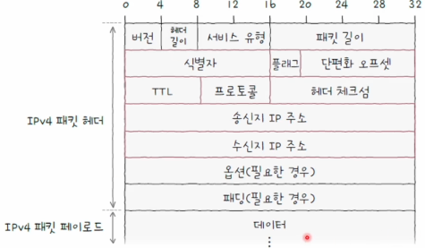
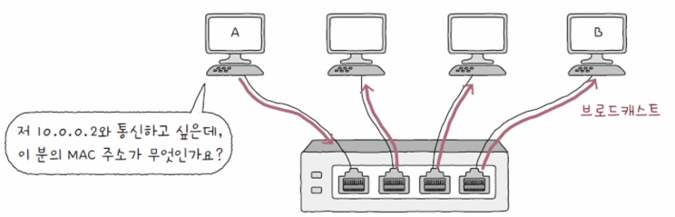
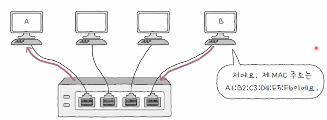

## 네트워크 계층이 필요한 이유?

---

이전 물리계층과 데이터링크 계층의 전송 범위는 **LAN**이라는 네트워크 속에서 이루어집니다.
하지만, 현대의 네트워크는 **LAN**과 **LAN**을 넘어 통신할 수 있습니다. 이러한 통신 범위를 **LAN**을 넘어 수행하는 계층이
**네트워크 계층**입니다.

 

## L1, L2 계층의 한계

---

### 1. 물리 계층과 데이터 링크 계층만으로는 다른 네트워크 까지의 도달 경로를 파악하기 어렵습니다.

**LAN**과 **LAN**을 넘나들기 위해서는 경로를 파악하는 **라우팅**기술이 필요합니다. 이러한 기술은 L3영역의 기술이기 떄문에
이전 계층에서는 다른 네트워크 간의 도달 경로를 파악하기는 어렵습니다.

### 2. MAC 주소만으로는 호스트의 위치를 특정하기 어렵습니다.

**MAC 주소**는 **NIC** 라는 장치의 고유번호와 같습니다. 이러한 정보를 토대로 **데이터 링크**계층에서는 특정 호스트를 식별할 수 있습니다.
하지만 택배로 비유를 들면 **MAC**주소는 그저 택배 송장속 수신인에 불과합니다. 이러한 정보만 가지고 택배를 운송할 수 없습니다.
조금더 넓은 범위의 **수신지**라는 정보가 필요한데 여기서 그 정보는 **IP**를 뜻합니다.

 
 

## 인터넷 프로토콜

---

네트워크 계층의 핵심은 **인터넷 프로토콜**이라고 부르는 통칭 **IP**에 있습니다.
두가지 버전이 있으며, **IPv4**, **IPv6**가 있습니다.

 

## IP 의 기능

---

**IP**는 대표적으로 **IP 주소 지정**, **IP 단편화** 기능을 수행합니다.

흔히 아는 **IP**의 기능은 **IP 주소 지정**입니다. 특정 지점을 식별하고 접근할 수 있게 하는 기능입니다.

하지만, **IP 단편화**에 대해서는 어색할 것입니다.

**IP 단편화**는 최대 전송 단위인 **MTU**를 설정하고, 이 **MTU**보다 큰 패킷이 전달되면 패킷을 분할하여 전달하는 것을 의미합니다.
이렇게 나누어진 패킷은 수신지에 도착하면 재조합되게 됩니다.

 
 

## IPv4

---

**IPv4**는 4바이트(32비트)로 주소를 표현할 수 있습니다. 숫자당 8비트로 표현되며 0~255 범위안에 있는 네개의 10진수로 표현됩니다.
각 10진수는 ,으로 표현되며 이러한 하나의 단위를 옷텟이라고 부릅니다.

> ex) 192.168.1.1

 

해당 그림은 **IPv4**의 헤더를 나타냅니다. 대표적으로 

1. 식별자
2. 플래그
3. 단편화 오프셋
4. TTL
5. 프로토콜
6. 송신지 IP 주소
7. 수신지 IP 주소

 
 

### 식별자

식별자는 패킷에 할당된 번호입니다. 전송과정에서 패킷이 여러 조각으로 쪼개져서 전송된다면, 수신지에서 이를 재조합하기 위해 사용되는 정보입니다.

 

### 플래그

플래그는 세개의 비트로 구성된 필드입니다. 첫비트는 항상 0으로 예약되어있고, 나머지 두개의 비트는 **DF(Don't Fragment)** 의 약어이며 **IP 단편화**를
막는 플래그입니다. 나머지 플래그는 **MF(More Fragment)** 로서 단편화된 패킷이 더있는지를 나타냅니다.

 

### 단편화 오프셋

단편화된 패킷이 초기 데이터에서 몇 번째로 떨어진 패킷인지를 나타냅니다. 단편화되어 전송되는 패킷들은 수신지에 순서대로 온다는 보장이 없기 때문에,
이를 재조합하려면 단편화된 패킷이 초키 데이터 기준 얼마나 떨어져있는지 오프셋이 필요하고 이를 지정합니다.

 

### TTL

패킷이 호스트 또는 라우터에 한 번 전달되는 것을 **홉**이라고 합니다. **TTL**필드의 값은 홉마다 1씩 감소합니다.

 

### 프로토콜

**IP패킷**의 프로토콜은 상위 계층의 프로토콜이 어떤 프로토콜이닞 나타내는 필드입니다.

 
 

## IPv6

---

**IPv6**의 등장은 **IPv4**만으로 지구상의 네트워크 갯수가 부족한 상황을 대비해 그보다 더많은 16바이트(128비트)로 주소를 표현하는 것입니다.

 
 

## ARP(Address Resolution Protocol)

---

**IP주소**를 통해 **MAC**주소를 알아내는 프로토콜 입니다. 동일 네트워크내에 있는 송수신 대상의 **IP**를 통해 **MAC**주소를 알 수 있습니다.

세가지 단계를 거쳐서 이를 수행할 수 있습니다.

1. ARP 요청
2. ARP 응답
3. ARP 테이블 갱신

### 1. ARP 요청

우선 A는 네트워크 내의 모든 호스트에게 브로드캐스트 메시지를 보냅니다. 이 메시지는 **ARP 요청**이라는 ARP 패킷입니다.

 

### 2. ARP 응답

네트워크 내의 모든 호스트가 ARP 요청 메시지를 수신하지만, B를 제외한 나머지 호스트는 자신의 IP 주소가 아니므로 이를 무시합니다.

B는 자신의 MAC주소를 담은 메시지를 A에게 전송합니다. 이 유니캐스트 메시지는 ARP응답이라는 ARP패킷입니다.

 

### 3. ARP 테이블 갱신

ARP응답을 받게 되면 해당 호스트는 IP주소와 MAC주소를 매핑하여 저장합니다.
ARP 테이블은 일정 시간이 지나면 삭제되고, 임의로 삭제할 수도 있습니다.

## 출처

---

[이미지 출처](https://www.inflearn.com/course/%ED%98%BC%EC%9E%90-%EA%B3%B5%EB%B6%80%ED%95%98%EB%8A%94-%EC%BB%B4%ED%93%A8%ED%84%B0%EA%B5%AC%EC%A1%B0-%EC%9A%B4%EC%98%81%EC%B2%B4%EC%A0%9C/dashboard)

