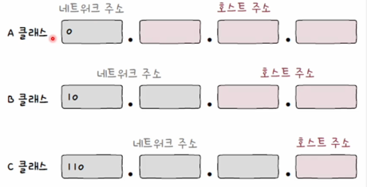
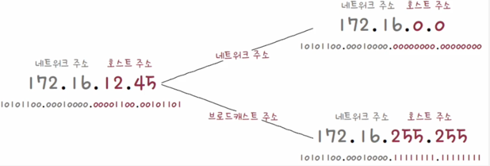
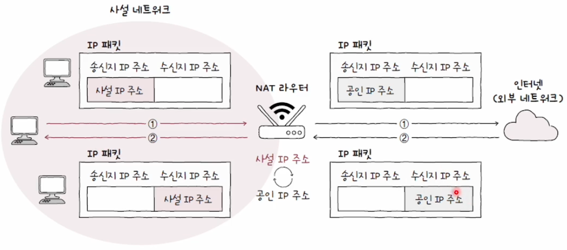

# IP주소

---

하나의 **IP주소**에는 크게 두가지 지점으로 나누어집니다. **네트워크 주소**와 **호스트 주소**입니다.

 

## 네트워크 주소, 호스트 주소

---

**네트워크 주소**는 네트워크를 식별하는 역할을 하며, **호스트 주소**는 호스트를 식별하는 역할을 합니다.

하나의 **IP**는 네트워크 주소 지점과 호스트 주소 지점이 다릅니다. 현재 그림은 각 주소에 16비트를 할당받은
모습을 보이지만 옥텟을 기준으로 네트워크를 8비트 혹은 24비트를 할당받는 것 또한 가능합니다.
즉 네트워크와 호스트 주소의 범위는 유동적입니다.

**IP**주소를 유동적으로 할당하는 것에는 고려할 부분이 있습니다.

**호스트 주소**를 24비트 할당받게 되면 호스트가 할당되지 않는 부분에 대해서 **IP**를 낭비될 수 있습니다.
그렇다고 **네트워크 주소**를 24비트 할당받게 되면 필요한 호스트의 수가 줄어들 수 있습니다.

이러한 문제를 해결하기 위해 **호스트 주소**, **네트워크 주소**의 크기를 분류하는 기준을 정해 두었고 그것을
**클래스**라고 부릅니다.

 
 

## 클래스풀 주소 체계

---

**클래스**를 통해 네트워크 크기를 가변적으로 조정해 네트워크와, 호스트 주소를 구획할 수 있습니다.
이렇게 클래스를 기반으로 **IP**주소를 관리하는 방식을 **클래스풀 주소 체계**라고 합니다.

 

그림은 대표적인 **클래스풀 주소**의 3가지 클래스입니다.

- A클래스: 네트워크주소 1옥텟, 호스트 주소 3옥텟, 네트워크 주소 초기 시작 비트가 0
- B클래스: 네트워크주소 2옥텟, 호스트 주소 2옥텟, 네트워크 주소 초기 시작 비트가 10
- C클래스: 네트워크주소 3옥텟, 호스트 주소 1옥텟, 네트워크 주소 초기 시작 비트가 110

각 클래스는 이러한 특징이 있습니다.

예를 들어 A클래스는 초기 시작 **네트워크**주소가 0으로 할당되어 있기 때문에 네트워크 주소에 2^^(8-1) = 128 만큼 할당할 수 있고,
호스트 주소에는 2^^24 만큼 할당할 수 있습니다.
이러한 방식에서 첫 옥텟 크기가 0~127 사이라면 **A클래스**를 짐작할 수 있습니다.

 

### 호스트 주소의 약속

호스트 주소에는 하나의 약속이 있습니다. 호스트 주소가 전부 0인경우와 전부 1인 IP주소는 예약된 호스트 주소입니다.

해당 그림처럼 비트를 기준으로 모두 0이거나, 모두 1인경우는 각각 네트워크 자체를 의미하는 주소 그리고 브로드캐스트를
위한 주소로 사용되기 떄문입니다.

 
 

## 클래스리스 주소 체계

---

이전 클래스 풀 주소 체계는 한가지 문제가 있습니다. 클래스별 네트워크와 호스트 크기가 고정되어있고, 고정된 클래스를
선택하는 것입니다. 이는 유동적으로 **호스트 IP**를 할당할 수 없습니다.
대략 수적으로 계산해도 , 1600만개 or 6만개 or 254개 순으로 A,B,C 클래스는 호스트의 갯수를 가지게 됩니다.

각 클래스간 차이가 극적으로 변하기 때문에 비효율적인 IP가 남거나 부족한 경우가 많습니다.
그렇기 때문에 클래스를 사용하지 않고 각 비트 단위로 **네트워크**, **호스트**주소를 나누는 **클래스리스 주소**
체계가 등장했습니다.

**클래스리스**체계에서 네트워크와 호스트간 구역을 구분 짓는 임의의 지점이 필요한데, 그 지점을 바로 **서브넷 마스크**를
통해서 구분짓습니다.

 

### 서브넷 마스크

**서브넷 마스크**란 **IP 주소**상에서 네트워크 주소를 1, 호스트 주소를 0으로 구분 짓는 비트열 표기법입니다.

이전 A클래스를 기준으로 설명하자면 

그림처럼 1옥텟, 3옥텟 주소를 A클래스는 가지고 있습니다.
각 8비트, 24비트를 네트워크와 호스트 주소에 할당할 수 있다는 의미가됩니다.

즉 이를 서브넷 마스크로 변경하게 된다면,

> 11111111.00000000.00000000.00000000

이렇게 됩니다.

 

### 서브네팅

서브네팅이란 서브넷 마스크를 이용해서 네트워크와 호스트 주소를 구분 짓는 방법입니다.
**IP**주소와 **서브넷마스크**를 알고있을때, 어떻게 네트워크 주소와 호스트 주소를 구분하는가에 대한 방법입니다.

방법은, **IP주소**와 **서브넷마스크**를 비트 AND 연산을 수행하여 0으로 나오는 지점이 **호스트 주소**라는것을
통해 알 수 있습니다.

 

### CIDR 표기법

**CIDR**표기법은 **서브넷 마스크**를 표기하는 방법입니다. **1의 갯수**즉 네트워크 주소의 비트 수를 
IP주소뒤에 붙이는 방식입니다.

> ex) 192.168.219.103/24

 

다시 본론으로 돌아와서 **클래스 리스**방식은 **서브넷 마스크**를 이용해 **네트워크**와, **호스트**를 구분짓는 방식입니다.

 
 

## 공인 IP, 사설 IP

---

**IP주소**는 고유한 주소가 있고, 고유하지 않은 주소가 있습니다.

 

### 공인 IP

**공인IP**주소는 전 세계에서 고유한 IP 주소입니다. 네트워크 간의 통신, 이를테면 인터넷을 이용할 때 사용하는
IP주소가 공인 IP입니다. 이러한 주소는 ISP나 기관을 통해 받을 수 있습니다.

 

### 사설 IP

**사설IP**란 사설네트워크 속 이용되는 **IP입니다**. 외부에서 별도로 할당받지 않은 **IP**들입니다.
이러한 IP는 **라우터**에 의해서 할당받습니다. 사설 네트워크에서 고유한 주소이기 떄문에 다른 네트워크의
사설 IP와 중복될수 있습니다.

 

### NAT

이러한 사설 IP와 공인 IP간의 통신을 하기 위해서 IP주소를 변환하는 기술이 **NAT**이라는 기술입니다.

가정환경에서는 공유기가 **NAT**기능을 수행합니다. 내부에서 나갈때는 공인 IP로 변경하고, 반대로 들어올때는
사설 IP로 변경합니다.

 
 

## 정적 IP, 동적 IP

---

호스트가 **IP**를 할당받는 방식에는 크게 두가지가 있습니다.
정적IP할당과 동적IP할당입니다.

 

### 정적 IP할당

정적 IP할당이란 호스트에 직접 수작업으로 IP주소를 부여하는 방식입니다. 네트워크 설정에서 IP혹은 여타한
정보들을 수동적으로 등록하는 방식입니다. 하지만, 이런방식은 호스트 수가 많아질때 수동으로 잘못할당하는 경우에
대비하기 어렵습니다.

 

### 동적 IP할당

정적 IP할당은 휴먼에러를 통해 발생하는 문제를 줄이기 위해 **동적**으로 자동할당 되는 방식을 이용합니다.

이렇게 **동적**으로 할당하기 위해서는 대표적으로 **DHCP**라는 프로토콜을 이용합니다. 이러한 **DHCP**는
응용 계층에 속합니다.

**DHCP**동작 방식은 IP를 받고자 하는 호스트와 이를 제공하는 DHCP서버간 통신입니다.
일반적인 가정환경은 공유기가 수행합니다.

DHCP가 할당하는 **IP**주소는 기간이 정해져있습니다. 이러한 기간이 지나면 반납하거나 연장해야 합니다.

**호스트**가 **IP**를 할당받기 위해서는 4가지의 과정이 필요합니다.

1. DHCP Discover
2. DHCP Offer
3. DHCP Request
4. DHCP Ack

과정을 거치게 됩니다.

### DHCP Discover

호스트는 **DHCP 서버**를 찾기 위해 브로드 캐스트 전송을 하며, 이과정에서 아직 호스트는 IP를 할당받지 못해
0.0.0.0이라는 주소를 통해 전송합니다.

### DHCP Offer

DHCP 서버는 메시지를 받은 뒤 클라이언트에게 DHCP Offer 메시지를 보냅니다. Offer는 영어로 제안하다라는
뜻입니다. 즉, 이 메시지를 클라이언트에게 할당해 줄 IP 주소를 제안하는 메시지입니다. 이곳에는 서브넷마스크나,
임대기간같은 정보가 같이 포함됩니다.

### DHCP Request

Offer메시지에 대한 응답입니다. 이 부분에서 브로드 캐스트 전송이 됩니다.

### DHCP ACK

최종 승인 메시지입니다. 이 메시지를 받은 호스트는 해당 정보를 토대로 IP와 임대기간을 지키게 됩니다.

 
 

## 출처

---

[이미지 출처](https://www.inflearn.com/course/%ED%98%BC%EC%9E%90-%EA%B3%B5%EB%B6%80%ED%95%98%EB%8A%94-%EC%BB%B4%ED%93%A8%ED%84%B0%EA%B5%AC%EC%A1%B0-%EC%9A%B4%EC%98%81%EC%B2%B4%EC%A0%9C/dashboard)

