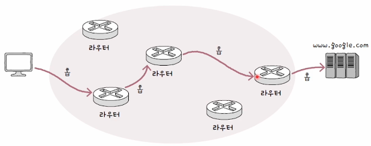
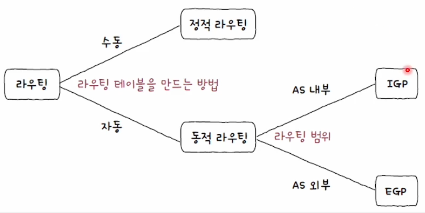
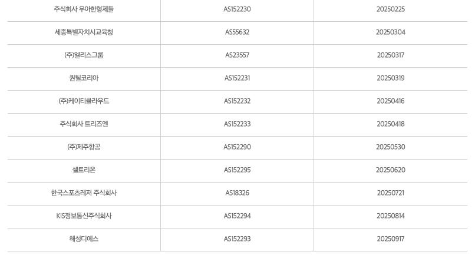
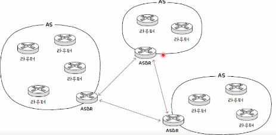
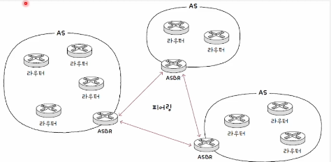

## 개요

---

**라우팅**이란 패킷이 이동할 최적의 경로를 설정한 뒤 해당 경로로 패킷을 이동시키는 것입니다.
**라우팅**에서 중요하게 다룰 내용은, **라우팅 테이블** 그리고 **라우팅 프로토콜**입니다.

 
 

## 라우터

---

**라우터**는 네트워크 계층의 핵심 장비입니다. **라우팅**을 담당하며, 가정 환경에서는 공유기가 라우터의 기능을 대신 수행합니다.
호스트는 패킷을 다른 네트워크로 전송하기 위해 **라우터**의 도움을 받으며, 그 과정에서 라우터간의 요청도 있을 수 있습니다.

하나의 네트워크에서 또다른 네트워크로 넘어가기 위해 호스트, 라우터 간의 요청이 있는데 이러한 하나의 요청 과정을 **홉**이라고 부릅니다.

 
 

## 라우팅 테이블

---

**라우팅**을 수행하기 위해서는 **라우터**는 **라우팅 테이블**을 통해 정보를 관리합니다. 대표적으로 **수신지 IP주소**, **서브넷 마스크**,
**다음 홉**등의 정보가 있습니다.

| 수신지 IP주소    | 서브넷 마스크       | 게이트웨이       | 인터페이스 | 메트릭 |
|-------------|---------------|-------------|-------|-----|
| 192.168.2.0 | 255.255.255.0 | 192.168.2.1 | eth0  | 30  |

해당 표처럼 정보가 저장되게 됩니다.
하지만 해당 표에서는 특정 위치로 패킷을 전송하기를 원하는데, 테이블에 없는 경로로 패킷을 전송해야 할 떄가 있습니다.
이 처럼 패킷을 내보낼 기본 경로를 **디폴트 라우트**라고 하며, 이는 모든 IP주소인 0.0.0.0/0으로 명시합니다.

 
 

## 라우팅 테이블을 만드는 두가지 방식

---

라우팅 테이블을 만드는 두가지 방법이 있습니다. 하나는 정적으로 사용자가 테이블을 생성하는 방식이고, 두번째는 동적으로 테이블을 생성하는 것입니다.
**정적 라우팅** 자체는 사용자가 수동으로 테이블을 생성하는 것이기 떄문에 **동적 라우팅**에 대해서만 설명합니다.

 

### 동적 라우팅

네트워크 규모가 커지면 사용자가 테이블을 생성하고 관리하고 어렵습니다. 또한 특정 루트에 문제가 발생하였어도 **정적 라우팅**방식이면, 해당 문제가
발생한 루트를 계속 사용하여야 한다는 문제가 있습니다.

동적 라우팅을 수행하기 위해서는 **모든 라우터**는 **경로**를 **공유**한다는 것을 알아야 합니다. 

이렇게 경로를 공유하는 방법을 **라우팅 프로토콜**이라고 부르며, 각 프로토콜마다 어떤 정보를 어떻게 공유할건지는 상의합니다.

 

## 라우팅 프로토콜

---

라우팅 방식과 라우팅 프로토콜은 그림처럼 분류 할 수 있습니다.
그중 동적 라우팅을 수행하기 위해서는 **라우팅 범위**를 통해서 **라우팅 프로토콜**을 구분합니다.

여기서 **AS**라는 개념이 나오게 되는데,

### AS(Autonomous System)

집단 네트워크를 **AS**라고 부릅니다. 회사나 단체에서 관리하는 라우터 집단입니다.

**AS**는 고유한 번호이며 쉽게 검색을 통해 확인할 수 있습니다.

그림처럼 **AS**내부에는 여러 라우터가 있고, **AS**간의 통신을 위해서라면 **ASBR**이라는 **AS 경계 라우터**를 통해서 통신을 해야합니다.

 
 

다시 라우팅 프로토콜로 돌아와서 라우팅이 수행되는 범위에 따라 **AS**의 내부, 외부로 나누어집니다.
전자를 **IGP(Interior Gateway Protocol)**, **EGP(Exterior Gateway Protocol)** 이라고 부릅니다.

 

## IGP

---

대표적인 **IGP**은 **RIP**, **OSPF** 방식이 있습니다.
각각 **거리벡터**, **링크 상태**를 통해 구분짓는 방식입니다.

 

### RIP(Routing Information Protocol)

**RIP**방식은 **거리 벡터**를 이용합니다. 여기서 거리벡터의 기준은 **홉**의 수입니다.
즉 최적의 경로를 찾기위해 **홉**을 가장적게 거쳐가는 방식을 최우선으로 고르게 됩니다.

**RIP**는 인접한 라우터끼리 정보를 주기적으로 교환하여 라우팅 테이블을 갱신합니다. 이를 통해 특정 위치에 도달하기 위한 최적의 경로를 계산합니다.

 

### OSPF(Open Sortest Path First)

네트워크는 **노드**와 **간선**으로 이루어져 있고, 이를 **OSPF**방식에서는 **링크 상태 데이터베이스**에 저장합니다. 이 데이터베이스에는
라우터들간의 연결관계, 연결 비용 등 현재 네트워크의 상태를 그래프로 표현하기 위한 정보가 저장됩니다.
**OSPF**에서는 **대역폭**을 통해서 최적을 경로를 계산합니다.

**RIP**방식과 정보 갱신의 차이가 있는데, **RIP**방식은 주기적인 주변 라우터 들 간의 정보 교환을 통해 정보를 갱신하지만, **OSPF**방식은
네트워크 구성이 변경되었을 떄 라우팅 테이블을 갱신합니다.

이런 방식은 네트워크 단위가 커질때 부담이 되기 떄문에 같은 **AS**도 **에어리어**라는 단위로 나누고, **AS**안에 세분화된 **AS**를 통해 관리합니다.

 

## EGP

---

대표적인 **EGP**는 **BGP**방식이 있습니다.
**EGP**자체가 외부 통신이 가능한 프로토콜이기 떄문에 보다 좁은 **AS**간 내부 통신도 지원합니다.
여기서 내부 통신을 위한 **BGP**를 **IBGP**, 외부통신을 위한 **BGP**를 **EBGP**라고 부르게 됩니다.

 
 

### 피어와 피어링

**BGP**에서는 다른 **AS**간 통신을 하기위해 **BGP 라우터**간 정보를 주고받을 수 있어야 하고, 이렇게 메시지를 주고받을 수 있게 연결된
**라우터**를 **피어**라고 부르며, 이 **피어**간의 통신을 **피어링**이라고 합니다.

 
 

### BGP의 특징

BGP는 **두가지** 특징이 있습니다.
첫번째는, **AS**간 라우팅은 **라우터**의 수를 홉으로 계산하는 것이아닌, **AS**의 수를 고려합니다.

두번쨰는, **BGP**는 **RIP**처럼 거리가 아닌, 경로를 고려합니다.
여기서 거리가 아닌 경로를 표현하는 이유는, 자기 참조 순환을 방지하기 위해서입니다.

 
 

## BGP의 속성

**BGP**는 최적 경로를 결정하는 과정이 **속성**을 고려하기 때문에 일정하지 않습니다.
**속성**이란 **BGP**의 부가정보입니다

### AS-PATH 속성

**AS-PATH**는 메시지가 수신지에 이르기까지 거쳐간 **AS**의 목록입니다.

 

### NEXT-HOP 속성

**NEXT-HOP** 속성은 다음 홉, 다음으로 거칠 라우터의 **IP**를 나타냅니다.

 

### LOACL-PREF 속성

**LOACL-PREF**은 지역 선호도의 약자입니다. 
해당 속성은 효율보다 정책을 고려할 수 있고, 그렇기 떄문에 앞선 두가지 속성보다 우선시 되는경우가 많습니다.
예를 들어 다른 루트로 가는것이 효율적일지라도, 특정 지점을 거쳐야 한다면 이것은 최우선으로 고려해야 하는 **정책**입니다.

## 출처

---

[이미지 출처](https://www.inflearn.com/course/%ED%98%BC%EC%9E%90-%EA%B3%B5%EB%B6%80%ED%95%98%EB%8A%94-%EC%BB%B4%ED%93%A8%ED%84%B0%EA%B5%AC%EC%A1%B0-%EC%9A%B4%EC%98%81%EC%B2%B4%EC%A0%9C/dashboard)

