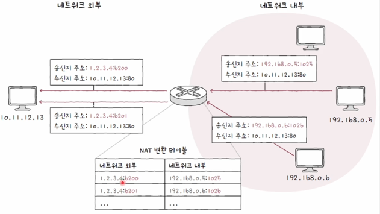

## 전송 계층에 대해 알아보기

---

**전송 계층**의 역할은 크게 3가지로 볼 수 있습니다.

1. **신뢰할 수 있는 통신**
2. **연결형 통신**
3. **포트를 이용한 응용 계층의 애플리케이션 식별**

해당 특징에서 1번 2번은 이전 네트워크 계층의 한계를 극복한 특징이라면, 3번은 **전송 계층**만의 특징이라고
생각해 볼 수 있습니다.

이러한 전송계층의 특징을 알기 위해서 **네트워크 계층**에서 왜 1번 2번이 문제가 되는지 알아야 합니다.

 
 

## 신뢰할 수 없는 통신과 비연결형 통신

---

네트워크 계층은 **IP 주소지정**, **IP 단편화**의 역할을 수행합니다.
하지만 네트워크 계층의 정보는 **신뢰할 수 없는 프로토콜**이며, **비연결형 프로토콜**입니다.

### 신뢰할 수 없는 통신

**IP 프로토콜**은 패킷이 수신지까지 제대로 전송되었다는 보장을 하지 않습니다.
이는 통신 과정에서 패킷의 데이터가 손상되었거나, 중복되었거나 의 문제를 체크할 수 없고, 문제가 발생한다고 해서
이것을 해결할 능력도 없습니다.

이를 **최선형 전달**이라고 부르지만, 이는 전송에 대한 최선을 보장하지만, 결과에 대해서는 보장하지 않는다는
의미를 함유합니다.

 

### 비연결형 통신

송수신 호스트 간에 사전 연결 수립 작업을 거치지 않는다는 특징이 있습니다.

이는 **성능**에 직접적인 영향을 주는 부분으로서, 모든 패킷을 확인하고 처리하는 과정은 **패킷**을 처리하는데
오버헤드를 발생시키기 때문에 **비연결형 통신**이 사용됩니다.

모든 패킷이 안전하게 송수신되야 하는것은 아닙니다. 금융권 서비스에서는 안정성을 중요시 할테지만, 영상 스트리밍 서비스에서는
패킷 몇개가 손실이 발생하여도, 잠깐 문제가 발생할뿐 영상을 보는데는 문제가 없기 떄문입니다.

이러한 이유로 **네트워크**계층은 비연결형 방식을 사용합니다.

 
 

## 전송 계층은 IP의 한계를 보완한다.

---

 

### 1. 전송 계층은 연결형 통신을 가능하게 합니다.

**전송 계층**은 연결형 통신을 지원하기 위해 대표적으로 **TCP**프로토콜을 사용합니다.
**TCP**프로토콜은 두 호스트가 정보를 주고받기 전에 가상의 회선을 설정하듯이 연결을 수립합니다.

 

### 2. 전송 계층은 신뢰성 있는 통신을 가능하게 한다.

**전송 계층**은 신뢰성 있는 통신을 위해 **TCP**를 사용합니다. 여기서 **TCP**는 패킷이 수신지까지
올바르게 전송되는 것을 보장하기 위해, **재전송을 통한 오류 제어**, **흐름 제어**, **혼잡 제어**등 기능을 사용합니다.

하지만, 이전에 모든 패킷이 **신뢰성**, **성능**을 고려할때 **성능**이 우선되어야 하는 경우가 있다고 했습니다.
**전송계층**에서는 그러한 경우에 대비해서 **UDP**라는 **비연결형**, **신뢰할 수 없는 통신**을 이용합니다.

 
 

## 전송 계층만의 특징 포트

---

### 포트란?

특정한 호스트는 여러개의 응용프로그램을 실행하고 있습니다.
호스트간 통신에서 패킷을 전달할때 A라는 응용프로그램에 필요한 정보를 수신받았다고 가정합니다.
지금까지의 호스트간 통신에서는 특정 호스트로 패킷을 보냈습니다.

하지만, 패킷이 필요한건 특정 응용프로그램이지 호스트가 아닙니다. 이 패킷을 호스트가아닌 호스트에 속한
특정 프로그램을 식별해서 그곳으로 전달할 수 있어야 합니다.

여기서 특정 프로그램을 식별하는 역할을 수행하는것이 **포트**입니다.

 

### 포트의 분류

전송계층에서는 **포트 번호**를 통해 특정 어플리케이션을 식별합니다.

전송계층 프로토콜인 **TCP**와 **UDP**모두 포트라는 정보를 포함합니다.
포트번호는 16비트로 표현 가능하며, 사용 가능한 포트의 수는 2**16(65536)입니다.

이러한 포트는 범위로 나눠지게 됩니다.

| 포트종류     | 포트 번호 범위      |
|----------|---------------|
| 잘 알려진 포트 | 0 ~ 1023      |
| 등록된 포트   | 1024 ~ 49151  |
| 동적 포트    | 49152 ~ 65535 |

 

### 잘 알려진 포트

범용적으로 사용되는 포트를 **잘알려진 포트(well-known-port)** 라고 부릅니다.
대표적인 예시는 아래와 같습니다.

| 잘 알려진 포트 | 설명     |
|----------|--------|
| 20, 21   | FTP    |
| 22       | SSH    |
| 23       | TELNET |
| 53       | DNS    |
| 67, 68   | DHCP   |
| 80       | HTTP   |
| 443      | HTTPS  |

 

### 등록된 포트

잘 알려진 포트에 비해 덜 범용적이지만, 자주 사용되는 어플리케이션 프로토콜에 할당하기 위해 사용합니다.

| 등록된 포트 번호 | 설명            |
|-----------|---------------|
| 1194      | OpenVPN       |
| 1433      | MS SQL SERVER |
| 3306      | MYSQL         |
| 6379      | Redis         |
| 8080      | HTTP 대체       |

 

### 동적 포트

49152번부터 65535번까지를 **동적포트**라고 부릅니다. 인터넷 할당 관리 기관에 의해 할당된 애플리케이션 프로토콜이 없고ㅡ
특별히 관리되지 않는 포트 번호인 만큼 자유롭습니다.

보통 서버는 사전에 정의된 포트를 이용하지만, 클라이언트 프로그램은 **동적 포트**에서 할당 받습니다.
대표적으로 **웹 브라우저**가 이에 속합니다.

 
 

## 포트 기반 NAT

기존 **NAT**은 특정 공인IP와 사설IP를 1대1로 매핑해서 외부 네트워크와 내부 외트워크 주소를 변환하는 기술이였습니다.

하지만, 이런 기술의 문제는 **사설IP**가 늘어날수록, **공인IP**주소도 많아져야 합니다.
왜냐하면 둘의 IP는 1대1로 매핑되어야 하기 때문입니다.

**공인 IP**주소는 한정되었기 때문에 이들을 1대1로 매핑하기 위해서는 **포트**를 이용할 수 있습니다.

 

### NAPT

포트 기반의 APT방식을 **NAPT**라고 합니다. 

이러한 NAPT기술은 여러개의 사설IP가 특정한 공인IP에 해당하여 포트를 기반으로 접근하는 것을 가능하게 합니다.

 

### 포트포워딩

해당 **NAPT**는 포트를 도입한 **NAT**방식입니다.
이는 외부에서 처음 들어오는 요청에 대해서는 조금 다른 양상을 보입니다.

만약 내가 특정한 서버를 열었고, 외부에서 해당 서버로 접근한다고 가정합니다.

그럼 외부에서 들어오는 요청에 대한 NAT변환 테이블이 없습니다. 이를 해결하기 위해 **포트포워딩**이라는
기술을 사용하게 됩니다.

**포트포워딩**이란 외부에서 들어오는 정보를 특정 내부 **IP**와 **포트**에 할당한뒤 이를 외부 네트워크에 알려
이후부터 특정 내부 지점으로 들어오기 위해 사전에 약속된 포트로 접속하는것을 의미합니다.

 
 

## 네트워크 계층에서 단점 보완

---

**IP**는 신뢰할 수 없고, 비연결형 전송이라는 특징을 가지고 있습니다.
이를 **네트워크 계층**에서 보완하는 방법이 있는데 이를**ICMP**라고 부릅니다.

 

## ICMP(Internet Control Message Protocol)

ICMP는 IP패킷의 전송 과정에 대한 피드백 메시지를 얻기 위해 사용하는 프로토콜입니다.

**ICMP** 메시지는 크게 두가지로 나누어집니다.

1. 전송과정에서 발생한 문제 상황에 대한 오류 보고
2. 네트워크에 대한 진단 정보

또한 **ICMP**는 타입과 코드로 정의됩니다.
타입 필드는 ICMP 메시지의 유형이 번호로 표시되고, 코드에는 구체적인 메시지 내용이 번호로 표시됩니다.

| 타입이름(타입 번호) | 코드 번호 | 코드 설명               |
|-------------|-------|---------------------|
| 수신지 도달불가(3) | 0     | 네트워크 도달 불가          |
|             | 1     | 호스트 도달 불가           |
|             | 2     | 프로토콜 도달 불가          |
|             | 3     | 포트 도달 불가            |
|             | 4     | 단편화가 필요한데 DF가 1로 설정 |
| 시간 초과(11)   | 0     | TTL 만료              |
| 에코 요청(8)    | 0     | 에코 요청               |
| 에코 응답(0)    | 0     | 에코 요청에 대한 응답        |
| 라우터 광고(9)   | 0     | 라우터 광고              |

대표적으로 **오류 보고**를 위해 3번 11번이 있고, 정보 제공을 위해 8번 0번 9번이 있습니다.

이러한 **ICMP**는 알림의 역할을 수행하며 문제를 알려줄뿐 근본적인 **신뢰성**을 수립하는 역할을 수행하지는 않습니다.

## 출처

---

[이미지 출처](https://www.inflearn.com/course/%ED%98%BC%EC%9E%90-%EA%B3%B5%EB%B6%80%ED%95%98%EB%8A%94-%EC%BB%B4%ED%93%A8%ED%84%B0%EA%B5%AC%EC%A1%B0-%EC%9A%B4%EC%98%81%EC%B2%B4%EC%A0%9C/dashboard)

