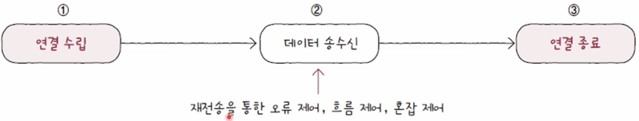
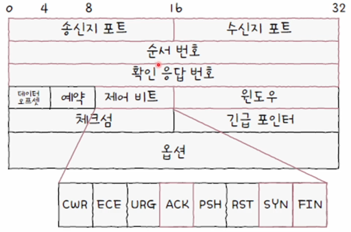
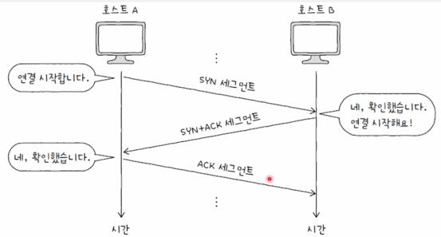
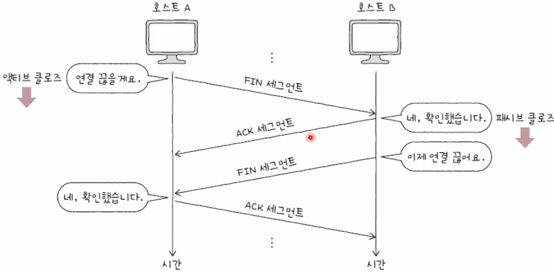

## 전송계층의 대표적인 프로토콜

---

전송계층의 대표적인 프로토콜에는 **TCP**와, **UDP**가 있습니다.
**TCP**는 신뢰할 수 있는 연결형 프로토콜이고, **UDP**는 빈신뢰성 비연결형 프로토콜입니다.

 

## TCP

---

TCP에 대한 통신을 크게 세 단계로 나누어 볼 수 있습니다.
기본적으로 **연결수립**, **데이터 송수신**, **연결종료**과정을 거치게 됩니다.
이중에서 데이터 송수신 과정에서 재전송을 통한 오류, 흐름, 혼잡 제어를 수행합니다.

**TCP**의 연결수립과 종료는 **MSS**라는 단위와 TCP의 세그먼트 구조를 이해해야 합니다.
이는 **TCP**를 전송할 수 있는 최대 크기의 페이로드의 단위입니다.

또한, 헤더 구조를 이해해야 합니다.

### TCP 헤더

 

 

헤더는 그림과 같으며 대표적으로

1. 송신지 수신지 포트
2. 순서 번호
3. 확인 응답 번호
4. 제어 비트
5. 윈도우

라는 중요한 값을 가집니다.

 

### 제어 비트

제어비트란 현재 요청에 대한 상태를 나타내는 필드입니다.
대표적으로,

1. ACK: 세그먼트의 승인을 나타내는 필드
2. SYN: 연결을 수립하기 위한 비트
3. FIN: 연결을 종료하기 위한 비트

가 있습니다.

 

### 순서번호와 확인 응답 번호

순서 번호 필드에 명시되는 **순서 번호**는 세그먼트의 올바른 송수신 순서를 보장하기 위한 번호입니다.

처음 통신을 수립하는 SYN플래그가 1인경우는 **초기 순서 번호**라는 랜덤한 값을 보내고, 이후 순서 번호는
**초기 순서 번호** + **송신한 바이트 수** 입니다.

이후 **확인 응답 번호**라는 것을 보내게 되는데, 이는 수신한 순서 번호에 +1을 더해서 보내게 됩니다.

 

## TCP 연결

---

**TCP 연결**과정은 **쓰리 웨이 핸드셰이크**라고 부르게 됩니다.

해당 그림을 통해서 설명하면 연결을 시작하는 호스트의 과정을 **액티브 오픈**, 그 반대를 **패시브 오픈**이라고 합니다.

초기 액티브 호스트가 **SYN** 비트를 1로 변경한후 요청을 합니다. 이를 받은 패시브 호스트가**SYN**, **ACK**비트를
1로 변경한후 요청을 합니다. 이를 받은 액티브 호스트는 이 세그먼트를 받고 **ACK** 요청을 다시 보냅니다.

 

## TCP 연결 종료

---

**TCP 연결 종료** 과정은4단계로 구성되며 이를 **포 웨이 핸드셰이크**라고 부릅니다.

보내는 측 여기서는 클라이언트로 고정하고, 클라이언트는 FIN/ACK 값을 1로 만들어 서버측으로 패킷을 송신합니다.

이를 받은 서버는 패시브 클로즈 처리를 시작합니다. 클라이언트 측으로 받은 요청에 대한 ACK처리를 합니다.

서버는 이번에 자신의 어플리케이션에서 클로즈 요청이 오게 되면 FIN/ACK 패킷을 송신합니다.

클라이언트는 패킷을 받고 TIME-WAIT라는 상태로 전환합니다. 이상태는 서버가 마지막으로 ACK를 못받을 경우에 대비한 상태입니다.

ACK를 받은 서버는 CLOSED상태로 전환하고 커넥션을 삭제합니다. 이와 함깨 모든 자원을 해제 합니다.

클라이언트 측도 같은 과정을 반복합니다.

## 출처

---

[이미지 출처](https://www.inflearn.com/course/%ED%98%BC%EC%9E%90-%EA%B3%B5%EB%B6%80%ED%95%98%EB%8A%94-%EC%BB%B4%ED%93%A8%ED%84%B0%EA%B5%AC%EC%A1%B0-%EC%9A%B4%EC%98%81%EC%B2%B4%EC%A0%9C/dashboard)

