## 개요

---

TCP 연결, 종료 중간 과정인 데이터 송수신 과정에서 **오류 제어**, **흐름 제어**, **혼잡 제어**등을
이용해서 **신뢰성**을 얻는 방법 방법에 대해서 다룰것입니다.

 
 

## 오류 제어: 재전송 기법

---

TCP는 잘못된 세그먼트를 처리하기 위해 세그먼트를 **재전송**하는 방법을 이용합니다.
그렇다면 어떻게 **잘못된 상황을 인지** 할 수 있을까요?

 
 

## 오류 검출과 재전송

---

**TCP 신뢰성**을 보장하기 위해서는 두개의 방안이 필요합니다.

1. 송신 호스트가 송신한 세그먼트에 문제가 발생함을 인지하여야 하고
2. 오류를 감지하게 되면 해당 세그먼트를 재전송할 수 있어야 합니다.

즉 보내는 곳에서 잘못된 상황을 인지하고, 잘못된 세그먼트를 보내야 하는것이다.

여기서 중요한 부분은 **1번**이다. 2번은 발생환 결과를 해결하는 방법이기 때문에 자연스럽게 진행할 수 있지만,
1번을 검출할 기준이나 방법이 필요하기 때문입니다.

여기에는 두가지 상황을 고려할 수 있습니다.

 

### 첫째, 중복된 ACK 세그먼트를 수신했을 때

TCP는 중복된 ACK를 수신했을때 오류가 생겼다고 인지합니다.

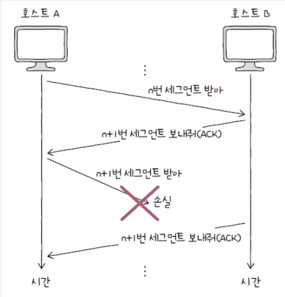

해당 그림처럼 수신측 즉 호스트B는 n+1 세그먼트를 전달받지 못했기 떄문에, 계속해서 ACK 요청을 보내게 될것입니다.
호스트A 즉 수신측 입장에서는 이러한 상황에서 중복된 ACK의 요청이 들어오면 해당 세그먼트가 전송 과정중 문제가 발생했다고 인지할 수 있습니다.

 

### 둘째, 타임아웃이 발생했을 때

TCP는 하나의 세그먼트를 요청하고 응답받을 때 까지 **재전송 타이머**라는 것을 유지합니다. 이러한 타이머가
끝나는 상황을 **타임아웃**이라고 부릅니다.
송신 호스트는 타임아웃이 발생하기 전까지 **ACK**를 받지 못했다면 중간에 문제갓 생긴것으로 판단 후 타임아웃을 발생시킵니다.

 

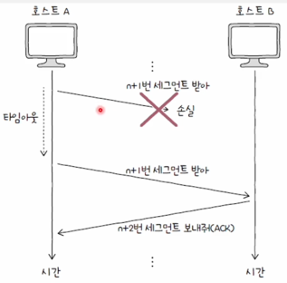

 
 

## 재전송 기법: ARQ

---

1번 검출 방법을 알았기 때문에, 이제 2번 해결방법에 대해서 이야기 할 차례입니다.
TCP는 문제가 발생한 상황에서 **재전송**을 통한 문제를 해결합니다.
이렇게 문제 세그먼트를 **재전송**하는 것을 **ARQ(Automatic Repeat Request)** 라고 부릅니다.

이러한 **ARQ**도 세가지 방안으로 나뉘게 됩니다.

 
 

### 1. Stop-and-Wait 

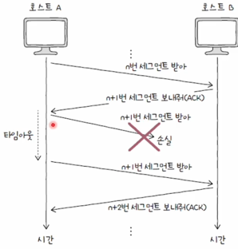

해당 방식은 문제가 발생했다면 제대로 전달했음을 확인하기 전까지 새로운 메시지를 보내지 않는 방식입니다.
이러한 방식은 **높은 신뢰성**을 보장한다는 장점이 있지만, 네트워크 이용 효율이 낮다는 단점이 있습니다.

이러한 네트워크 이용 효율에 관한 문제를 해결하기 위해서 **파이프라이닝**이라는 기술을 고려합니다.
해당 기술은 응답을 받기전에 새로운 세그먼트를 보내는 방식을 사용합니다.

 

### 2. Go-Back-N

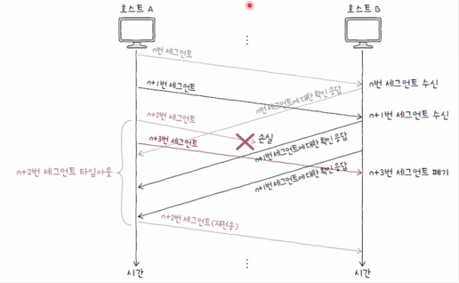

**Go-Back-N**방식은 파이프라이닝 방식을 활용해 여러 세그먼트를 전송하고, 도중에 잘못 전송한 세그먼트가 발생한 경우에
해당 세그먼트부터 전부 다시 전송하는 방식입니다.

 

### 3. Selective Repeat ARQ

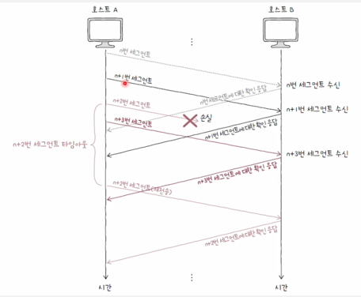

**Selective Repeat ARQ**방식은 선택적으로 재전송하는 방법입니다.
문제가 발생한 세그먼트만 골라 따로 전송하게 됩니다.

오늘날 대부분 호스트는 이러한 방식을 채용합니다. 만약 이러한 방식을 사용하지 않는다면 **GO-Back*N**방식을
사용하게 됩니다.

 
 

## 흐름제어: 슬라이딩 윈도우

---

파이프라이닝 기반의 **GO-Back-N** 그리고 **Selective Repeat** 방식이 제대로 동작하게 하려면 흐름제어를 고려해야 합니다.
왜냐하면 호스트가 한번에 처리 가능한 세그먼트는 한계가 있기 떄문입니다.

이러한 흐름제어는 **수신 버퍼**, **버포 오버플로**를 고려하게 됩니다. **수신 버퍼**란 세그먼트가 애플리케이션
프로세스에 의해 읽히기 전에 임시로 저장되는 공간입니다. 만약 해당 버퍼에 수용가능한 정보보다 많은 데이터가 들어온다면
**버퍼 오버플로**가 발생합니다.

결국 흐름제어란, 송신 호스트가 수신 호스트의 처리 속도를 고려하여 송수신 속도를 균일하게 유지하는 것을 의미합니다.
이렇게 균일하게 속도를 유지하기 위해서는 **슬라이딩 윈도우**를 사용합니다.

여기서 **윈도우**는 송신 호스트가 한번에 보낼수 있는 최대량을 **윈도우**라고 합니다.

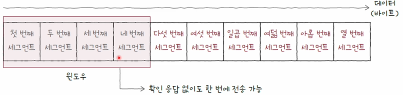

 

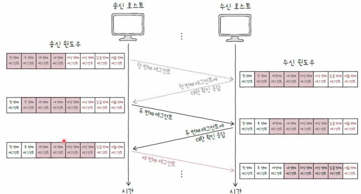

 

해당 그림처럼 송신 호스트가 보낸 세그먼트를 받을때마다 수신 윈도우가 옮겨지고 수신 윈도우 또한 같은 위치로 이동하게 됩니다.
이처럼 송수신 과정에서 **윈도우**가 미끄러져 가는 현상을 **슬라이딩 윈도우**라고 합니다.

 
 

## 혼잡 제어

---

**혼잡**이란 하나의 라우터가 수많은 호스트에 연결되어있을 때, 하나의 라우터로 많은 세그먼트가 모여 과부화 되는 현상을
**혼잡**이라고 합니다.

**혼잡 제어**도 **윈도우**라는 개념이 있습니다. 이는 이정도 양을 전송하면 **혼잡이 발생하지 않음**이라는 기준치 입니다.
이를 **혼잡 윈도우**라고 부릅니다.

이러한 **혼잡 윈도우**는 **송신 호스트**가 직접 계산해야 하며, 여기서 **혼잡 제어 알고리즘**이 사용됩니다.

대표적인 알고리즘으로는 **AIMD**가 있습니다.

 

### AIMD(Additive Increase/Multiplicative Decrease)

 

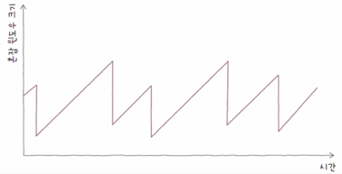

이는 '합으로 증가 곱으로 감소'라는 의미를 가지고 있습니다.

혼잡 윈도우를 **RTT**마다 1씩 증가시키고 혼잡이 감지되면 혼잡 윈도우를 절반떨어트리는 동작을 반복하는 알고리즘 입니다.

> 여기서 **RTT**는 호스트가 세그먼트를 요청하고 **ACK**를 받기까지의 간격입니다.

이러한 **AIMD**는 기본적인 알고리즘이며 이를 더 정교하게 만드는 혼잡 제어알고리즘이 3가지 있습니다.

 
 

### 1. 느린 시작 알고리즘

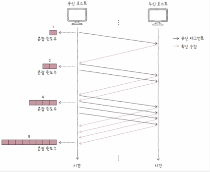

느린 시작 알고리즘은 초기 **혼잡 윈도우**를 1로 잡습니다. 그리고 1RTT 간격마다 해당 윈도우의 크기를 두배를 증가시킵니다.
정확히 말하면 ACK 세그먼트 하나당 혼잡윈도우를 1씩 증가시키지만 모든 세그먼트를 **ACK**하게 되면 초기 크기의 두배가 됩니다.

이러한 방식은 **AIMD**에 비해서 빠른 속도의 증가를 보여줍니다. 왜냐하면 **AIMD**는 선형적인 증가폭을 이루지만,
**느린 시작**알고리즘은 지수적인 증가를 보여주기 떄문입니다.

하지만, 이렇게 지수적으로 증가하게 되면 언젠가 혼잡한 상황에 도달하게 됩니다. 그렇기 때문에 **느린 시작**알고리즘은
**느린 시작 임계치**라는것을 사용하게 됩니다.

이후 세가지 알고리즘 전환케이스가 있습니다.

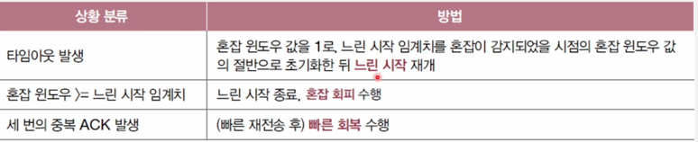

이를 통합적으로 설명하기 위해 **혼잡 회피**, **빠른 회복**을 먼저 설명합니다.

 
 

### 2. 혼잡 회피

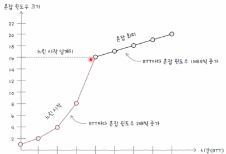

**혼잡 회피**방식은 RTT마다 혼잡 윈도우를 1MSS씩 증가시키는 알고리즘 입니다.
**혼잡 회피**는 선형적으로 윈도우를 늘리게 됩니다.

이런 혼잡 회피는 두가지 케이스를 맞이할 수 있습니다.

1. 타임 아웃
2. 3번의 중복 ACK

이런 상황이 발생했다면 **혼잡 회피**는 혼잡한 상황에 도달하였다는 것을 의미하며, 타임아웃이 발생하면
혼잡 윈도우 값을 1로, 느린 시작 임계치는 혼잡 감지 시점의 혼잡 윈도우값 절반으로 초기화하고 **느린 시작**을 수행합니다.

그리고 세번의 중복 ACK발생시, 혼잡 윈도우 값과, 느린 시작 임계치를 대략 절반으로 떨어트리고 빠른 회복 알고리즘을 수행합니다.

 
 

### 3. 빠른 회복 알고리즘

**세번의 중복된 ACK**를 수신하면 빠른 회복 알고리즘을 사용합니다.
이는 **느린 시작**을 건너뛰고 **혼잡 회피**를 수행하는 알고리즘입니다. 빠르게 전송률을 회복하기 위한 알고리즘입니다.
여기서 **타임 아웃**이 발생하면 **느린 시작**을 수행합니다.

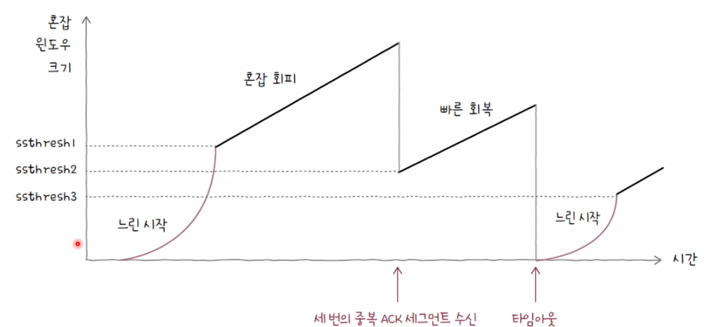

## 출처

---

[이미지 출처](https://www.inflearn.com/course/%ED%98%BC%EC%9E%90-%EA%B3%B5%EB%B6%80%ED%95%98%EB%8A%94-%EC%BB%B4%ED%93%A8%ED%84%B0%EA%B5%AC%EC%A1%B0-%EC%9A%B4%EC%98%81%EC%B2%B4%EC%A0%9C/dashboard)

