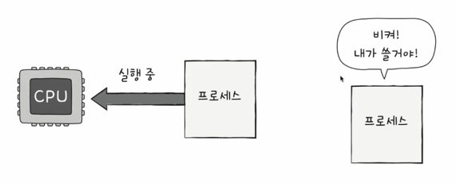
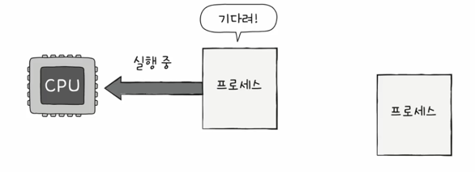

## 선점형? 비선점형? 개요

---

**CPU 스케줄링**은 자원 선점 후 자원에 대한 권한이 뺏길 수 있냐 없냐에 따라 두가지로 나누게 됩니다.

여기서 자원을 사용하고 있음에도 외부에서 CPU 자원을 뺏는 방식과, 한번 점유한 CPU 자원을 끝가지 사용할 수 있는 방식이 있습니다.

 
 

## 선점형 스케줄링

---

> 선점의 사전적 정의는 '남보다 앞서서 차지함'이라는 뜻을 가지게 됩니다.

즉, 어떤 프로세스가 CPU라는 자원을 사용하고 있음에도 운영체제가 CPU를 사용중인 프로세스로부터 자원을 강제로 빼앗아 다른 프로세스에 할당할 수 있는
스케줄링 방식을 의미합니다.

다르게 표현한다면 어떠한 프로세스도 CPU를 독점할 수 없다는 말입니다.

선점형의 예시중 하나는 지금까지 보았던, 특정 주기마다 CPU에 대한 할당 권한을 다른 프로세스에게 넘겨주는 방식이 있습니다.

 

 
 

## 비 선점형 스케줄링

---

비선점형 스케줄링이란 하나의 프로세스가 자원을 사용하고 있다면 그 프로세스가 종료되거나 
스스로 대기 상태에 접어들기 전까진 다른 프로세스가 끼어들 수 없는 스케줄링입니다.

다르게 표현한다면 특정 프로세스가 CPU를 사용하기 시작했다면 자원 사용을 독점할 수 있는 방식입니다.

 

 
 

## 선점, 비선점의 장 단점

---

대부분의 운영체제는 **선점형 스케줄링**를 사용중입니다. 그럼에도 **비선점형 스케줄링**를 사용하는 곳이 있는데 그것은 각자의 장 단점이 존재하기 때문입니다.

 

- 선점형 스케줄링 장점

> 선점형 스케줄링은 어는 한 프로세스의 자원 독점을 막고 프로세스들에 골고루 자원을 분배 할 수 있다는 장점이 있습니다.

 

- 선점형 스케줄링 단점

> 콘텍스트 스위칭이 빈번하기 떄문에 오버헤드가 많이 발생합니다.

 
 

- 비 선점형 스케줄링 장점

> 상대적으로 선점형 보다 콘텍스트 스위칭에 대한 오버헤드가 작게 발생합니다.

 

- 선점형 스케줄링 단점

> 하나의 프로세스가 작업이 끝나기를 기다려야 하기 때문에, 모든 프로세스가 골고루 자원을 사용할 수 없습니다.

 
 

## 기아 상태(Starvation)

---

기아 상태란 우선순위가 밀린 프로세스가 영원히 자신의 우선순위까지 순서가 오지 못해 실행되지 못하는 상태를 기아 상태라고 합니다.

 
 

## 기아 상태 해결법

---

이러한 기아 상태를 해결하기 위한 방법으로는

**에이징** 기법을 활용하는 것입니다.

기아 상태가 발생하는 이유는 항상 자신보다 높은 우선순위를 가지는 프로세스가 존재하기 떄문입니다.

**에이징** 기법은 준비큐에서 대기가 길어진 프로세스들에게 우선순위를 조금씩 높여주는 방식을 사용합니다.
결국 조금씩 우선순위가 높아진다면 언젠가는 해당 프로세스가 실행될 수 있게 됩니다.

