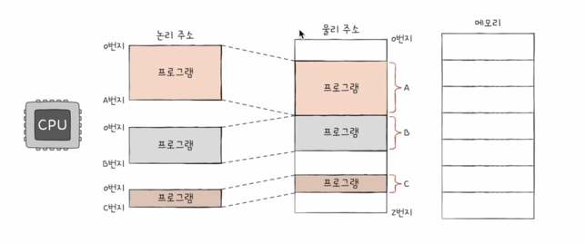

## 물리주소와 논리주소

---

메모리는 보조기억장치로 부터 실행될 프로그램을 받아서 저장합니다.
이 저장된 메모리의 데이터를 **CPU** 혹은 **실행중인 프로그램**이 읽어 실행하게 됩니다.

해당 그림은 두가지 관점으로 **주소**를 나누고 사용하는 방식을 그림으로 나타낸 것입니다.

왜, 주소를 두가지 방식으로 나누어서 사용하게 되었을까요?

> 이유는 메모리에 저장되어 있는 정보는 변화가 빠르고 이를 시시각각 알기어렵기 때문에

가령 프로그램이 새롭게 실행될때, 삭제 될때 혹은 같은 프로그램일지라도 실행될때마다 실행되는 주소가 다르기 때문입니다.

그렇기때문에 주소를 두가지 관점으로 나눠서 사용하게 됩니다.

> **물리주소**란 실제로 정보가 저장된 하드웨어상 주소를 의미합니다.

> **논리주소**란 실행중인 프로그램에 부여된 0번지부터 시작되는 주소를 의미합니다.

여기서 주의할점은 **논리주소**는 0번지 부터 시작하는 논리적 주소이기 때문에, **고유성**이 없습니다. 하지만 **물리주소**는
하드웨어상 주소기 때문에 **고유성**이 있습니다.

## 출처

---

[이미지 출처](https://www.inflearn.com/course/%ED%98%BC%EC%9E%90-%EA%B3%B5%EB%B6%80%ED%95%98%EB%8A%94-%EC%BB%B4%ED%93%A8%ED%84%B0%EA%B5%AC%EC%A1%B0-%EC%9A%B4%EC%98%81%EC%B2%B4%EC%A0%9C/dashboard)

