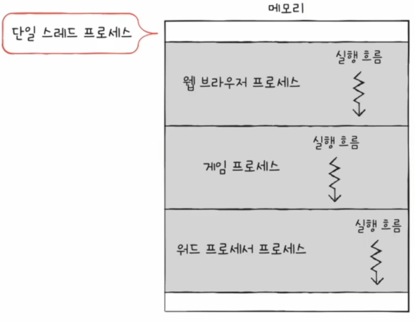
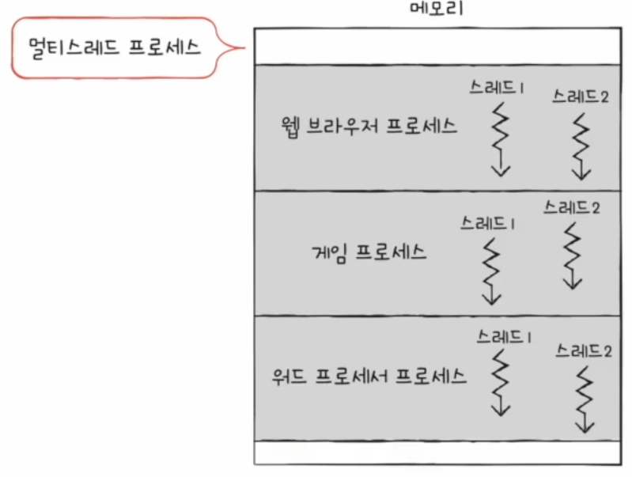
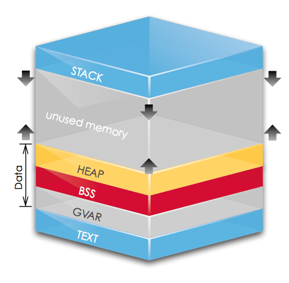
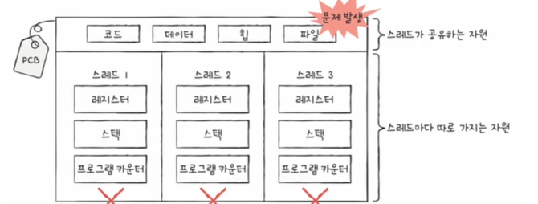
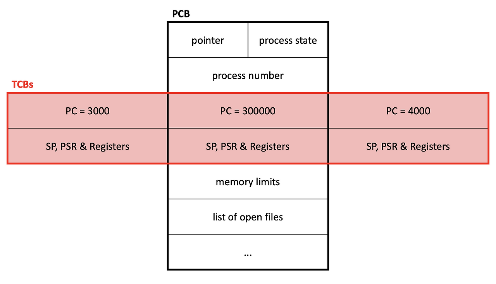

## 스레드란?

---

 

스레드는 프로세스를 구성하는 실행의 흐름 단위라고 표현합니다.

또한, 하나의 프로세스가 복수적인 스레드를 가질 수 있습니다. 그렇기 때문에 스레드를 이용하면
하나의 프로세스에서 여러 부분을 동시에 실행할 수 있습니다.

마치 화상 회의를 진행중에 회의 어플리케이션이란 프로세스 속 채팅과 화상통화의 기능이 독립적으로 돌아가는것과
같이 여러 기능을 수행할 수 있습니다.

 

### 프로세스와 스레드

---

스레드를 이해하기 위해서는 프로세스와 엮어서 설명하고자 합니다.
전통적인 CPU는 하나의 프로세스만 처리할 수 있었습니다. 메모장, 워드, 게임등 많은 프로세스가 하나의 실행
흐름을 가지고 한 번의 하나의 부분만 실행되는 프로세스입니다.

이런 프로세스를 단일 스레드 프로세스라고 부릅니다.

 

하지만, 스레드라는 개념이 도입되면서 하나의 프로세스가 한 번에 여러가지 일을 동시에 처리하는 것이 가능해졌습니다.
프로세스를 구성하는 명령어를 동시에 처리하는것이 가능해졌습니다.

 

그림을 통해 스레드를 보게 되면 스레드는 '프로세스를 구성하는 실행의 흐름 단위'라고 표현 가능 할 것입니다.

왜냐하면, 하나의 프로세스 안에 여러가지 스레드가 있고 각각의 작업 흐름을 가지며 프로세스가 하는 일을 병렬적으로 만들어
주기 때문입니다.

 
 

## 스레드 메모리 구조

---

스레드의 메모리 구조를 이해하기 위해서는 이전 프로세서의 구조를 상기해봐야 합니다.

프로세스는 스택, 힙, 데이터, 코드 영역을 각자 가진다고 합니다.
스레드는 '프로세스를 구성하는 실행 흐름의 단위'라고 했고, 이 떄문에 스레드는 프로세스의 메모리 구조의 대부분을 공유해서
사용한다. 그렇기 때문에 여러 스레드의 작업이 하나의 프로세스 안에서 이루어져도 동시작업이 가능한 이유입니다.

 

그렇다면 어떻게 스레드는 프로세스와 스레드간 데이터를 공유하는 것일까?
아래 그림을 통해서 보게되면

 

[사진출처](https://gmlwjd9405.github.io/2017/10/01/basic-concepts-of-development-os.html)

 

우선 하나의 프로세스안에 코드, 데이터, 힙, 스택 영역이 존재합니다. 그리고 프로세스 내부의 개별적인 스레드가 존재합니다.

스레드가 레지스터, 프로그램 카운터, 스택을 개별적으로 가지는 핵심 이유는 독립적인 실행 흐름을 보장하기 위해서입니다.

프로그램 카운터는 각 스레드가 서로 다른 코드 위치에서 실행될 수 있도록 현재 실행 지점을 개별 추적하고, 

레지스터는 각 스레드의 작업 데이터를 독립적으로 저장합니다. 
이를 통해 CPU가 스레드 간 전환할 때 현재 상태를 저장하고 복원하여 중단된 지점에서 정확히 재개할 수 있습니다.
스택 영역을 따로 가지는 이유는 각 스레드가 독립적인 함수 호출 흐름을 가져야 하기 때문입니다. 

스택은 함수 호출 시 지역 변수, 매개변수, 리턴 주소를 저장하는데, 만약 스레드들이 스택을 공유한다면 한 스레드의 
함수 호출이 다른 스레드의 함수 실행에 영향을 주어 실행 흐름이 꼬이게 됩니다. 따라서 각 스레드는 독립적인 스택을 가져 서로 다른 함수를 안전하게 호출하고 실행할 수 있습니다.
결과적으로 이런 구조를 통해 스레드들은 힙과 데이터 영역은 공유하면서도 각자 독립적인 실행 흐름을 유지할 수 있어
, 하나의 프로세스 내에서 여러 작업을 동시에 효율적으로 처리할 수 있게 됩니다.

 
 

## TCB란

---

스레드 제어 블록은 운영체제가 각 스레드를 관리하기 위해 유지하는 데이터 구조체입니다. 
프로세스 제어 블록(PCB)과 유사하지만 스레드 수준에서 필요한 정보들을 담고 있습니다.
링크드 리스트 형태로 구현되어 PCB안에 해당 스레드의 TCB를 내포하고 있는 형태로 저장됩니다.

 

 
 

TCB는 사진과 같은 형태로 저장되며, 아래와 같은 정보를 가진다.

| 정보         | 설명                              |
|------------|---------------------------------|
| 스레드 식별자    | 각 스레드를 식별하는 고유한 식별자             |
| 스레드 상태     | 실행 준비 대기 등 스레드의 현재 상태           |
| 프로그램 카운터   | 스레드가 다음에 실행할 명령어의 주소            |
| 레지스터       | 스레드가 현재 사용하고 있는 CPU 레지스터의 값을 저장 |
| 스레드 우선순위   | 스케줄링 결정에 사용되는 스레드의 우선순위         |
| 스레드 스택 포인터 | 스택 내에서 현재 작업의 위치를 가리키는 레지스터     |
| 스레드 문맥 정보  | 문맥 교환 시 저장되고 복원되어야 할 정보         |

