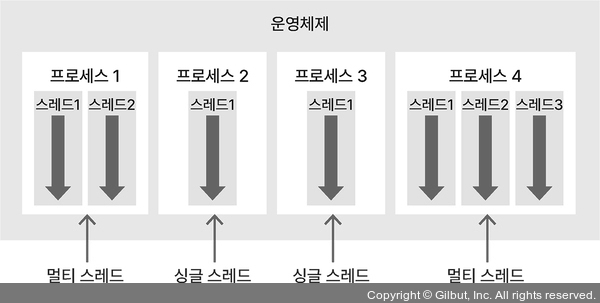

멀티 프로세스는 운영체제에서 하나의 응용 프로그램에 대해 동시에 여러 개의 프로세스를 실행할 수 있게 하는 기술입니다.
보통은 하나의 프로그램을 실행하기 위해서 하나의 프로세스만 메모리에 생성하게 되지만, 부가적인 기능을 위해
여러개의 프로세스를 생성하는 것입니다.

 
 

### 어떻게 멀티 프로세스를 생성할까?

멀티 프로세스는 이전에 보았던 계층구조 프로세스 처럼 부모 프로세스가
여러개의 자식 프로세스를 생성합니다.

부모 프로세스는 자식 프로세스의 PID를 알고있으며 자식또한 PID와 PPID를 알고있어
서로 통신이 가능합니다.

이런 성질은 각각 독립적이지만 통신이 가능하게 만들었고 멀티 프로세스의 대표적인 예가
브라우저의 탭이라고 할 수 있습니다.

브라우저 탭은 문제가 발생해서 닫아야 하는 상황이여도 다른 탭까지 닫히지 않고 개별적으로
운용을 할 수 있는걸 기억해보면 독립적이란 말을 더 잘 이해할 수 있을것이다.

 
 

## 멀티 프로세스의 장점

 

1. 안정성

멀티 프로세스의 안정성은 각각의 프로세스가 독립적이기 떄문에 가능합니다.
대표적인 예로 좀전에 설명을 했던 특정 브라우저 탭이 문제가 발생하여 닫아야 하는 상황에서
같은 브라우저의 다른 탭까지 닫히지는 않습니다.
이런것이 독립적인 성격에 의한 안정성이라고 할 수 있습니다.

 
 

## 멀티 프로세스의 단점

 

1. 문맥교환 (Context Switching) Overhead

멀티 태스킹을 이루는 기술인 문맥 교환 과정에서 성능 저하가 발생할 수 있습니다.
프로세스를 컨텍스트 스위칭 하면, CPU는 다음 프로세스의 정보를 불러오기 위해
메모리를 검색하고, CPU 캐시 메모리를 초기화하며, 프로세스 상태를 저장하고, 
불러올 데이터를 준비해야 하기 떄문에, 빈번한 문맥교환이 발생하고 이 비용은 곧 오버헤드로 발생할 수 있습니다.

 
 

2. 자원 공유 비효율성

프로세스는 독립적인 메모리를 가지고, 멀티 프로세스는 독립적인 메모리 공간의 합일 것입니다.
그렇기 때문에 메모리 비효율성을 초래합니다.

 
 

## 멀티 스레드

---

 

이전에 보았던 것처럼 스레드는 하나의 프로세스 내에 있는 실행 흐름입니다.
멀티 스레드는 하나의 프로세스 안에 여러개의 실행흐름을 가지는 것입니다.
멀티 스레드 또한 멀티 프로세스 처럼 여러개의 작업을 동시 실행 할 수 있습니다.

이전에 보았던 것처럼 멀티 프로세스는 브라우저의 여러개의 탭을 통해 예시를 들었습니다.
하지만, 멀티 스레드는 같은 브라우저라 할지라도 동일탭에 여러 실행 흐름을 말하게 되고 
예를들어 네트워크 처리 스레드, 검색 스레드 와 같이 동일한 프로세스 내 기능들을 말하게 됩니다.

 
 

## 멀티 스레드의 장점

---

### 프로세스보다 스레드가 가벼움

스레드는 프로세스보다 용량이 가볍다. 이유는 데이터, 코드, 힙 영역을
프로세스와 공유해서 사용하기 때문에 내장된 정보다 프로세스보다 작기 떄문입니다.
그렇기 때문에 스레드를 제거하는 작업이 프로세스를 제거하는 작업보다 가볍습니다.

 
 

### 자원의 효율성

멀티 스레드는 하나의 프로세스 내에서 스택영역을 제외한 영역을 공유하기 때문에
프로세스 간 통신을 사용하지 않고도 자원의 공유가 가능하여 자원을 효율적으로 사용할 수 있습니다.

 
 

### Context Switching 비용 감소

스레드 문맥 교환 또한 오버헤드가 존재하지만, 프로세스 문맥교환과 비교했을 때,
상대적으로 오버헤드가 적습니다.

이유는 프로세스 컨텍스트 스위칭 비용은 스위칭할 때마다 CPU 캐시에 있는 내용을 모두 초기화하고,
새로운 프로세스 정보를 CPU 캐시에 적재해야 하기 떄문입니다.
하지만, 스레드 문맥교환은 스레드 개별적인 정보만 교체하면 되기 떄문에 비용이 상대적으로 낮습니다.

 
 

## 멀티 스레드의 단점

멀티 프로세스는 개별적인 작업으로 인해 독집적이고, 각자의 문제를 전파하지 않는다고 합니다.

하지만, 멀티 스레드는 하나의 스레드가 문제가 발생하면 다른 스레드들고 영향을 받아 전체가 종료가 될 수 있습니다.

 
 

## 데드락

데드락이란 하나의 자원을 사용하기위해 여러 곳에서 접근했고, 그상황에서 교착상태가 일어났을때
여러대의 스레드가 서로 대기하면서 무한정 기다리는 현상을 데드락이라고 합니다.

예를들어, 스레드 1 은 자원 A을 점유하고 있는 상태에서 자원 B가 필요한 상황입니다. 
그리고 스레드 2 는 자원 B를 점유하고 있는 상태에서 자원 A이 필요한 상황입니다. 
하지만 스레드 1은 자원 B가 필요한 상황에서 자원 A을 빌려줄 수 있는 상황이 아니고, 
스레드 2또한 자원 A이 필요한 상태에서 자원 B를 빌려줄 수 없는 상황인 것입니다.
이처럼 다수의 쓰레드가 같은 lock을 동시에, 
다른 명령에 의해 획득하려 할 때 서로 절대 불가능한 일을 계속적으로 기다리는 상황을 이야기 합니다.

