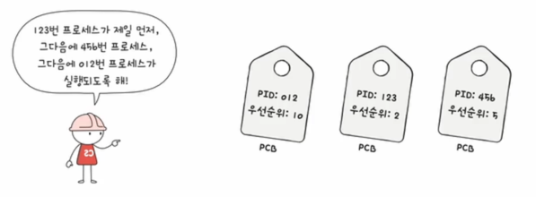
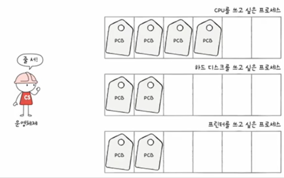

## CPU 할당?

---

지금까지 배운 내용을 토대로 프로세스는 CPU를 필요로 하며, 프로세스가 실행 된다는 말은 메모리에 올라간 데이터를 토대로 프로세스가 CPU를 할당받아 사용
하는것을 프로세스가 실행 된다고 표현합니다. 그 과정에서 프로세스는 일정 주기마다 컨텍스트 스위칭을 통해 CPU 할당을 바꾸고 IO요청에 대해서도 대기 상태로 들어가는 등
CPU사용에 여러 변수가 있습니다.

한가지 의문점은, 누가? 어떻게? CPU를 할당하는지 배운적은 없습니다.
여기서 CPU라는 리소스에 대한 사용을 결정짓는건 운영체제입니다.
그리고 오늘 글의 주제인 CPU 스케줄링은 운영체제가 CPU라는 자원을 배분하는 행위를 지칭합니다.

 
 

## CPU 스케줄링 우선순위

---

운영체제는 많은 프로세스에게 공정하게 CPU라는 공용자원을 배분하기 위해 고려해야 하는것이 우선순위 입니다.
우선순위라는 기준을 매겨야 하는 이유는
운영체제는 어떤 프로세스는 당장 처리해야 할 중요성을 띄거나, IO작업이 많거나, CPU 사용시간 자체가 길거나처럼 각자의 사정이 있고, 이 사정 가운대 효율적으로 자원을 배분해야 하기 떄문입니다. 

 

'우선순위가 높다'라는 표현은 CPU 사용에 우선권을 가집니다. 즉 먼저 처리되어야 한다 라는 뜻입니다.
대표적으로 우선순위가 높은 프로세스는 입출력이 많은 프로세스 입니다.
(입출력 처리가 많은 프로세스가 우선순위가 높은 이유는 아래에서 설명합니다.)

대부분의 프로세스는 I/O 작업과 CPU처리를 번갈아가면서 수행하게 됩니다. 이 말은 프로세스 상태 변화에서 실행, 대기를 번갈아 가면서 사용한다는 뜻입니다.
그렇지만 모든 프로세스가 동일한 비율로 I/O와 CPU처리를 하는것은 아닙니다. 여기서 CPU작업의 비율이 많다면 **CPU 집중 프로세스**라고 하게 되며, 반대로 I/O작업의
비율이 많다면 **입출력 집중 프로세스** 라고 부르게 됩니다.

CPU집중 프로세스는 실행상태가 많고, 입출력 집중 프로세스는 대기 상태가 많으니 입출력 집중 프로세스를 빠르게 대기 상태로 넘겨주는 것이 CPU사용에 대해서 더 효율적인
방법일것입니다. 그렇기 떄문에 입출력 처리가 많은 프로세스가 우선순위가 높습니다.

여담으로, CPU를 이용하는 작업을 **CPU 버스트**, 입출력을 이용하는 작업을 **입출력 버스트**라고 부르게 됩니다.

 
 

이러한 우선순위는 **PCB**에 기록됩니다. **PCB** 우선순위 기준으로 먼저 처리할 프로세스를 결정하고 처리하게 됩니다.

 
 

## 스케줄링 큐

---

우선순위는 **PCB**에 기록되지만, 운영체제가 매 CPU 할당 과정마다 **PCB**를 확인하고 결정하는건 비효율 적인 방식입니다.
그렇기 때문에 프로세스는 마치 '줄을 서는것'처럼 대기하게 됩니다. 이것을 **스케줄링 큐**라고 부르게 됩니다.

 

 

운영체제는 메모리로 적재되고 싶은 프로세스들을 큐에 삽입하여 줄을 세우고, CPU를 사용하고 싶거나, 특정 입출력장치를 사용하거 싶은 프로세스들을 줄세웁니다.
이 과정에서 사용할 자원에 따라 다른 큐에서 대기하게 됩니다.

운영체제가 관리하는 큐로는 **준비큐**와 **대기큐**로 이루어 져 있습니다. **준비 큐**는 말그대로 CPU를 이용하고 싶은 프로세스들이 대기하게 되고,

 

 

**대기 큐**는
입출력장치를 이용하기 위한 대기 상태에 돌입한 프로세스들이 서는 줄입니다.
큐에 들어와 있다고 해도 항상 순서대로 작동하는 것은 아니고 **우선 순위**를 고려합니다.

 

## 출처

---

[이미지 출처](https://www.inflearn.com/course/%ED%98%BC%EC%9E%90-%EA%B3%B5%EB%B6%80%ED%95%98%EB%8A%94-%EC%BB%B4%ED%93%A8%ED%84%B0%EA%B5%AC%EC%A1%B0-%EC%9A%B4%EC%98%81%EC%B2%B4%EC%A0%9C/dashboard)
