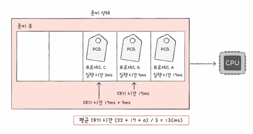
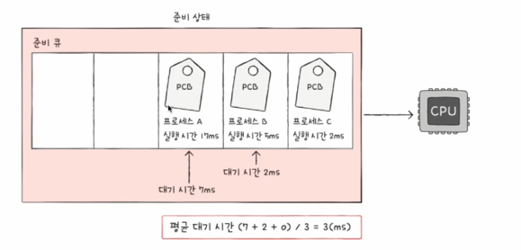
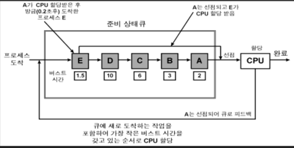

## 스케줄링 알고리즘 개요

---

스케줄링 알고리즘중 다섯가지의 알고리즘을 선점, 비선점을 통해 설명하겠습니다.

 

- 비선점 스케줄링
  - 선입 선처리 스케줄링 (FCFS)
  - 최단 작업 우선 스케줄링 (SJF)

 

- 선점 스케줄링
  - 라운드 로빈 스케줄링
  - 최소 잔여 시간 우성 스케줄링 (SRT)
  - 우선순위 스케줄링

 

# 비 선점 스케줄링

 
 

## 선입 선처리 스케줄(FCFS)

---

 

FCFS는 **준비 큐**에 들어가있는 순서대로 CPU를 할당하는 간단한 스케줄링 입니다.

하지만, FCFS 방식에는 **호위 효과**라는 문제가 있습니다.

그림을 보면 프로세스 A, B, C순서대로 실행되며 각각 실행 시간이 17, 5, 2 ms가 걸리게 됩니다.
이상황에서 프로세스 B는 실행 상태가 되기 위해 최소 17ms를 기다려야 하며, 프로세스 c는 22ms를 기다리게 됩니다.

> 이러한 현상을 **호위 효과(Convoy effect)** 라고 하며 이것이 FCFS 스케줄링의 단점입니다.

 
 

하지만, 이러한 FCFS 방식도 배치 처리 시스템이나 작업 길이가 거의 비슷하고 사용자와 상호 작용이 필요하지 않는 환경에는
적합하며, 멀티프로그래밍이나 실시간 시스템에서는 부적합합니다.

 
 

## 최단 작업 우선 스케줄링(SJF)

---

 

최단작업 우선 스케줄링(SJF)는 이전 FCFS방식에서 **호위 효과**를 억제하기 위해 사용하는 방식입니다.

**호위 효과**는 실행시간이 긴 프로세스 때문에 다른 프로세스가 기다리는 시간이 길다는 문제가 있고,
이러한 문제를 실행시간이 짧은 프로세스를 먼저 시행되게 하여 해결하는 방식입니다.

그림을 통해 보면 FCFS방식의 평균 대기시간은 13ms인 반면에 SJF방식의 편균대기 시간은 3ms로 줄어든것을
확인할 수 있습니다.

> 즉 SJF방식은 호위효과를 줄여 프로세스들의 평균대기시간을 줄이는 방법으로 이해하면 됩니다.

하지만, 이러한 방식도 문제가 있는데, 실행 시간이 긴 프로세스가 **기아**상태에 빠지기 쉽다는 것입니다.

이러한 방식은 평균 대기 시간을 중요하게 여기는 시스템에 적합하며, 실시간 시스템이나 사용자 대화형 시스템에 부적합하게 됩니다.

 
 

#  선점 스케줄링

 
 

## 라운드 로빈 스케줄링

---

 

라운드 로빈 스케줄링은 선입 선처리 방식(FCFS)방식에서 **타임 슬라이스**가 더해진 방식입니다.
여기서 말하는 **타임 슬라이스**는 CPU를 사용할 수 있는 정해진 시간을 의미합니다.

그림에서처럼 타임 슬라이스가 4ms이면 한번에 4ms까지 CPU를 할당받을 수 있고, 그 이후는 큐 가장 뒤로 들어가며
콘텍스트 스위칭이 일어나게 됩니다.

 

> 라운드 로빈 방식의 중요한 포인트는 **슬라이스 크기**입니다.

만약 슬라이스 크기가 지나치게 크다면 **FCFS**방식과 다를게 없을 것이고, 지나치게 작다면 콘텍스트 스위칭으로 인한
오버헤드가 많이 발생할 것입니다.

 
 

## 최소 잔여 시간 우선 스케줄링 (SRT)

---

 

최단 작업 우선 알고리즘(SJF) 그리고 라운드 로빈 알고리즘을 합친 형태입니다.
즉 작업 시간이 짧은 프로세스를 먼저 실행하되, 타임슬라이스 보다 큰 프로세스는 다시 큐 뒤로 보내고 작업을 이어가는 방식입니다.

위 알고리즘은 특이한 점이 있어서 상세히 설명하겠습니다.

 

### SRT 동작 방식

1. 새로운 프로세스가 도착하면 그 프로세스의 남은 실행 시간을 계산합니다
2. 준비 큐에 있는 프로세스 중에서 현재 실행 중인 프로세스를 포함하여 가장 짧은 실행 시간을 가진 프로세스에 CPU를 할당합니다
3. 만약 새로운 프로세스가 도착하고 현재 실행 중인 프로세스 보다 남은 실행 시간이 더 짧다면 현재 프로세스는 중단되고 CPU는 새 프로세스에 할당되는 '선점'이 발생합니다.
4. 선점이 발생하면 운영체제는 콘텍스트 스위칭으로 CPU자원을 현재 프로세스에서 새 프로세스로 교체합니다.
5. 선점된 프로세스는 준비 큐로 이동합니다.

 

SRT또한 SJF와 비슷한 장 단점을 공유하는데, 평균 대기 시간을 최소화 하는 장점을 가지지만, 작업 시간이 긴
프로세스는 CPU 할당을 받기 어렵다는 단점이 있습니다.

 
 

## 우선 순위 스케줄링

---

우선순위 스케줄링은 우선순위를 부여하고, 가장 높은 우선순위를 가진 프로세스부터 실행하는 알고리즘 입니다.
만약 같은 우선순위가 있다면 선입 선처리로 처리 됩니다.

이러한 우선순위 알고리즘 방식은 기아(Starvation) 현상을 동반하며 이는 에이징 방식으로 해결가능 하다고 이전 파트에서 설명했으니
넘어가겠습니다.

## 출처

---

[이미지 출처](https://www.inflearn.com/course/%ED%98%BC%EC%9E%90-%EA%B3%B5%EB%B6%80%ED%95%98%EB%8A%94-%EC%BB%B4%ED%93%A8%ED%84%B0%EA%B5%AC%EC%A1%B0-%EC%9A%B4%EC%98%81%EC%B2%B4%EC%A0%9C/dashboard)

[SRT 출처](https://devshovelinglife.tistory.com/977)

