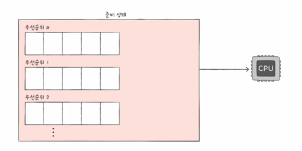
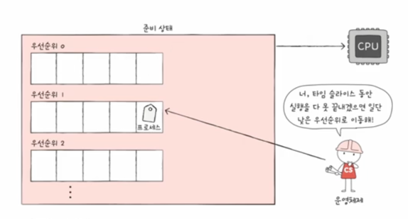

## 다단계 큐 스케쥴링(Multilevel queue scheduling)

---

멀티 레벨 스케줄링은 **우선순위** 스케줄링의 발전된 형태입니다. 
아래 그림을 통해 설명 하면,

 

 

이전에는 준비상태에 해당하는 단 하나의 큐만 사용하여 스케줄링을 진행하였는데, 
멀티레벨 스케줄링은 우선순위에 따른 n개의 큐를 이용하는 방식입니다.

가장 높은 우선순위에 있는 큐들을 처리하고, 가장 높은 우선순위 큐가 비게 된다면 그 아래 우선순위의 큐를 처리하게 됩니다.
그림을 통해 이해하자면, 우선순위 0 -> 우선순위 1 -> 우선순위 2 이렇게 처리하게 되는것입니다.

멀티레벨 큐의 특징으로는 각각의 큐들을 개별적으로 핸들링 할 수 있습니다.
예를들어, 특정 큐의 타임 슬라이드와 다른 큐의 타임 슬라이드를 다르게 처리 한다던가, 혹은 스케줄링 방식 자체를
FCFS를 적용하고 다른 곳에서는 라운드로빈을 적용하는것 처럼 개별적인 핸들링이 가능합니다.

 
 

### 다단계 큐 스케쥴링 문제점

---

다단계 큐 스케줄링의 문제점으로는 **기아** 현상이 있습니다.

멀티레벨 큐 방식에서는 큐간의 이동이 불가능합니다. 그렇기 떄문에 우선순위가 낮은 곳에 배정받은 프로세스들은
이전에 보았던 **에이징**방식을 사용할수 없습니다. 그렇기 때문에 이러한 방식은 우선순위가 올때 까지 기다려야 하는
기아 현상을 문제로 가지고 있습니다.

이러한 방식의 해결법은 아래 설명할 다단계 피드백 큐 스케줄링으로 해결이 가능합니다.

 
 

## 다단계 피드백 큐 스케줄링(multilevel feedback queue scheduling)

---

 

다단계 피드백 큐 스케줄링 같은경우는 프로세스들이 큐 사이로 이동할 수 있습니다. 그렇기 때문에 이전 방식에서 보았던
**기아**현상을 직접적으로 해결할 수 있습니다.

 

### 다단계 피드백 큐 스케줄링 특징

이러한 이동가능한 점 때문에 **멀티 레벨 큐**와 다른 점이 있습니다.
**멀티 레벨 피드백 큐**는 처음 생성된 프로세스가 우선순위가 가장 높은 큐로 삽입이 됩니다. 그 이후 CPU를 할당받고
타임슬라이드 동안 실행되며, 이 실행이 끝나게 된다면 다음 우선순위 큐로 넘어 갑니다(우선순위가 낮아짐). 또 다음 우선순위
큐에서 실행이 끝나지 않는다면 또 다음 우선순위로 넘어가고 이 과정을 반복합니다.

이렇게 우선순위가 낮아지는 방식을 사용함으로써 자동으로 **CPU 버스트**가 많은 프로세스는 우선순위가 낮아지고,
**IO 버스트**가 많은 프로세스는 상대적으로 우선순위가 높아질것입니다.

### 기아 해결

또한, 프로세스들이 이동가능 하기 때문에 우선순위가 낮아져 **기아**상태에 빠진 프로세스에는 **에이징**기법을 적용해
다시 우선순위를 높이게 됩니다.

