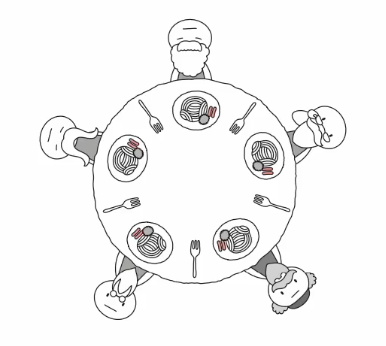

## 교착상태란?(Dead Lock)

---

**교착상태**란 두개 이상의 프로세스가 각자 가지고 있는 자원을 무작정 기다리는것을 말합니다.

**교착상태**를 설명하는 대표적인 예시로 **식사하는 철학자 문제**라는게 있습니다.

 

### 식사하는 철학자

---

 

식사하는 철학자 문제는 그림처럼 동그란 원탁에 다섯명의 철학자가 앉아 있습니다. 이 철학자들은 각각 식사를 배정받고, 식사에 필요한 포크도 있습니다.
식사를 하려면 두개의 포크를 들어야 하는 상황입니다.

이를 순서도로 표현하면

1. 생각을 하다가 왼쪽 포크를 들 수 있다면 든다.
2. 생각을 하다가 오른쪽 포크를 들 수 있다면 든다.
3. 왼쪽, 오른쪽 포크를 모두 집어들면 정해진 시간동안 식사를 한다.
4. 식사 시간이 끝나면 오른쪽 포크를 내려놓는다.
5. 나머지 왼쪽 포크도 내려놓는다.
6. 1번부터 반복한다.

 

위와같은 상황일때 모든 철학자가 왼쪽 포크를 들고 있거나, 반대쪽 포크를 들고 있다면 식사는 영원히 끝나지 않습니다. 이유는 포크라는 자원은
철학자의 수만큼 존재하고 각 철학자는 두개의 포크를 원하는 상태에서 모든 포크를 얻을때까지 가디라기 떄문에, 모든 철학자가 포크를 기다리기만 하는
상황이 발생합니다.

이러한 문제는 **일어나지 않을 사건을 기다리며 진행이 멈춰 버리는** **교착상태**와 같습니다.

여기서 철학자를 **프로세스 혹은 스레드** 포크를 **자원** 그리고 생각하는 행위가 자원을 기다리는 것이라고 생각한다면, 프로세스와 스레드는
**자원**을 사용하기 위해 **기다리는 행위**만 계속하는 상황이 되는것입니다.

 
 

## 교착상태 발생조건

---

교착상태가 발생할 조건에는 네가지가 있습니다. 차례대로 **상호배제**, **점유와 대기**, **비선점**, **원형 대기**입니다. 해당 조건은
모두 만족해야지 **교착상태**가 발생하고 하나라도 해당하지 않는다면 **교착상태**는 발생하지 않습니다.

 

### 1. 상호 배제

교착 상태가 발생한 근본적인 원인은 해당 자원을 하나의 프로세스만 사용하기 때문입니다. 프로세스도 마찬가지로 한 프로세스가 사용하는 자원을 다른 프로세스가
사용할 수 없을때, 교착상태가 발생합니다.

### 2. 점유와 대기

프로세스는 자원을 할당받은 상태에서 다른 자원을 할당받기를 기다린다면 교착 상태가 발생할 수 있습니다. 이렇게 **자원을 할당받은 상태에서 다른 자원을
할당받기를 기다리는 상태**를 **점유와 대기**라고 합니다.

### 3. 비선점

이전에 **선점**, **비선점**이라는 개념을 보았습니다. **비선점**이란 프로세스나 스레드가 자원을 할당받으면 그 작업이 끝나기전까지 자원을 뻇어갈수 없다는
특징이 있었습니다. 교착상태가 발생하는 원인은 **점유와 대기**상태중 필요한 자원을 **선점**할수 없이 계속 기다리기만 하여서 발생하는 문제 입니다.

### 4. 원형 대기

**자원 할당 그래프**가 원의 형태로 그려지면 교착 상태가 발생할 수 있습니다. 이렇게 프로세스들이 원의 형태로 자원을 대기하는 것을 **원형 대기**라고 합니다.

 
 

## 교착상태 해결방법

---

교착상태를 해결하는 방법은 크게 세가지로 나눌수 있습니다.
> 1. 예방
> 2. 회피
> 3. 검출 후 회복

 
 

## 예방을 통한 해결

---

예방이란 교착상태 발생 조건에 부합하지 않게 자원을 분배하는 방식입니다.

이전에 말한 **교착상태**발생 조건에 해당하는 네 가지 중 하나를 충족 하게 되면 **교착 상태**를 해결할 수 있습니다.

### 상호 배제를 없애는 방식

> 이론적으로는 가능하나, 모든 자원이 상호 배제를 없애기는 어렵기 때문에 비현실적이다.

 

### 점유와 대기를 없애는 방식

> 특정 자원이 먼저 점유를 수행하여 작업을 끝내고, 다른 프로세스에게 자원을 몰아주는 방식으로 해결이 가능합니다.
> 
> 하지만 이런 방식은 자원 활용률이 낮아 진다는 문제가 있습니다.

 

### 비선점 조건을 없애는 방식

> 비선점 방식으로 작업을 다루게 되면 교착상태가 발생해도 자원을 뺏어 해결 할 수 있습니다.
> 
> 하지만, 이런방식의 문제점은 모든 자원이 비선점 기능을 사용할 수 없다는 점에 있습니다.
> 
> 예를들어, 프린터는 비선점 방식을 수행하는 자원입니다.

 

### 원형 대기 조건을 없애는 방식

> 모든 자원에 번홀을 붙이고 오름차순으로 자원을 할당하면 원형 대기는 방생하지 않습니다.
> 마치 원형이 아닌, 선형으로 자원을 나열하는 방식입니다.
> 
> 이런 방식은 자원에 일일이 번호를 붙여야 한다는점과, 특정 번호는 자원 활용률이 떨어질수 있다는 문제가 있습니다.

 
 

## 회피를 통한 해결

---

회피 방식에서는 교착 상태 발생이 한정된 자원을 무분별하게 할당하였서 그렇다고 가정합니다. 그렇기 때문에 회피방식은 자원을 신중하게 할당하는 방식으로
해결합니다.

즉, 교착 상태가 발생하지 않을 정도의 양만큼만 자원을 배분하는 방법을 **교착 상태 회피**라고 부릅니다.

**안정 상태**, **불안전 상태**가 있습니다. 각각 교착상태가 발생하지 않는 상태를 **안정상태**, 발생할 가능성이 있는 상태를 **불안정 상태**라고 부릅니다.

**회피**를 통해 교착상태를 해결하기 위해 **안전 순서열**을 고려해서 문제를 해결합니다.

> 안전순서열: 교착 상태 없이 안전하게 프로세스들에 자원을 할당할 수 있는 순서를 의미합니다.

 

내용을 종합하면 **안전 순서열**이 있고 그것을 사용할때 상태를 **안정상태**, 안전 순서열이 없을 때 상태는 **불안정상태**라고 부르게 됩니다.

 
 

## 교착 상태 검출 후 회복

---

마지막으로, 교착상태를 피하기 위해서는 **검출**, **회복** 방식을 사용합니다.

두가지 방식을 고려할 수 있는데,

1. 선점을 통한 회복
2. 프로세스 강제종료

 

### 선점을 통한 회복

교착 상태가 해결될 때까지 한 프로세스씩 자원을 몰아주는 방식입니다. 교착 상태가 해결될 떄까지 다른 프로세스로부터 자원을 빼앗고 할당하는 방식입니다.

 

### 강제종료를 통한 회복

교착 상태에 놓인 순간 모든 프로세스를 종료 하는 방법 혹은 프로세스를 하나씩 종료해서 확인해보는 방법이 있습니다.

전자는 가장 확실하지만 모든 작업에 대한 진행사항을 잃을 가능성이 있고, 후자는 전자보다 손실에 대한 부담은 적지만 오버헤드가 커진다는 단점이 있습니다.

## 출처

---

[이미지 출처](https://www.inflearn.com/course/%ED%98%BC%EC%9E%90-%EA%B3%B5%EB%B6%80%ED%95%98%EB%8A%94-%EC%BB%B4%ED%93%A8%ED%84%B0%EA%B5%AC%EC%A1%B0-%EC%9A%B4%EC%98%81%EC%B2%B4%EC%A0%9C/dashboard)

