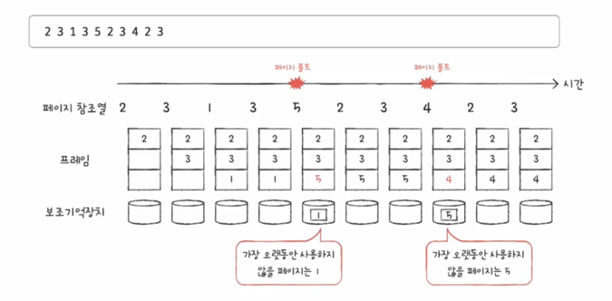
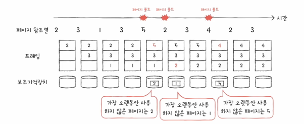
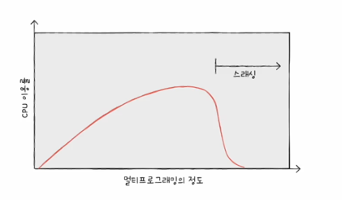
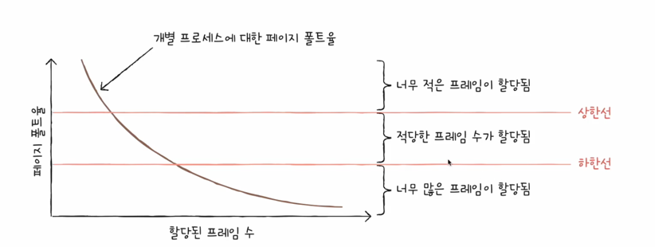

## 서론

---

지금까지 **가상 메모리**를 통해서 실제 물리적 메모리 보다 더 많은 프로세스를 실행할 수 있다고 배웠습니다.
이러한 행위는 한정된 **메모리**를 어떻게 더 효율적으로 사용할까에서 출발하게 됩니다.

그럼에도 더 효율적인 메모리를 이용하기 위해서 두가지 방법을 더 고려하게 됩니다.

1. 불필요한 페이지를 **선별** 후 **스왑 아웃** 한다.
2. 프로세스에게 적절한 **프레임**을 할당한다.

각각 **페이지 교체 알고리즘**, **프레임 할당**이라고 부릅니다.

또한, 이러한 작업은 **요구 페이징(demand paging)** 이라는 작업을 더 효율적으로 할 수 있게 돕습니다.

이 글은 요구 페이징에 대해서 알아보고, 요구 페이징이 안정적으로 작동하기 위해 필연적인 페이지 교체 알고리즘과, 프레임 할당을 설명합니다.

 
 

## 요구 페이징(demand paging)

---

프로세스를 메모리에 적재할 떄 처음부터 모든 페이지를 적재하지 않고 필요한 페이지만을 메모리에 적재하는 방식을
**요구 페이징**이라고 부릅니다.

요구 페이징은 다음과 같은 플로우로 진행됩니다.

1. CPU가 특정 페이지에 접근하는 명령어를 내린다.
2. 페이지가 메모리에 존재하면 **유효비트 1**을 나타내며 해당 프레임에 접근한다.
3. 존재 하지 않는다면 **유효비트 0**을 나타내며 **페이지 폴트**가 발생한다.
4. **페이지 폴트**가 발생하면 해당 페이지를 메모리로 적재하고 유효비트를 1로 설정한다.
5. 1번을 다시 시행한다.

이러한 **요구 페이징**은 필요한 페이지만 그때그때 불러서 적재 후 사용한다는 의미를 나타냅니다.

**요구 페이징**을 안정적으로 수행하기 위해서는 크게 두가지를 고려해야 합니다.
첫번째는, **요구 페이징**은 메모리 기준 **Input**작업 입니다.
그렇다면 반대로 **Output**작업도 필요하게 됩니다.

왜냐하면 메모리는 한정되고 상대적으로 덜 필요한 페이지를 **스왑아웃**하는 작업도 필요하기 때문입니다.

이러한 방식을 **페이지 교체** 라고 부르며, 그중 여러가지 방식이 있기 때문에 **페이지 교체 알고리즘**으로 분류하고 명명합니다.

두번째는, 한정된 프레임을 잘 배분하는 것으로 **스왑 아웃**자체를 줄일 수 있기 때문에 **프레임 할당** 또한
**요구 페이징**을 수행하기 위해 중요합니다.

 
 

# 페이지 교체 알고리즘

---

페이지 교체 알고리즘은 **스왑 아웃**할 페이지를 **선별**하는 알고리즘입니다.
그렇기 때문에 어떤 **선별 기준**에 따라 알고리즘을 나누게 됩니다.

일반적으로 **기준**은 **페이지 폴트** 발생 비율입니다. **페이지 폴트**는 보조기억장치로 부터
정보를 가져와서 메모리로 할당하여 그 정보를 불러와야 하는 비효율적인 시퀀스를 가지고 있습니다.
이러한 **페이지 폴트** 발생 비율이 적은 교체 알고리즘을 좋다고 평가합니다.

그리고 **페이지 폴트 횟수**는 **페이지 참조열**을 통해서 진행합니다.

가령,

> 2 2 2 3 5 5 5 3 3 7

이라는 페이지 참조가 발생한다면 **페이지 참조열**은 여기서 연속된 중복을 제거한 순서입니다.

> 2 3 5 3 7

이 해당 순서에 **페이지 참조열**이 됩니다. 이렇게 중복을 제거하는 이유는 연속된 참조는 **페이지 폴트**대상이
아니기 때문입니다.

 
 

## FIFO 페이지 교체 알고리즘

FIFO 페이지 교체 알고리즘은 이름 그대로 먼저 들어온 페이지를 먼저 내보내는 방식입니다.

해당 그림을 통해 설명하면 2,3,1 번의 순서대로 프레임에 쌓이게 되며 마지막 1번 페이지가 적재 된 이후에는
프레임이 가득차게 됩니다. 이후 3번은 이미 적재된 페이지이기 때문에 넘어갑니다.

5번 페이지가 적재 되는 시점에 프레임은 가득 차있고, 5번페이지는 적재 되어있지 않기 때문에 **선별**후 **교체**하는
작업이 필요합니다.

여기서 **FIFO**방식은 가장 먼저들어온 페이지를 내보낸다라고 설명드린것처럼 처음들어온 **2페이지** **스왑아웃** 시키게 됩니다.
빈 공간에 필요한 **5페이지**를 넣게 됩니다.

이렇게 먼저 들어온 페이지를 먼저 내보내는것을 **FIFO 교체 알고리즘**이라고 명명합니다.

하지만 이러한 방식에는 큰 단점이 있는데, 먼저 들어온 페이지가 실행 내내 사용 될 수도 있습니다.
즉, 먼저 들어왔다고 해서 교체에 대상이 되기는 합당한 이유가 아니기 때문입니다.

 
 

## 2차 기회 페이지 교체 알고리즘

---

해당 알고리즘은 **FIFO**방식을 개선한 알고리즘 입니다. 이름 처럼 한번의 기회를 더 주는 방식입니다.
두가지 케이스가 있습니다. 기본적으로 가장 오래된 페이지를 **스왑 아웃**한다는 방식은 같습니다.
만약 **스왑 아웃** 시점이 오게 되면, 해당 **참조 비트**를 확인합니다.

CPU에 의해서 **참조** 된적이 있다면, 해당 **참조 비트**를 0으로 바꾸고 적재 시간을 현재로 변경하며,
**참조 비트**가 0이라면 오래되면서 참조된적도 없기 떄문에 바로 **스왑 아웃** 시켜버립니다.

 
 

## 최적 페이지 교체 알고리즘

---

**최적 페이지 교체** 방식은 이름그대로 최적의 방안을 찾는 알고리즘입니다.
미래를 통해 오랫동안 사용되지 않을 페이지를 **스왑아웃** 시키면서 문제를 해결합니다.

해당 그림을 통해 설명하면 5번 페이지를 요청할때 페이지 폴트가 발생하고 그 과정에서 이후 미래를 고려해서
1번이 사용되지 않는다고 판단해 1번을 **스왑 아웃**하는 방식입니다.

해당 알고리즘은 **페이지 폴트**가 가장 낮습니다.
그렇지만, 현실적인 구현이 어렵습니다. 미래를 예측하는건 어려운 작업입니다. 그렇기 떄문에 현실적으로 가능한
알고리즘으로 여기기 보단, **페이지 폴트**가 가장 낮다는 점을 고려하여 상대적인 **성능 평가**를 목적으로 사용합니다.

다른 **교체 알고리즘**의 하한선으로 잡고 비교대상으로 쓰여집니다.

 
 

## LRU 페이지 교체 알고리즘 (Least Recently Used Page Algorithm)

---

해당 알고리즘은 **최적 페이지 교체 알고리즘**을 변형해 **미래**를 예측하는것이 아닌, **과거**를 통해
사용되지 않은 페이지를 **스왑아웃**하는 방식을 차용합니다.

'최근에 사용되지 않은 페이지는 앞으로도 사용되지 않을 것이다' 라는 점을 토대로 구성됩니다.

페이지마다 마지막으로 사용한 시간을 토대로 최근에 가장 사용이 적었던 페이지를 교체합니다.
해당 그림에서는 5번 페이지가 적재될 시기에 가장 오래 사용되지 않는 **2**를 **스왑아웃** 시키는것을
알 수 있습니다.

 
 

## 스래싱과 프레임 할당

---

요구 페이징을 잘 수행하기 위해 **페이지 폴트**를 줄이는 방식을 이야기 했습니다.
이러한 **페이지 폴트**를 줄이기 위해 **교체 알고리즘**을 적절하게 선택하는것이 중요하단것을 알게 되었습니다.

하지만, **페이지 폴트**를 발생시키는 이유에는 **프레임 수의 한정**이라는 문제가 있습니다.
프레임이 무지막지 하게 많다면 모든 프로세스를 할당할 수 있을것이고, 그렇게 되면 **스왑 아웃**이 발생할 이유도 없을것입니다.

그렇기 때문에 **페이지 폴트**의 발생을 줄이기 위해 적절하게 **프레임을 할당**하는 것또한, 중요합니다.

역으로 자원을 효율적으로 사용하고, 가상메모리와 같은 기법을 사용하면서 **페이징에 프로세스 실제 실행시간보다
더큰 리소스를 사용**하는 문제가 생길 수도 있습니다.

이렇게 배보다 배꼽이 큰 상황, 플어서 이야기하면
> 페이징 시간이 프로세스 실제 실행보다 더 길어지는 상황

을 **스레싱**이라고 부르게 됩니다.

 

### 멀티 프로그래밍 정도

해당 그래프는 세로축 **CPU 이용률**, 가로축 **메모리에 올라와 있는 프로세스 수**를 나타냅니다.
그래프에서 알 수 있듯이 프로세스수가 증가하면, CPU이용률 또한 증가합니다 하지만 일정 가로축을 넘어가면
**CPU**이용률이 줄어드는 것을 알게 됩니다.

즉, 프로세스가 너무 많이 발생하면 각 프로세스에 할당된 **프레임**이 부족하고 그런 문제로 인해 **페이지 폴트**가
자주 발생하게 됩니다.

CPU를 아무리 좋은것을 사용해도 메모리 공간이 부족하면 컴퓨터 성능이 안좋아지는 이유가 이런이유입니다.

 
 

# 프레임 할당

---

스래싱의 근본적 이유는 각 프로세스가 필요로 하는 **프레임**이 부족하기 때문입니다. 그렇기 떄문에
운영체제는 **프레임**을 적절하게 할당할 수 있어야 합니다.

이러한 **프레임 할당**을 크게 두가지로 나눌수 있습니다.

1. 정적 할당 방식
2. 동적 할당 방식

 
 

## 정적 할당 방식

---

정적할당방식은 두가지로 나누어집니다.

1. **균등할당**
2. **비례할당**

 

### 균등할당

균등할당은 이름에서 알 수 있듯이 모든 프로세스에 프레임을 균등하게 할당하는 방식입니다.
프로세스가 3개가 있고, 프레임이 300개가 있다면 각 프로세스는 100개의 프레임을 할당받게 됩니다.

이러한 방식은 프로세스 크기도 각자 다른 상황에서 합리적이지 못한 선택입니다.

 

### 비례할당

크기가 큰 프로세스에 더 많은 프레임을 할당하는 방식을 비례할당이라고 부릅니다.
하지만 이러한 방식은 **정적**이라는 한계점을 가지고 있습니다.

실제 프로세스를 실행해보면 크기와 상관없이 더 많은 프레임을 필요로 하거나 그렇지 않은 프로세스들이 존재합니다.
이러한 문제 떄문에 비례할당도 합리적이라고 할 수 없습니다.

 

## 동적 할당 방식

---

동적할당방식에는 크게 두가지로 나누어집니다.

1. 작업 직합 모델(working set model)
2. 페이지 폴트 빈도(PFF: page fault frequency)

 

### 작업 집합 모델

작업 집합 모델에서는 '프로세스가 일정 기간 동안 참조한 페이지 집합'을 기억하며 빈번한 페이지 교체를 방지합니다.
예를 들어 프로세스가 3초동안 20개의 페이지를 집중적으로 참조했다면 20개의 프레임을 할당하면 효율적일 것입니다.

이렇게 실행 중인 프로세스가 일정 시간 동안 참조한 페이지의 집합을 **작업 집합**이라고 합니다.

 
 

### 페이지 폴트 빈도

페이지 폴트 빈도 방식은 해당 그래프를 통해 이루어 집니다.
가로축은 할당된 프레임을 나타내며 세로축은 페이지 폴트율을 나타냅니다.
할당된 프레임은 적으면 페이지 폴트가 많이 발생하는 형상이 됩니다.

이러한 그래프에서 상한과 하한을 정한다음 해당 적정 구간에 들어올 수 있도록 프레임을 할당해주는
방식을 **페이지 폴트 빈도**방식이라고 합니다.

## 출처

---

[이미지 출처](https://www.inflearn.com/course/%ED%98%BC%EC%9E%90-%EA%B3%B5%EB%B6%80%ED%95%98%EB%8A%94-%EC%BB%B4%ED%93%A8%ED%84%B0%EA%B5%AC%EC%A1%B0-%EC%9A%B4%EC%98%81%EC%B2%B4%EC%A0%9C/dashboard)
