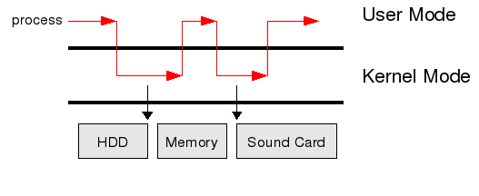

## 운영체제(OS, Operating System)

[운영체제는 컴퓨터라는 기계 안에서 프로그램과 하드웨어 사이에서 문제없이 그리고 효율적으로 잘 돌아가도록 관리해주는 소프트웨어이다.](https://en.wikipedia.org/wiki/Operating_system#:~:text=An%20operating%20system%20(OS)%20is%20system%20software%20that%20manages%20computer%20hardware%20and%20software%20resources%2C%20and%20provides%20common%20services%20for%20computer%20programs.)

운영체제가 없으면 어떻게 될까? 꼭 필요할까?

> _A computer is a machine that can be programmed to automatically carry out sequences of arithmetic or logical operations_
> (컴퓨터는 산술적 또는 논리적 연산(계산)의 순서를 자동으로 수행하도록 프로그래밍할 수 있는 기계이다).
> [ - wikepedia](https://en.wikipedia.org/wiki/Computer#:~:text=A%20computer%20is%20a%20machine%20that%20can%20be%20programmed%20to%20automatically%20carry%20out%20sequences%20of%20arithmetic%20or%20logical%20operations%20(computation).)

운영체제가 없다면 컴퓨터는 그저 하드웨어의 집합체에 불과하다. 
사용자는 프로그램을 실행하기 위해서 매번 하드웨어를 직접 제어해야 하며, 이렇게 하는 것은 매우 비효율적일거다. 
또한 직접 제어를 한다고 해도 하드웨어의 성능은 제한적이므로 이 환경에서 최대한의 성능을 끌어내기 위해 최적화라는 고통스러운 작업을 해야 할 것이다.
이러한 상황을 상상해보면 "배보다 배꼽이 더 크다"라는 말이 떠오른다.

실제로 운영체제라는 개념이 있기 전에는 사용자들이 하나의 작업을 위해 펀치카드를 소지하며 관리해야 했다.
그리고 단순 하드웨어에 올려 실행하는 과정의 방식이기에 한 번에 하나의 프로그램만 실행할 수 있었고, 해당 프로그램이 끝나야 다른 프로그램을 수행할 수 있었다. 
지금처럼 복잡한 방식의 프로그램은 꿈도 꿀 수 없었을 것이다.

이러한 문제를 해결하기 위해 운영체제가 나왔고, 다음과 같은 목적을 지닌다.

- 사용자에게 컴퓨터의 프로그램을 쉽고 효율적으로 실행할 수 있는 환경을 제공한다.
- 컴퓨터 시스템 하드웨어 및 소프트웨어 자원을 여러 사용자 간에 효율적 할당, 관리, 보호하는 것
- 운영체제는 제어 프로그램으로서 사용자 프로그램의 오류나 잘못된 자원 사용을 감시하는 것과 입출력 장치 등의 자원에 대한 연산과 제어를 관리한다.

운영체제은 위와 같은 목적을 위해 다양한 방식을 가지고 있다.

### 일괄 처리 시스템 (Batch Operating System)

사용자의 개입없이 비슷한 작업들을 모아서 순차적으로 처리하는 방식이다. 
한 작업이 끝나야 다음 작업이 실행되기 때문에 모든 작업이 완료될 때까지 기다릴 수 있는 환경에서 사용된다. 
주로 대용량 데이터를 처리하거나 시간이 많이 소요되는 작업에 활용되며, 사용자의 개입이 필요하지 않고 반복적인 작업을 일괄적으로 처리할 수 있다.

### 다중 프로그래밍 시스템 (Multi Programming System)

이 방식은 CPU을 최대한 사용하고 하는 방식으로,
여러 응용프로그램을 메모리에 동시에 올라가 CPU가 쉬지 않고 여러 작업을 번갈아서 실행하며 항상 연산을 수행하는 상태로 활용하는 방식이다.
하나의 프로그램을 실행하는 동안 다른 프로그램은 대기하거나 I/O 작업 등을 수행하며 메모리에 올라간 상태로 대기하게 된다.
운영 체제는 이런 과정에서 CPU를 배분하는 작업 스케줄링과 CPU 스케줄링을 진행하며, 
이를 통해 시스템 자원을 효율적으로 활용하고 응용 프로그램들이 서로 영향을 주지 않으면서 병렬적으로 실행된다.

### 시분할 시스템 (Time Sharing System)

이 방식은 CPU에 대해 일정 시간을 할당 받아 짧은 간격으로 번갈아 실행하는 방식이다. 
다중 프로그래밍 시스템에서는 Context Switching(CPU 점유 권한 전환)이 I/O작업에서만 발생한다.
이를 통해서만 스케줄링을 할 경우 하나의 프로세스가 아주 오래 CPU를 독점하고 있는 상태가 발생할 수 있다는 문제점이 있다.
이를 해결하기 위한 것이 시분할 시스템으로, 다중 프로그래밍과 비슷하지만 모든 프로세스가 특정 시간만 CPU를 점유하고 다른 프로세스에 권한을 넘겨주는 방식으로
Context Switching 기준 시간으로 시분할을 구현해서 RR(Round-Robin) 알고리즘으로 스케줄링을 한다.

### 대화형 시스템(Interactive System)

앞서 설명한 일괄 처리 시스템은 처리해야할 작업들을 한번에 정의하고 일괄적으로 처리하는 방식이었다.
이러한 일괄 처리 시스템의 문제점은 처리가 이루어지는 중에 시스템의 상태를 확인하기가 힘들고, 
작업이 끝나 결과가 도출되기 전까지는 작업을 수정할 수도 없다는 문제점이 있었다.
이를 보완하기위해 등장한 시스템이 대화형 시스템으로, 
작업 중에도 사용자가 데이터, 명령 또는 작업을 입력하면 컴퓨터가 즉각적으로 해당 입력에 응답하는 사용자와 컴퓨터 간의 상호작용을 통해 작동하는 방식이다.

## 커널(Kernel)

그럼 우리들의 컴퓨터 속 운영체제는 어떻게 이러한 기능을 수행하고 있을까?

[운영체제의 이러한 핵심적인 부분을 담당하고 수행하는 것이 바로 커널이다.](https://en.wikipedia.org/wiki/Kernel_(operating_system)#:~:text=A%20kernel%20is%20a%20computer%20program%20at%20the%20core%20of%20a%20computer%27s%20operating%20system%20that%20always%20has%20complete%20control%20over%20everything%20in%20the%20system.) 

커널을 한글로 번역하면 핵심이다! 재밌지 아니한가? 아무튼 다시 돌아와서 커널은 어떻게 운영체제의 기능을 수행할까? 

[커널은 하드웨어를 인터페이스로 제공하여 여러 사용자 또는 여러 프로세스가 하드웨어 즉 리소스를 효율적으로 관리하며 작업을 수행할 수 있도록 해준다.](https://en.wikipedia.org/wiki/Kernel_(operating_system)#:~:text=The%20kernel%27s%20interface%20is%20a%20low%2Dlevel%20abstraction%20layer.%20When%20a%20process%20requests%20a%20service%20from%20the%20kernel%2C%20it%20must%20invoke%20a%20system%20call%2C%20usually%20through%20a%20wrapper%20function.)
여기서 중요한 점은 커널은 사용자가 직접 제어할 수는 없다.
그 이유는 보안상 유저 어플리케이션이 함부로 운영체제의 리소스를 건들지 못하게 하기 위해서다.
그래서 커널에는 하드웨어에 접근이 허가된 커널모드와 그렇지 못한 유저모드로 분리가 되어있다.

커널의 구조는 위 사진과 같은데, 간단한 흐름을 설명하자면 사용자가 유저모드인 어플리케이션을 실행하면서 발생하는 요청이 시스템 콜을 통해 커널 모드로 전환이 된다.
애플리케이션은 커널모드로 전환되었다가 작업을 끝낸 후 응답을 반환하면서 다시 유저모드로 되돌아 가게 된다.
여기서 시스템 콜은 뭐지 싶을텐데 [어플리케이션의 요청이 커널에 접근해 시스템에 요청하는 것](https://en.wikipedia.org/wiki/System_call#:~:text=In%20computing%2C%20a%20system%20call%20(syscall)%20is%20the%20programmatic%20way%20in%20which%20a%20computer%20program%20requests%20a%20service%20from%20the%20operating%20system%5Ba%5D%20on%20which%20it%20is%20executed.)으로 간단히 유저모드에서 커널모드로 전환하는 것이라고 생각하면 된다. 

이러한 방식을 통해 사용자의 프로세스가 직접적으로 운영체제의 리소스를 함부로 변경하지 못하게 보호해준다.

