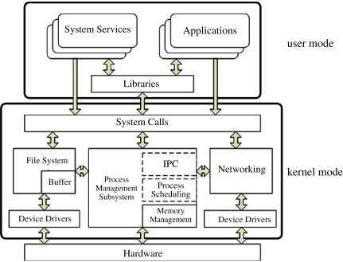
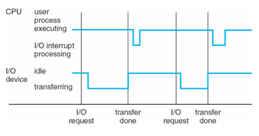
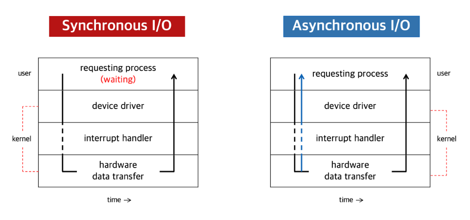
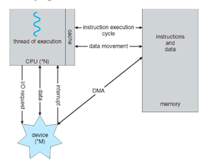

앞서, 운영체제란 무엇인지 그리고 커널에 대해 간단하게 알아봤다.
이제 커널이 어떻게 작동하는지 제대로 알아보자.

먼저 인터럽트(Interrupt)에 대해 알아야 한다.

컴퓨터는 위 사진처럼 주변 입출력 기기와 서로 통신하는데 
이 과정에서 서로 입출력 요청이 오가는데 이때 입출력 메커니즘들이 발생된다.
이중 하나가 인터럽트이다. 

인터럽트는 중단시키다라는 의미로 초인종과 같다고 할 수 있다.
즉, 인터럽트가 발생하면 잠깐 멈추고 다시 실행된다.

실제 발생하는 대부분의 인터럽트는 I/O 인터럽트이다.
예를들면, 우리가 자바에서 print을 할 때 print라는 API를 파일이라는 인터페이스를 통해서 유저모드에서 커널 모드로 시스템 콜이 발생한다.
유저모드 API에서 커널모드 구성요소에서 시스템 콜이 이어지고 디바이스 드라이버를 제어하기 시작하는데
[이때 디바이스 드라이버가 인터럽트를 CPU에 요청한다. 이 행위를 IRQ라고 한다.](https://en.wikipedia.org/wiki/Interrupt_request#:~:text=In%20a%20computer,or%20mouse%20movements.)
이러한 IRQ는 장치마다 다른 번호로 관리하게 된다.
아무튼 출력기기에 출력이 되면, 다시 역순으로 디바이스(하드웨어)에서 디바이스 드라이버로,
디바이스 드라이버에서 커널 모드로 해서 최종적으로 유저 모드로 다시 돌아오게 된다.

이때, 이러한 행위 도중 wait을 걸면 블라킹(동기) 안걸면 논블라킹(비동기)으로 동작하게 된다.

인터럽트에는 우선순위가 있고 외부 인터럽트인지 내부 인터럽트인지에 따라 우선순위가 달라진다.

먼저, 외부 인터럽트로 내부 인터럽트보다 우선 시 된다.

그 중에서도 우선 순위가 있는데, 다음과 같다.
- 전원 이상 인터럽트: 말 그대로 정전 또는 파워 이상
- 기계 착오 인터럽트: CPU의 기능적인 오류.
- 외부 신호 인터럽트: 타이머 또는, 키보드 인터럽트 키(Ctrl + Alt + Delete). 외부장치로부터 인터럽트 요청이 있는 경우. I/O 인터럽트와 다른 개념이다.
- 입출력 인터럽트: 입출력 장치가 데이터 전송을 요구하거나 전송이 끝나 다음 동작이 수행되어야 할 경우. 입출력 데이터에 이상이 있는 경우. 우리가 자주 다루게 될 인터럽트 부분이다.

이제 내부 인터럽트인데, 사실 우리가 주로 다루게 될 것은 외부 인터럽트에 있어 내부 인터럽트는 뭐가 있는지만 대강 본다.

- 명령어 잘못 인터럽트: 잘못된 명령어나 잘못된 데이터를 사용할 때 발생하며 Trap이라 부른다,
- 프로그램 검사
- 소프트웨어 인터럽트(=SVC, SuperVisor Call)

인터럽트 동작 순서에 대해 다시 살펴보면 다음과 같은데,

1. 인터럽트 요청
2. 프로그램 실행 중단
3. 현재 프로그램 상태 보존 -> PCB(Process Control Block), PC(Program Counter) 등
4. 인터럽트 서비스 루틴 실행: 인터럽트 처리 코드
5. 상태  복구
6. 중단 프로그램 실행 재개

이 과정에서 유저모드에서 커널모드로 넘어갈 떄 컨텍스트 스위칭이 되면서 오버헤드가 발생하는데 이로 인해 시스템 상 지연이 발생한다.
하지만 고성능 어플리케이션을 할 때 이 지연은 꽤나 치명적일 것이다. 
그래서 위와 같이 DMA(Direct Memory Access)라는 기술을 사용하게 됐다.
예를들어, DirectX라는 것이 있는데 이는 게임을 할 때 이러한 컨텍스트 스위칭 되는 부분을 건너뛰어 직접 드라이버까지 가는 방식이 있다.
이렇듯 DirectX처럼 인터럽트 시 컨텍스트 스위칭으로 인한 오버헤드가 발생하면서 지연이 발생하는데 이걸 해소하는 것이 DMA인 것이다.
정리하자면, [DMA는 RAM에 일정 부분을 예약해 불필요한 컨텍스트 스위칭을 스킵해 오버헤드 방지 및 지연을 획기적으로 줄이는 방식이다.](https://en.wikipedia.org/wiki/Direct_memory_access#:~:text=DMA%20(%20Direct%20Memory%20Access%20)%EB%8A%94%20%ED%8A%B9%EC%A0%95%20%ED%95%98%EB%93%9C%EC%9B%A8%EC%96%B4%20%ED%95%98%EC%9C%84%20%EC%8B%9C%EC%8A%A4%ED%85%9C%EC%9D%B4%20%EC%A4%91%EC%95%99%20%EC%B2%98%EB%A6%AC%20%EC%9E%A5%EC%B9%98%20(CPU)%20%EC%99%80%20%EB%8F%85%EB%A6%BD%EC%A0%81%EC%9C%BC%EB%A1%9C%20%EC%A3%BC%20%EC%8B%9C%EC%8A%A4%ED%85%9C%20%EB%A9%94%EB%AA%A8%EB%A6%AC%20%EC%97%90%20%EC%95%A1%EC%84%B8%EC%8A%A4%ED%95%A0%20%EC%88%98%20%EC%9E%88%EB%8F%84%EB%A1%9D%20%ED%95%98%EB%8A%94%20%EC%BB%B4%ED%93%A8%ED%84%B0%20%EC%8B%9C%EC%8A%A4%ED%85%9C%EC%9D%98%20%EA%B8%B0%EB%8A%A5%EC%9E%85%EB%8B%88%EB%8B%A4%20.)

