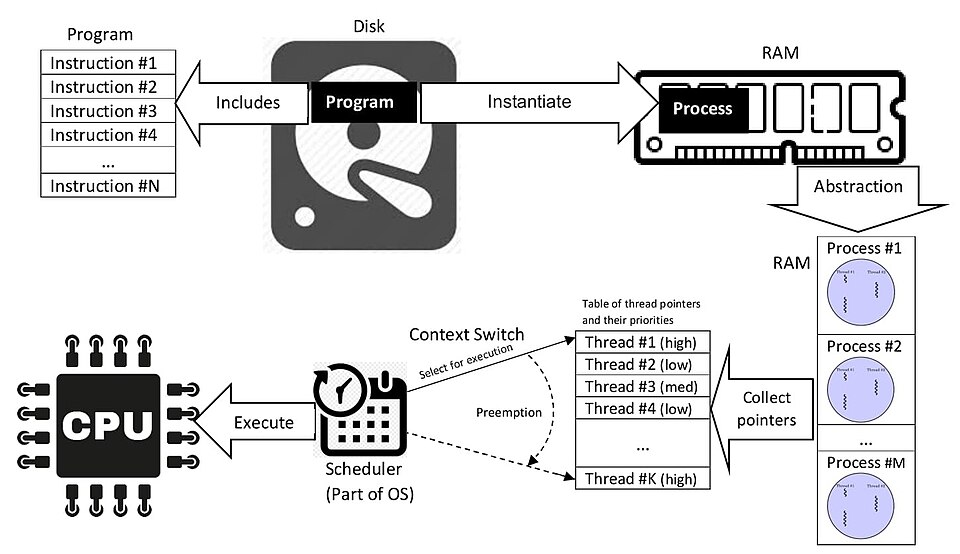
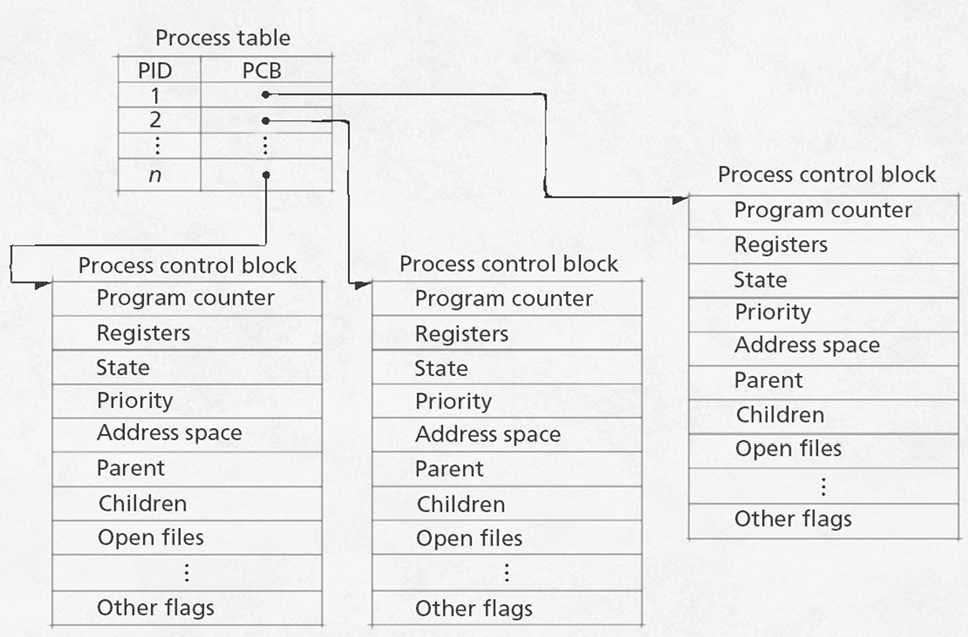
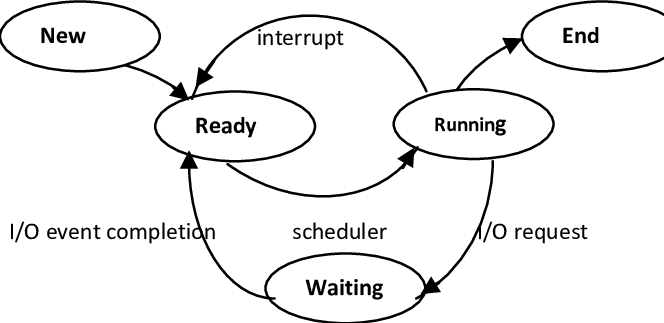
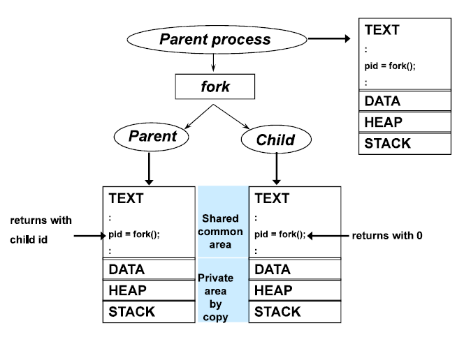

## 프로세스란? 

컴퓨팅에서 프로세스란 운영체제로부터 메모리 공간을 할당받아 실행 중인 프로그램의 [인스턴스](https://ko.wikipedia.org/wiki/%EC%9D%B8%EC%8A%A4%ED%84%B4%EC%8A%A4_(%EC%BB%B4%ED%93%A8%ED%84%B0_%EA%B3%BC%ED%95%99)#:~:text=%EC%9D%B8%EC%8A%A4%ED%84%B4%EC%8A%A4(instance)%EB%8A%94%20%ED%95%B4%EB%8B%B9%20%ED%81%B4%EB%9E%98%EC%8A%A4%EC%9D%98%20%EA%B5%AC%EC%A1%B0%EB%A1%9C%20%EC%BB%B4%ED%93%A8%ED%84%B0%20%EC%A0%80%EC%9E%A5%EA%B3%B5%EA%B0%84%EC%97%90%EC%84%9C%20%ED%95%A0%EB%8B%B9%EB%90%9C%20%EC%8B%A4%EC%B2%B4%EB%A5%BC%20%EC%9D%98%EB%AF%B8%ED%95%9C%EB%8B%A4.)를 의미합니다.
여기서 논하는 프로그램이란, 일반적으로 하드 디스크와 같은 저장장치에 저장되어 있는 실행 코드를 뜻합니다.

## 프로세스의 메모리 공간

프로세스는 다음 4개의 메모리 영역으로 구성되고 [가상 메모리](https://ko.wikipedia.org/wiki/%EA%B0%80%EC%83%81_%EB%A9%94%EB%AA%A8%EB%A6%AC#:~:text=%EA%B0%80%EC%83%81%20%EB%A9%94%EB%AA%A8%EB%A6%AC%20%EB%98%90%EB%8A%94%20%EA%B0%80%EC%83%81%20%EA%B8%B0%EC%96%B5%20%EC%9E%A5%EC%B9%98(%EB%AC%B8%ED%99%94%EC%96%B4%3A%20%EA%B0%80%EC%83%81%EA%B8%B0%EC%96%B5%EA%B8%B0%2C%20virtual%20memory%2C%20virtual%20storage)%EB%8A%94%20%EB%A9%94%EB%AA%A8%EB%A6%AC%20%EA%B4%80%EB%A6%AC%20%EA%B8%B0%EB%B2%95%EC%9D%98%20%ED%95%98%EB%82%98%EB%A1%9C%2C%20%EC%BB%B4%ED%93%A8%ED%84%B0%20%EC%8B%9C%EC%8A%A4%ED%85%9C%EC%97%90%20%EC%8B%A4%EC%A0%9C%EB%A1%9C%20%EC%9D%B4%EC%9A%A9%20%EA%B0%80%EB%8A%A5%ED%95%9C%20%EA%B8%B0%EC%96%B5%20%EC%9E%90%EC%9B%90%EC%9D%84%20%EC%9D%B4%EC%83%81%EC%A0%81%EC%9C%BC%EB%A1%9C%20%EC%B6%94%EC%83%81%ED%99%94%ED%95%98%EC%97%AC%5B1%5D%20%EC%82%AC%EC%9A%A9%EC%9E%90%EB%93%A4%EC%97%90%EA%B2%8C%20%EB%A7%A4%EC%9A%B0%20%ED%81%B0%20(%EC%A3%BC)%20%EB%A9%94%EB%AA%A8%EB%A6%AC%EB%A1%9C%20%EB%B3%B4%EC%9D%B4%EA%B2%8C%20%EB%A7%8C%EB%93%9C%EB%8A%94%20%EA%B2%83%EC%9D%84%20%EB%A7%90%ED%95%9C%EB%8B%A4.%5B2%5D%20%EA%B0%81%20%ED%94%84%EB%A1%9C%EA%B7%B8%EB%9E%A8%EC%97%90%20%EC%8B%A4%EC%A0%9C%20%EB%A9%94%EB%AA%A8%EB%A6%AC%20%EC%A3%BC%EC%86%8C%EA%B0%80%20%EC%95%84%EB%8B%8C%20%EA%B0%80%EC%83%81%EC%9D%98%20%EB%A9%94%EB%AA%A8%EB%A6%AC%20%EC%A3%BC%EC%86%8C%EB%A5%BC%20%EC%A3%BC%EB%8A%94%20%EB%B0%A9%EC%8B%9D%EC%9D%B4%EB%8B%A4.) 공간에 독립적으로 형성됩니다.

- 코드 영역(Code) : 프로그램 실행 코드가 적재되는 영역입니다. 읽기 모드만 지원합니다.
- 데이터 영역(Data) : 프로세스의 초기화 된 데이터들인 전역 변수와 정적 변수들이 적재되는 영역입니다.
- 힙 영역(Heap) : 런타임 동안 생성된 데이터를 보관하기 위해 동적으로 할당받는 영역입니다.
- 스택 영역(Stack) : 지역변수, 매개변수, 리턴 값, 복귀 주소 등이 저장되는 영역입니다.

이렇게 영역이 나눠진 이유는 최대한 중복적인 데이터를 방지하여 메모리 사용량을 줄이는데 목적이 있습니다.

> 예를 들면, 코드에서 공통으로 사용하는 부분을 전역 변수로 지정하는 행위와 같다.

## PCB(프로세스 제어 블록)

커널은 시스템 전체에 대해 레지스터에 하나의 프로세스 테이블을 두고 모든 프로세스의 정보를 관리합니다.
여기서의 프로세스 정보는 해당 프로세스를 실행하기 위해 필요한 정보들로 컨텍스트라고 부릅니다. 
여기서 프로세스의 상태에 따라 프로세스를 교체하는 작업인 컨텍스트 스위칭 작업 이루어 지는데,
이와 같은 상황에서 여러 프로세스를 관리하기 위해 각 프로세스들에 대해 식별이 가능해야 관리가 가능하기에 해당 프로세스의 정보가 필요합니다.

예를 들어, 인터럽트가 발생해서 자원을 할당받은 프로세스가 대기 상태가 되고 다른 프로세스를 실행 상태로 올릴 때
대기 중인 프로세스를 나중에 다시 수행하기 위해 대기 중인 프로세스의 상태와 같은 정보를 알아야 할 것입니다.

운영체제의 커널은 이러한 이유로 활성된 프로세스를 관리하기 위해 해당 프로세스에 대한 정보를 PCB(프로세스 제어 블록)이라는 데이터 구조에 저장합니다.
("PCB는 운영 체제가 프로세스를 표현한 것이다."라는 말도 있습니다.)

> PCB는 해당 프로세스가 실행되면 생성되어 종료 시 제거가 되는데 이 과정에서 PCB의 삽입 및 삭제가 용이한 연결 리스트(Linked List) 방식으로 관리됩니다.

## Process Metadata

그럼 PCB에는 어떤 정보가 담겨있을까요?
PCB에는 아래와 같은 프로세스의 메타데이터들이 담겨져 있습니다.

- 프로세스 번호(PID, Process ID): 각 프로세스의 고유 식별 번호입니다.(PPID: 부모 프로세스 ID)
- 프로세스 상태(Process State): 프로세스가 현재 어떤 상태인지를 나타내는 정보(new, ready, running, waiting, end)입니다.
- 프로그램 카운터(PC, Program Counter): 이 프로세스에서 실행될 다음 명령어의 주소를 가리키는 포인터(주소)입니다.
- 레지스터 상태(Register State): 프로세스의 레지스터 값 세트로, 프로세스를 다시 실행할 때 현재 상태를 복원하는 데 사용됩니다. 
- 스케줄링 정보(Scheduling Information): CPU 시간 스케줄링에 대한 정보입니다.
- 메모리 관리 정보 (Memory Management Information): 프로세스의 메모리 할당과 사용에 관한 정보입니다.
- 입출력 상태 (I/O Status): 프로세스가 입출력 작업을 수행 중인 경우, 해당 상태 정보 및 장치 정보입니다.

## 프로세스 상태

운영체제의 커널은 프로세스를 관리하기 위해 프로세스 정보를 알아야 해서 PCB를 생성하는 것을 알았습니다.
여기서 커널의 프로세스 관리는 프로세스 상태를 관리하는 것이기도 합니다.

프로세스 상태는 위에서 언급한대로 프로세스가 현재 어떤 상태인지를 나타내는 정보로, 
프로세스의 상태에 따라 CPU를 할당하거나 대기 상태로 전환하는 등의 작업이 이루어집니다.
프로세스 상태는 일반적으로 다음과 같은 상태로 구분됩니다.

- New(생성) : 프로세스는 저장장치에서 메모리로 로드되어 생성됩니다. 이후 커널은 메모리를 할당하고 PCB를 생성하고 프로세스 테이블에 등록합니다. 실행 준비를 마치면 ready 상태로 전이됩니다.
- Ready(준비) : 프로세스가 CPU를 사용하고 있지는 않지만 언제든지 사용할 수 있는 상태로, 해당 상태의 프로세스들은 커널에 있는 준비 큐([우선순위 큐](https://ko.wikipedia.org/wiki/%EB%B9%84%EC%9C%A8_%EB%8B%A8%EC%A1%B0_%EC%8A%A4%EC%BC%80%EC%A4%84%EB%A7%81))에 들어갑니다. 스케줄러가 컨텍스트 스위칭을 수행할 때, 준비 큐에서 우선순위가 높은 프로세스가 CPU 스케줄링에 따라 리소스를 할당받아 running 상태로 전이(디스패치)됩니다.
- Running(실행) : 프로세스가 CPU를 차지하여 명령어들이 실행되고 있는 상태입니다. 할당된 시간을 모두 사용했다면 타이머 인터럽트가 발생되어 준비 상태로 전이되고, 입출력 요청이나 자원 요청 등으로 인해 대기 상태로 전이될 수도 있습니다.
- Waiting(대기) : 프로세스 실행 도중 입출력 완료(주된 원인)와 같은 수신 등을 대기하는 상태를 말합니다.
- End(=terminated, 종료) : 프로세스의 실행이 종료된 상태입니다. 이떄, PCB와 프로세스의 메모리를 해제 또는 정리합니다.

## 프로세스 계층 구조

프로세스는 실행 도중 시스템 콜을 통해 다른 프로세스를 생성할 수 있습니다. 
이때 시스템 콜을 호출한 프로세스를 부모 프로세스, 생성된 프로세스를 자식 프로세스라 합니다.

> 서로 다른 프로세스라 서로 다른 PID를 가집니다. 
> 일부 운영체제에서는 자식 프로세스의 PCB에 부모 프로세스의 PID (PPID)가 기록되기도 합니다.

프로세스 생성 기법은 복제와 교체 과정을 통한 방식을 사용합니다.

흐름의 시작인 부모 프로세스는 fork(복제) 시스템 콜을 통해 자신의 복사본을 자식 프로세스로 생성합니다.
자식 프로세스는 exec(교체) 시스템 콜을 통해 자신의 메모리 공간을 다른 프로그램으로 교체합니다.
이때, 자식 프로세스의 메모리 공간을 새로운 프로그램으로 덮어쓰게 합니다.(코드/데이터는 내용만 바꾸고, 나머지는 초기화)
자식 프로세스가 exec 시스템 콜을 호출하지 않을 경우, 부모 프로세스와 자식 프로세스는 같은 코드를 병행하여 실행하는 프로세스가 됩니다.
이러한 과정을 통해 프로세스는 계층 구조를 이루어 관리할 수 있습니다.

많은 운영체제에서는 이처럼 프로세스를 낳는 계층적인 구조로써 프로세스들을 관리합니다.
컴퓨터가 부팅될 때 실행되는 최초의 프로세스가 자식 프로세스들을 생성하고, 
생성된 자식 프로세스들이 새로운 프로세스들을 낳는 형식으로 여러 프로세스가 동시에 실행되는 것입니다.