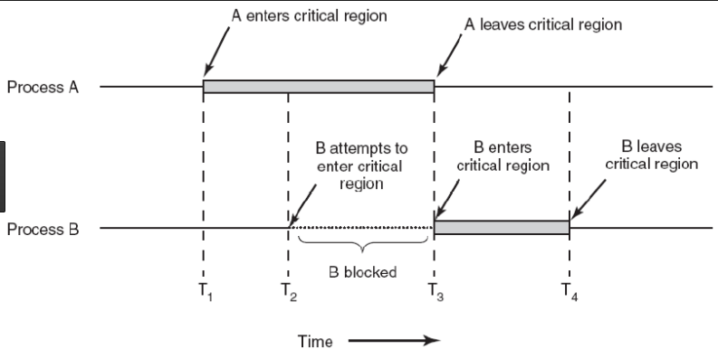

## 프로세스 동기화

컴퓨터에서는 여러 프로세스들이 서로 협력하기 위해 동시에 같은 자원(주소 공간)을 공유하며 실행하기도 합니다.
이러한 상황에서 사용되는 자원에서는 원자성과 일관성을 보장해야 합니다.
이를 위해 운영체제에서는 프로세스 동기화라는 기법을 사용합니다.

> 컴퓨터 과학에서 동기화는 합의에 도달하거나 특정 작업 순서를 커밋하기 위해 특정 지점에 합류하거나 핸드셰이킹하도록 여러 프로세스를 조정하는 작업이다. - [wikipedia](https://ko.wikipedia.org/wiki/%EB%8F%99%EA%B8%B0%ED%99%94_(%EC%BB%B4%ED%93%A8%ED%84%B0_%EA%B3%BC%ED%95%99)#:~:text=%EC%BB%B4%ED%93%A8%ED%84%B0%20%EA%B3%BC%ED%95%99%EC%97%90%EC%84%9C%20%EB%8F%99%EA%B8%B0%ED%99%94(synchronization)%EB%8A%94%20%ED%95%A9%EC%9D%98%EC%97%90%20%EB%8F%84%EB%8B%AC%ED%95%98%EA%B1%B0%EB%82%98%20%ED%8A%B9%EC%A0%95%20%EC%9E%91%EC%97%85%20%EC%88%9C%EC%84%9C%EB%A5%BC%20%EC%BB%A4%EB%B0%8B%ED%95%98%EA%B8%B0%20%EC%9C%84%ED%95%B4%20%ED%8A%B9%EC%A0%95%20%EC%A7%80%EC%A0%90%EC%97%90%20%ED%95%A9%EB%A5%98%ED%95%98%EA%B1%B0%EB%82%98%20%ED%95%B8%EB%93%9C%EC%85%B0%EC%9D%B4%ED%82%B9%ED%95%98%EB%8F%84%EB%A1%9D%20%EC%97%AC%EB%9F%AC%20%ED%94%84%EB%A1%9C%EC%84%B8%EC%8A%A4%EB%A5%BC%20%EC%A1%B0%EC%A0%95%ED%95%98%EB%8A%94%20%EC%9E%91%EC%97%85%EC%9D%B4%EB%8B%A4.)

프로세스 동기화란 프로세스들 사이의 수행시기를 맞추는 것을 의미합니다.
프로세스 동기화는 실행 순서 제어를 위한 동기화와 상호베제를 위한 동기화로 구분할 수 있습니다.

> 현대에는 대부분 쓰레드 기준으로 동기화 컨텍스트 스위칭이 발생해서 쓰레드 동기화라고 부르기도 합니다. 
> 하지만 공유되는 환경에서 실행의 흐름을 갖는 모든 것들이 동기화의 대상이기에 엄격하게 구분을 짓진 않는 것 같습니다.

### 실행 순서 제어를 위한 동기화

실행 순서 제어를 위한 동기화는 프로세스들이 특정 순서에 따라 실행되어야 하는 경우에 사용됩니다.
예를 들어, 프로세스 A가 프로세스 B보다 먼저 실행되어야 하는 경우, A가 완료된 후에 B가 실행되도록 제어하는 것입니다.

### 상호배제를 위한 동기화

상호배제를 위한 동기화는 여러 프로세스가 동시에 공유 자원에 접근하는 것을 방지하기 위해 사용됩니다.
예를 들어, 두 개의 프로세스가 동시에 같은 파일에 접근하여 데이터를 수정하는 경우, 데이터의 일관성이 깨질 수 있습니다.
이러한 상황을 방지하기 위해, 한 프로세스가 공유 자원에 접근하는 동안 다른 프로세스는 접근하지 못하도록 제어하는 것입니다.

## 공유 자원과 임계 구역

공유 자원(shared resource)이란 여러 프로세스가 동시에 접근할 수 있는 자원을 의미합니다. 
예를 들어, 메모리 공간, 파일, 입출력 장치 등이 공유 자원에 해당합니다.
임계 구역(critical section)이란 이러한 공유 자원에 접근하는 코드의 부분을 의미합니다.
즉, 공유 자원에 접근하는 코드 영역을 임계 구역이라고 합니다.

## 경쟁 상태

임계 구역에 대한 동시 접근은 예상치 못한 동작이나 오류 동작을 초래해 자원의 일관성을 해칠 수 있습니다.
이러한 상황을 경쟁 상태 즉, 레이스 컨디션(race condition)이라고 합니다.  



운영체제는 임계 구역에서 발생하는 이러한 경쟁 상태를 방지하기 위해 다음과 같은 기법을 원칙 하에 동기화를 구현합니다.

- 상호 배제(mutual exclusion) : 한 프로세스가 임계 구역에 진입했다면 다른 프로세스는 임계 구역에 들어올 수 없습니다.
- 진행(process) : 임계 구역에 어떤 프로세스도 진입하지 않았다면 임계 구역에 진입하고자 하는 프로세스는 들어갈 수 있어야 합니다.
- 유한 대기(bounded waiting) : 한 프로세스가 임계 구역에 진입하고 싶다면 그 프로세스는 언젠가는 임계 구역에 들어올 수 있어야 합니다. 임계 구역에 들어오기 위해 무한정 대기해서는 안 됩니다

## 동기화 기법

이제 실행 순서 제어와 상호 배제를 위한 동기의화 실제 적용 기법에 대해 알아보겠습니다.

### 뮤텍스 락

뮤텍스 락(mutex lock)은 임계 구역에 동시에 접근하지 않도록 하는 상보 배체를 위한 동기화 기법입니다.
임계 구역에 진입하는 프로세스는 자신이 현재 임계 구역에 있음을 알리기 위해 뮤텍스 락을 이용해서 임계 구역에 락을 걸 수 있습니다.
다른 프로세스는 임계 구역에 락이 걸려 있다면 기다리고, 그렇지 않다면 임계 구역에 진입할 수 있게 됩니다.

뮤텍스 락은 프로세스들이 공유하는 `lock` 전역변수와 
임계 구역에 락을 거는 `acquire` 함수, 
그 락을 해제하는 역할인 `release` 함수로 구성됩니다.

```java
class Mutex {
    private boolean lock = false;
    public void acquire() {
        while (lock) {
            // busy waiting
        }
        lock = true;
    }
    public void release() {
        lock = false;
    }
}
```

> 여기서 `busy waiting`이란 프로세스가 임계 구역에 진입하기 위해 반복적으로 `lock`를 확인하는 것을 의미합니다.
> 이런 행위는 CPU 자원을 낭비를 유발합니다.

이렇게 구현하게 되면 프로세스는 임계 구역에 락이 되어있을 경우 계속해서 락이 해제되기를 기다리게 됩니다.
락이 해제되어 임계 구역에 진입할 수 있게 되면 락을 건 후 임계 구역에 진입하여 작업을 진행하게 됩니다.
그리고 다시 임계 구역에서 빠져나올 때 락을 해제하여 다른 프로세스가 임계 구역에 진입할 수 있도록 합니다.
뮤텍스 락은 이런 방식으로 임계 구역에 동시에 접근하는 것을 방지하여 임계구역을 보호할 수 있습니다.

### 세마포어

세마포어(semaphore)는 뮤텍스 락보다 더 일반화된 동기화 기법으로,
실행 순서 제어를 위한 동기화와 상호 배제를 위한 동기화 모두에 사용할 수 있습니다.
뮤텍스 락은 임계 구역에 하나의 프로세스만 접근할 수 있도록 하지만, 
세마포어는 여러 프로세스가 동시에 접근할 수 있도록 허용할 수 있습니다.

> 사실 세마포어의 종류에는 이진 세마포와 카운팅 세마포어가 있습니다.
> 하지만 이진 세마포어는 뮤텍스 락과 동일한 기본 구현을 사용하는 락 메커니즘로서,
> 이 글에서는 카운팅 세마포어에 대해 설명하고자 합니다.

#### 상호배제를 위한 세마포어

세마포어는 임계 구역에 동시에 접근할 수 있는 프로세스의 수를 나타내는 정수형 전역 변수 `S`와
임계 구역에 진입하기 위해 `S`를 감소시키는 `wait` 함수, 
임계 구역에서 빠져나올 때 `S`를 증가시키는 `signal` 함수로 구성됩니다.

```java
class Semaphore {
    private int S;
    public Semaphore(int S) {
        this.S = S;
    }
    public void wait() {
        while (S <= 0) {
            // busy waiting
        }
        S--;
    }
    public void signal() {
        S++;
    }
}
```

코드를 보면 바쁜 대기(busy waiting)이 뮤텍스에서 본 거 처럼 존재하는 것을 알 수 있습니다.
세마포어는 이런 상황에서 CPU 자원을 낭비하는 것을 방지하기 위해, 
바쁜 대기 대신 프로세스를 대기 상태로 전환하는 방법을 사용합니다.

```java
class Semaphore {
    private int S;
    private Queue<Process> queue = new LinkedList<>();

    public Semaphore(int S) {
        this.S = S;
    }

    public synchronized void acquire(Process p) {
        S--;
        if (S < 0) {
            queue.add(p);
            p.sleep(); // 블로킹
        }
    }

    public synchronized void release() {
        S++;
        if (S <= 0) {
            Process p = queue.poll();
            if (p != null) {
                p.wakeUp();
            }
        }
    }
}
```

이렇게 구현하게 되면 프로세스는 임계 구역에 진입하기 위해 `acquire` 함수를 호출합니다.
`S`가 0보다 작아지면 임계 구역에 진입할 수 없으므로, 프로세스는 대기 큐에 추가되고 대기 상태로 전환됩니다.
그리고 임계 구역에서 빠져나올 때 `release` 함수를 호출하여 `S`를 증가시키고, 
대기 큐에 있는 프로세스 중 하나를 깨워서 임계 구역에 진입할 수 있도록 합니다.
이런 방식으로 세마포어는 .

#### 실행 순서 제어를 위한 세마포어

세마포어는 실행 순서 제어를 위한 동기화에도 사용할 수 있습니다.
프로세스 $P_1$가 프로세스 $P_2$보다 먼저 실행되어야 하는 경우를 예로 들어보겠습니다. 
전역 변수 `S`를 0으로 초기화하고,
먼저 실행할 프로세스 $P_1$ 뒤에 `signal` 함수를 호출하여 `S`를 1로 증가시킵니다.
그리고 나중에 실행할 프로세스 $P_2$ 앞에는 `wait` 함수를 호출합니다.
이렇게 하면 $P_2$가 먼저 진입해도 `wait` 함수로 인해 $P_1$ 프로세스 먼저 실행되고, 그 다음에 $P_2$가 실행되도록 제어할 수 있습니다.
즉, $P_1$와 $P_2$의 실행되는 순서에 차이가 있더라도 항상 $P_1$가 먼저 실행되도록 보장할 수 있습니다.

### 모니터

이처럼 세마포어는 뮤텍스 락보다 더 일반화된 동기화 기법이지만,
매번 임계 구역에 진입할 때마다 `wait`와 `signal` 함수를 호출해야 하므로 번거롭고,
코드가 복잡해질 수 있습니다.
또한, `wait`와 `signal` 함수를 호출하는 순서가 잘못되거나 중복해서 사용한 경우 예기치 못한 상황이 발생할 수 있습니다.
이를 해결하기 위해 모니터(monitor)라는 고수준의 동기화 기법이 개발되었습니다.

#### 상호배제를 위한 모니터

모니터는 공유 자원과 공유 자원에 접근하기 위한 인터페이스를 하나의 추상 데이터 타입으로 캡슐화한 것입니다.
모니터를 통해 공유 자원에 접근하고자 하는 프로세스를 큐에 삽입하고,
큐에서 프로세스를 꺼내어 공유 자원을 사용할 수 있도록 합니다.
즉, 모니터에 진입하기 위한 큐를 만들고, 
모니터 안에 항상 하나의 프로세스만 존재하도록 보장여 상호 배제를 위한 동기화를 구현합니다.

##### 실행 순서 제어를 위한 모니터

모니터는 모니터에 진입하도록 하기 위한 상호 배제를 위한 큐와
`wait`가 호출되어 실행 중단된 프로세스가 대기하는 큐,
그리고 조건 변수(condition variable)를 이용하여 실행 순서 제어를 위한 동기화도 구현할 수 있습니다.

> 조건 변수란 실행 순서를 제어하기 위해 wait()와 signal()을 호출할 수 있는 특별한 변수입니다.

세마포어와 마찬가지로 모니터에서도 `wait`와 `signal` 함수를 사용하는 것을 알 수 있는데,
동작은 유사하지만, 자체적인 값을 가지는 세마포어와 달리,
모니터의 조건 변수는 자체적인 값을 가지지 않고,
프로세스를 큐에 삽입하고 꺼내는 역할만 합니다.

