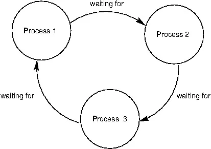

## 교착 상태

교착 상태(deadlock)란 둘 이상의 프로세스가 서로 자원을 점유한 채로 다른 프로세스가 점유한 자원을 기다리며 무한정 대기하는 상태를 의미합니다.

이러한 상황에서는 프로세스들이 서로 자원을 점유하고 있기 때문에 아무도 진행할 수 없게 됩니다.
그럼 교착 상태는 언제 발생할까요?
교착 상태 발생 조건은 다음과 같습니다.
조건 중 하나라도 만족하지 않는다면 교착상태가 발생하지 않지만,
아래 조건이 모두 만족될 때 교착 상태가 발생할 가능성이 생깁니다.
 
- 점유와 대기(hold and wait): 자원을 점유하고 있으면서 다른 자원을 기다리는 상태
- 상호 배제(mutual): 한 프로세스가 사용하는 자원을 다른 프로세스가 사용할 수 없는 상태
- 비선점(non-preemptive): 어떤 프로세스도 다른 프로세스의 자원을 강제로 뺴앗지 못하는 상태
- 원형 대기(circular wait): 자원을 기다리는 프로세스들이 순환되는 원형으로 연결되어 있는 상태

운영체제는 교착 상태를 예방, 회피, 탐지 및 회복하는 방법으로 교착 상태 문제를 해결합니다.

## 교착 상태 예방

교착 상태 예방(prevention)은 교착 상태 발생 조건 중 하나라도 만족하지 않도록,
교착 상태 조건인 점유와 대기, 상호 배제, 비선점, 원형 대기 중 하나를 제거한다는 의미입니다.

먼저 상호 배제 조건을 제거하는 방법이 있습니다.
이는 현실적으로 불가능합니다.
상호 배제를 제거한 다는 건 모든 자원을 공유하게 된다는 의미인데,
이는 동기화를 할 때 문제가 발생할 수 있습니다.

다음 방법은 점유와 대기 조건을 제거하는 방법인데,
특정 프로세스에 자원을 모두 할당하거나,
아예 할당하지 않는 방법입니다.
이 방법은 당장 자원이 필요해도 기다릴 수 밖에 없는 프로세스와 
사용되지 않으면서 오랫동안 할당되는 자원을 양산시켜
자원의 활용도를 떨어뜨릴 수 있습니다.

또 다른 방법으로는 비선점 조건을 제거하는 방법이 있습니다.
이 방법은 어떤 프로세스가 자원을 할당받았을 때,
다른 프로세스가 그 자원을 필요로 한다면,
할당받은 자원을 강제로 빼앗아 다른 프로세스에 할당하는 방법입니다.
이 방법은 자원을 강제로 빼앗기 때문에
프로세스가 작업을 완료하지 못하고 중단될 수 있습니다.
그렇기에 프린터 같이 선점이 불가능한 자원에는 적용하지 못하고,
선점이 가능한 자원에 한에 효과적입니다.
그래서 이 방법 또한 범용성이 떨어져 현실적으로 적용하기 어렵습니다.

마지막으로 원형 대기 조건을 없애는 방법이 있습니다.
원형 대기 조건을 없애는 방법은 자원에 순서를 매겨서
오름차순으로 낮은 순서의 자원만 할당받을 수 있도록 하는 방법입니다.
이 방법이 앞선 방법들에 비해 가장 현실적으로 적용할 수 있는 방법입니다.
하지만 컴퓨터 시스템 내에 존재하는 수많은 자원에 순서를 매기는 것이 쉽지 않고,
각 자원에 순서를 어떻게 할 건지에 따라 특정 자원의 활용률이 달라집니다.

## 교착 상태 회피

교착 상태 회피(avoidance)는 자원 할당 시 교착 상태가 발생하지 않도록,
미리 판단하고 자원을 할당하다가 교착 상태의 위험이 있으면 자원 할당을 멈추는 방법입니다.

교착 상태 회피에 대해 이해하기 위해 다음 용어들을 알아야 합니다.

- 안전 순서열(safe sequence): 시스템이 교착 상태 없이 모든 프로세스를 완료할 수 있는 순서열
- 안전 상태(safe state): 시스템이 안전 순서열을 가지고 있는 상태
- 불안전 상태(unsafe state): 시스템이 안전 순서열을 가지고 있지 않은 상태

예를 들어 $P_1$, $P_2$, $P_3$ 프로세스가 동시에 자원을 요청한 상황에서,
$P_3 \to P_2 \to P_1$ 순서로 자원을 할당하면 교착 상태가 발생하지 않는다고 가정하면,
$P_3 \to P_2 \to P_1$가 안전 순서열이 되는 것입니다.
이 안전 순서열이 있는 상태를 안전 상태라고 하고, 없는 상태가 불완전 상태라고 합니다.

운영체제는 교착 상태를 회피하기 위해 시스템 상태가 안전 상태에서 벗어나지 않는 경우에만 자원을 할당합니다.

## 교착 상태 탐지 및 회복

교착 상태 탐지(detection) 및 회복(recovery)는 자원을 할당하다가 교착 상태를 탐지하고,
탐지된 교착 상태를 회복하는 방법입니다.
회복에는 선점을 통햐 회복하는 방식과 프로세스 강제 종료를 통해 회복하는 방식이 있습니다.

먼저, 선점을 통한 회복 방식은 교착 상태에 빠진 프로세스 중 하나를 선택하여,
그 프로세스가 점유하고 있는 자원을 강제로 빼앗아 다른 프로세스에 할당하는 방법입니다.
이 방법은 선점이 가능한 자원에만 적용할 수 있습니다.
또한, 어떤 프로세스를 선택할지에 대한 기준이 명확하지 않기 때문에
적절한 프로세스를 선택하지 못하면 오히려 교착 상태가 더 심해질 수 있습니다.

다음으로 프로세스 강제 종료를 통한 회복 방식은 
교착 상태에 빠진 프로세스들을 모두 강제 종료시키는 방법과
교착 상태가 해결 될 때까지 하나씩 강제 종료시키는 방법이 있습니다.

모두 강제 종료시키는 방법은 강제 종료된 프로세스가 작업을 완료하지 못하고 중단될 수 있습니다.
그리고 작업 내용을 잃을 위험이 있습니다.

하나씩 강제 종료시키는 방법은 강제 종료 후,
교착 상태가 해결 되었는지 확인하는 과정에서 오버헤드가 발생합니다.

이처럼 선점이 불가능한 자원에도 적용할 수 있지만,
교착 상태 탐지 및 회복 방법은 교착 상태를 예방하거나 회피하는 방법에 비해
교착 상태가 발생한 후에야 문제를 해결할 수 있고,
시스템의 성능에 큰 영향을 미칠 수 있습니다.
따라서, 교착 상태 탐지 및 회복 방법은 교착 상태가 자주 발생하지 않는 시스템에서만 사용되는 것이 일반적입니다.