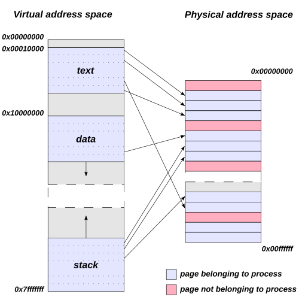
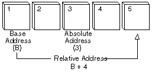
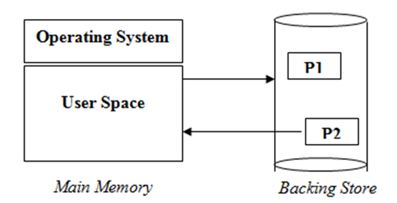

## 절대 주소와 상대 주소

메모리는 크게 2가지 영역으로 나눌 수 있습니다.
하나는 운영체제가 사용하는 커널 영역이고, 다른 하나는 사용자 프로세스가 사용하는 사용자 영역입니다.
운영체제는 커널 영역을 사용하고, 사용자 프로세스는 사용자 영역을 사용합니다.

운영체제는 중요한 역할을 하기 때문에 사용자가 운영체제 영역을 침범하지 못하도록 분리하여 메모리를 사용합니다.
사용자 프로세스는 메모리에 들어올 때 운영체제 영역으로 지정된 영역 이외의 사용자 영역에 저장되어야 합니다.
만약 운영체제 영역이 100번지까지 있으므로 사용자 프로세스는 101번지부터 들어올 수 있다.

이렇게 메모리에 접근할 때 사용하는 것이 메모리 주소입니다. 
메모리는 1Byte 크기로 나뉘어 각 영역은 메모리 주소로 구분을 하는데,
보통 첫번째 영역을 0번지로 지정하여 시작합니다.
CPU는 메모리에 저장된 데이터를 읽거나 쓸 때 메모리 주소 레지스터(MAR, Memory Address Register)에 메모리 주소를 지정하여 접근합니다.

이러한 메모리 주소는 절재 주소(absolute address)와 상대 주소(relative address)로 나뉘는데,
절대 주소는 실제 메모리의 주소 공간을 가리키는 것으로 메모리 관리자 입장에서 사용하는 주소입니다.
즉, MAR이 사용하는 주소로 컴퓨터에 삽입된 메모리의 실제 주소를 의미합니다.
상대 주소는 메모리 공간에서 사용자 영역이 시작되는 베이스 주소를 0번지로 변경해서 사용하는 주소 지정 방식입니다.
즉, 사용자 프로세스 입장에서 메모리 공간을 바라본 주소이고, 절대 주소와 관계없이 항상 0번지부터 시작합니다.

> 주소를 2개로 나눈 이유는 사용자 입장에서 절대 주소를 사용하게 되면 불편하고 위험하기 때문이다.
> 절대 주소를 사용하게 되면 사용자 프로세스 입장에서는 운영체제 영역은 사용할 수 없는 공간이지만,
> 매번 운영체제 영역을 확인해야 하는 불편함이 존재한다.
> 하지만 상대 주소를 사용하면 상대 주소가 운영체제 영역의 위치를 알 필요가 없고,
> 주소가 항상 0번지부터 시작하기 떄문에 편리해진다.
> 또한, 절대 주소를 사용하게 되면 사용자가 운영체제 영역의 주소를 실수나 고의적인 조작으로
> 접근할 수 있는 위험의 소지가 있게 된다.

이렇게 사용자 프로세스 입장에서 사용하는 상대 주소와 실제로 메모리 공간을 가리키는 메모리 관리자가 쓰는 절대 주소로 나뉜다면,
메모리 접근 시 상대 주소를 절대 주소로 변환하는 과정이 필요합니다.
상대 주소를 절대 주소로 변환하는 과정은 다음과 같습니다.
1. 운영체제는 사용자 프로세스가 메모리에 적재될 때, 운영체제 영역이 끝나는 주소를 베이스 레지스터(base register)에 저장합니다.
2. CPU가 사용자 프로세스의 상대 주소를 MAR에 지정하여 메모리에 접근하려고 하면, CPU는 MAR에 지정된 상대 주소에 베이스 레지스터에 저장된 값을 더하여 절대 주소로 변환합니다.
3. 변환된 절대 주소를 이용하여 메모리에 접근합니다.

> 프로세스에 메모리 공간을 할당하는 방식은 연속 메모리 할당 방식입니다.

## 스와핑

스와핑(swapping)은 현재 실행되지 않는 프로세스들을 보조기억 장치의 일부 영역으로 쫓아내고,
메모리에 생긴 빈 공간에 새로운 프로세스를 적재 시키는 방법입니다.

- 스왑 영역(swap space): 프로세스들이 쫓겨나서 머무는 보조기억장치의 일부 영역
- 스왑 아웃(swap out): 현재 실행되지 않는 프로세스가 메모리에서 스왑 영역으로 옮겨지는 것
- 스왑 인(swap in): 스왑 영역에 있던 프로세스를 다시 메모리로 옮겨오는 것

여기서 스왑 아웃되었던 프로세스가 다시 스왑 인이 될 때는 이전 물리 주소와 다른 주소에 적재될 수 있습니다.

스와핑을 이용하면 프로세스들이 요구하는 메모리 공간 크기가 실제 메모리 크기보다 
크더라도 모든 프로세를 동시 실행할 수 있습니다.

## 메모리 할당

프로세스는 메모리의 빈 공간에 할당되어야 합니다.
빈 공간이 여러개 있다면 어떤 공간에 메모리를 할당할지에 대한 방법으로 아래의 세 가지가 있습니다.

- 최초 적합(first-fit): 최초 적합은 운영체제가 메모리 내의 빈 공간을 순서대로 탐색하다 적재할 수 있는 공간을 발견하면,
  그 공간에 프로세스를 배치하는 방식입니다. 적재할만한 공간을 찾으면 바로 할당하기 때문에 다른 방식보다 탐색 시간이 적고, 빠른 할당이 가능합니다.
- 최적 적합(best-fit): 운영체제가 빈 공간을 모두 탐색해본 뒤, 적재 가능한 가장 작은 공간에 할당하는 방식입니다.
- 최악 적합(worst-fit): 운영체제가 빈 공간을 모두 탐색해본 뒤, 적재 가능한 가장 큰 공간에 할당하는 방식입니다.

## 단편화

단편화(external fragmentation)은 주기억장치에 프로그램을 할당하고 반남하는 과정에서 발생하는 사용되지 않는 작은 조각 공간을 뜻합니다.
주기억장치 상에서 빈번하게 기억장소가 할당되고 반납됨에 따라 기억 장소들이 조각들오로 나누어지는 현상을 뜻하기도 합니다.
메모리 할당 방식인 최초 적합, 최적 적합, 최악 적합 모두 단편화를 피할 수는 없습니다.

단편화에는 내부 단편화와 외부 단편화가 있습니다.

### 내부 단편화

내부 단편화(internal fragmentation)은 주기억장치 내 사용자 영역이 실행 프로그램보다 커서,
프로그램의 사용 공간을 할당 후 사용되지 않고 남게 되는 현상을 말합니다.
예를 들어, 100MB의 메모리에 80MB 크기의 프로세스를 올리게 되면 20MB가 남게 되는데
이렇게 적은 크기의 잔여 메모리가 발생해 해당 메모리를 사용할 수 해당 메모리를 사용할 수 없게 되는 것을 내부 단편화라고 합니다.

### 외부 단편화

외부 단편화(external fragmentation)은 남아있는 총 메모리 공간이 요청한 메모리 공간보다 크지만,
남아있는 공간이 연속적(contiguous)이지 않아 발생하는 현상입니다.
예를 들어, 남아있는 공간이 50MB로 된 2개가 있다고 가정하고 올려야하는 프로세스의 크기가 80MB라면,
남아있는 공간은 총 100MB로 요청한 메모리 공간 80MB보다 크지만,
남아있는 공간이 연속적이지 않아서 프로세를 할당할 수 없게 됩니다.
이로 인해 남아있는 메모리 공간이 낭비되게 되는 문제가 발생하게 됩니다.
이를 외부 단편화라고 합니다.

외부 단편화를 해결하기 위해 압축 기법을 사용할 수 있습니다.
압축 기법은 주기억장치 내 분산되어 있는 단편화된 공간들을 통합하여 하나의 커다란 빈 공간을 통합하여,
하나의 커다란 빈 공간을 만드는 작업을 말합니다.

하지만 압축이 좋은 점만 있는 것은 아닙니다.
작은 빈 공간들을 하나로 모으는 동안 시스템은 하던 작업을 멈추어야 하고,
어떤 프로세스를 어떻게 움직여야 오버헤드를 최소화화며 압축할 수 있는지에 대한 명확한 방법을 결정하기가 어렵습니다.
