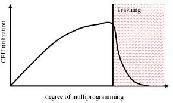
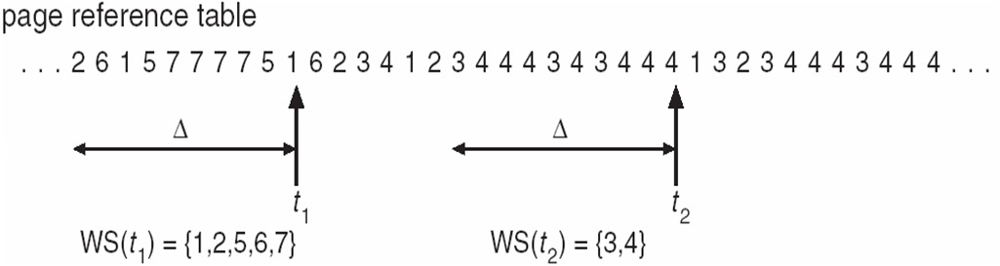
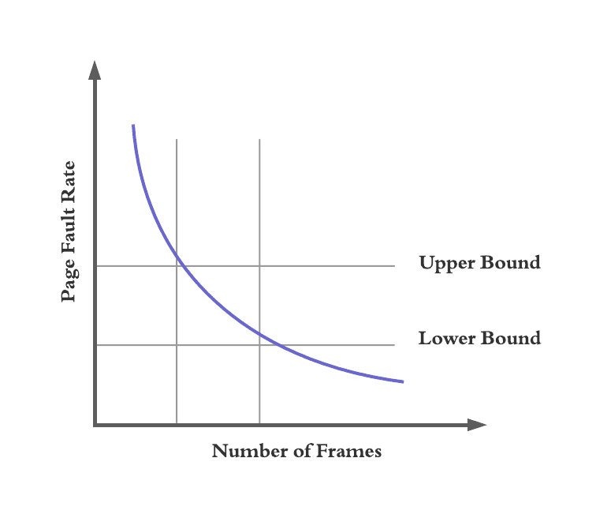

## 연속 메모리 할당의 문제점

연속 메모리 할당의 문제점은 단편화 문제 외에도
물리 메모리의 크기보다 큰 프로세스의 실행이 불가한 점이 있습니다.

예를 들어, RAM 용량이 4GB인데 프로세스 크기가 5GB면 실행할 수 없는 것을 의미합니다.
하지만 가상 메모리(virtual memory)를 이용하면 이게 가능합니다.
또한 외부 단편화 문제도 해결할 수 있습니다.
가상 메모리는 실행하고자 하는 프로그램을 일부만 메모리에 적재하여,
실제 메모리 크기보다 더 큰 프로세스를 실행할 수 있게 해줍니다.
가상 메모리 관리 기법에는 페이징과 세그멘테이션이 있습니다.

## 페이징

메모리 연속 할당에서 외부 단편화가 발생했던 근본적 이유는 
다른 크기의 프로세스가 메모리에 연속으로 할당되었기 때문입니다.
페이징(paging)은 메모리와 프로세스를 일정한 단위로 자르고,
이를 메모리에 불연속적으로 할당할 수 있도록 하여 
외부 단편화가 발생하지 않도록 할 수 있습니다.

페이징의 기본 개념은 프로세스의 논리 주소 공간을 페이지(page)라는 일정 단위로 자르고,
메모리 물리 주소 공간을 프레임(frame)이라는 페이지와 동일한 일정한 단위로 자른 뒤,
페이지를 프레임에 할당하는 가상 메모리 관리 방식입니다.

### 페이징에서 스와핑

페이징에서도 스와핑이 사용 가능한데,
페이징을 사용하는 시스템에서 프로세스 전체가 스왑 인, 스왑 아웃 되는 것이 아닌,
페이지 단위로 스왑 인, 스왑 아웃이 가능합니다.
즉, 메모리에 적재될 필요가 없는 페이지들은 보조기억 장치로 스왑 아웃되고,
실행에 필요한 페이지들은 메모리로 스왑 인됩니다.

이렇게 스와핑을 함으로써 한 프로세스를 실행하기 위해 프로세스 전체가 메모리에 적재될 필요가 없게 되었습니다.
즉, 프로세스를 이루는 페이지 중 실행에 필요한 일부 페이지만을 메모리에 적재하고, 
당장 실행에 필요하지 않은 페이지들은 보조기억장치에 남겨둘 수 있게 되었습니다.
이와 같은 방식을 통해 물리 메모리 크기보다 더 큰 프로세스도 실행할 수 있게 되었습니다.

### 페이지 테이블

페이징을 사용하면
프로세스를 이루는 페이지가 어느 프레임에 적재되어 있는지 CPU가 알기가 어렵다.
프로세스가 메모리에 불연속적으로 배치되어 있다면,
CPU 입장에서 이를 순차적으로 실행할 수가 없다.
CPU 입장에서는 다음에 실행할 명령어 위치를 찾기가 어려워집니다.

이를 해결하기 위해 페이지 테이블(page table)을 사용하게 되었습니다.
페이지 테이블이란 실제 메모리 주소인 물리 주소에 불연속적으로 배치되더라도,
CPU가 인식하는 논리 주소에는 연속적으로 배치될도록 하는 방식입니다.
즉, 페이지 번호와 프레임 번호를 매핑시킨 표라고 할 수 있습니다.

이렇게 하면 물리 주소상에서는 프로세스들이 분산되어 저장되어 있더라도,
CPU 입장에서는 연속적으로 보일 수 있다.
즉, 프로세스들이 메모리에 분산되어 저장되어 있더라도 CPU는 논리 주소를 그저 순차적으로 실행하면 됩니다.

> 페이징은 외부 단편화는 해결하지만, 내부 단편화는 막을 수 없습니다. 
> 페이징은 프로세스의 논리 주소공간을 페이지라는 일정한 크기로 자른다. 하지만 모든 프로세스가 페이지 크기에 딱 맞게 잘리는 것은 아닙니다. 
> 예를 들어, 페이지 크기가 10KB인데 프로세스 크기가 108KB라면 마지막 페이지는 2KB가 남습니다. 
> 이러한 메모리 낭비는 페이징에서는 해결할 수 없습니다.

### 페이지 테이블 베이스 레지스터

페이지 테이블 베이스 레지스터(PTBR)은 각기 페이지 테이블이 있고, 각 페이지 테이블은 CPU 내의 PTBR이 가리키는 주소에 저장됩니다.
즉, PTBR은 각 프로세스의 페이지 테이블이 적재된 주소를 가리키는 레지스터입니다.
각 프로세스들의 페이지 테이블 정보들은 각 프로세스 PCB에 저장되어 있습니다.

### TLB

페이지 테이블을 메모리에 두면 메모리 접근 시간이 두 배로 늘어납니다.
왜냐하면 메모리에 있는 페이지 테이블을 보고
테이블을 통해 알게 된 프레임에 접근하기 위해
이렇게 총 두 번의 메모리 접근이 필요하기 때문입니다.
이와 같은 문제를 해결하기 위해 TLB(Translation Lookaside Buffer)를 사용합니다.
TLB는 페이지 테이블의 일부를 캐시 메모리에 저장하는 고속 캐시입니다.
참조 지역성에 근거해 페이지 테이블의 일부를 가져와 저장합니다.
CPU가 발생한 논리 주소에 대한 페이지 번호가 TLB에 있을 경우 TLB 히트라고 하고,
이 경우 페이지가 적재된 프레임을 알기 위해 메모리에 접근할 필요가 없습니다.
하지만, CPU가 발생한 논리 주소에 대한 페이지 번호가 TLB에 없을 경우 TLB 미스라고 하고,
이 경우는 페이지가 적재된 프레임을 알기 위해 메모리 내의 페이지 테이블에 접근해야 합니다.

### 페이징에서의 주소 변환

하나의 페이지 혹은 프레임은 여러 주소를 포괄하고 있습니다.
그렇기 떄문에 특정 주소에 접근하려면 어떤 페이지에 혹은 프레임에 접근하고 싶은지
그리고 접근하려는 주소가 그 페이지 혹은 프레임으로부터 얼마나 떨어져 있는지 알아야 합니다.
이를 위해 페이징 시스템에서 모든 논리 주소는 페이지 번호(page number)와 페이지 오프셋(page offset)으로 나누어집니다. 
$(page \ number, offset)$으로 이뤄진 논리 주소는 페이지 테이블을 통해 $(frame \ number, offset)$으로 이뤄진 물리 주소로 변환됩니다.

> 페이지와 프레임은 단위가 같기 때문에 논리 주소의 변위와 물리 주소의 변위는 같습니다.

### 페이지 테이블 엔트리

페이지 테이블 안에 있는 각각의 행(row)들을 페이지 테이블 엔트리(page table entry)라고 합니다.
페이지 테이블 엔트리에 담기는 정보는 페이지 번호와 프레임 번호뿐만 아니라
유효 비트, 보호 비트, 참조 비트, 수정 비트 등이 담겨져 있습니다.

#### 유효 비트

여기서 유효 비트(valid bit)는 현재 해당 페이지에 접근 가능한지 여부를 나타냅니다.
프레임 번호 다음으로 중요한 정보입니다.
유효 비트가 1이면 해당 페이지가 메모리에 적재되어 있음을 의미하고,
유효 비트가 0이면 해당 페이지가 메모리에 적재되어 있지 않음을 의미합니다.
유효 비트가 0인 페이지에 접근하려고 하면 페이지 폴트(page fault)가 발생합니다.
CPU가 페이지 폴트를 처리하는 과정은 하드웨어 인터럽트를 처리한느 과정과 유사합니다.

1. CPU는 기존의 작업 내역을 백업합니다.
2. 페이지 폴트 처리 루틴을 실행합니다.
3. 페이지 처리 루틴은 원하는 페이지를 메모리로 가져온 뒤 유효 비트를 1로 변경해 줍니다.
4. 페이지 폴트를 처리했다면 이제 CPU는 해당 페이지에 접근할 수 있게 됩니다.

#### 보호 비트

보호 비트(protection bit)는 페이지 보호 기능을 위해 존재하는 비트입니다.
읽고 쓰기가 모두 가능한지, 읽기만 가능한지 나타냅니다.
보호 비트가 0이면 읽기만 가능하고,
보호 비트가 1이면 읽기와 쓰기가 모두 가능함을 의미합니다.
프로세스를 이루는 요소 중 코드 영역은 읽기 전용 영역인데,
이러한 읽기 전용 페이지에 쓰기 시도를 하면 운영체제가 이를 감지하고 막아줍니다.
이와 같은 방식으로 페이지 단위로 보호 기능을 구현할 수 있습니다.

#### 참조 비트

참조 비트(reference bit)는 CPU가 이 페이지에 접근한 적이 있는지 여부를 나타냅니다.
참조 비트가 1이면 적재 이후에 CPU가 이 페이지에 접근한 적이 있음을 의미하고,
참조 비트가 0이면 적재 이후에 CPU가 이 페이지에 접근한 적이 없음을 의미합니다.
이러한 참조 비트는 페이지 교체 알고리즘에서 사용됩니다.

#### 수정 비트

수정 비트(modified bit $or$ dirty bit)는 bit해당 페이지에 데이터를 쓴 적이 있는지 없는지 수정 여부를 나타냅니다.
해당 페이지에 데이터를 쓴 적이 있는지 없는지 수정 여부를 나타냅니다.
페이지가 메모리에서 사라질 때 보조기억장치에 쓰기 작업을 해야하는지, 할 필요가 없는지를 판단하는 데 사용됩니다.
수정 비트가 1이면 해당 페이지에 데이터를 변경된 적이 있음을 의미하고,
수정 비트가 0이면 해당 페이지에 데이터를 변경된 적이 없음을 의미합니다.
수정 비트가 1인 페이지가 메모리에서 사라질 때는
해당 페이지를 보조기억장치에 다시 써줘야 합니다. 

CPU는 메모리를 읽는 것뿐만 아니라 메모리에 값을 쓰기도 하는데, 한 번도 수정된 적이 없는 페이지가 스왑 아웃될 경우,
어차피 같은 페이지가 보조 기억 장치에 저장되어 있기 때문에 아무런 추가 작업을 하지 않아도 됩니다.
반대로 수정된 적이 있는 경우, 페이지가 스왑 아웃될 경우,
변경된 값을 보조기억장치에 기록하는 작업이 추가되어야 하기 때문에 이러한 작업이 필요한지 아닌지를 판단하기 위해 수정 비트가 사용됩니다.

## 요구 페이징

처음부터 모든 페이지를 메모리에 적재하는 것이 아니라,
프로세스가 필요로 하는 페이지를 그때그때 메모리에 적재하는 방식을 요구 페이징(demand paging)이라고 합니다.

요구 페이징은 아래의 과정으로 이루어집니다.
1. CPU가 특정 페이지에 접근하는 명령어를 실행합니다.
2. 해당 페이지가 현재 메모리에 있을 경우 즉, 유효 비트가 1일 경우 CPU는 페이지가 적재된 프레임에 접근합니다.
3. 해당 페이지가 현재 메모리에 없을 경우 즉, 유효 비트가 0일 경우 페이지 폴트가 발생합니다.
4. 페이지 폴트 처리 루틴은 해당 페이지를 메모리로 적재하고 유효 비트를 1로 설정합니다.
5. 다시 1번을 수행합니다.

### 순수 요구 페이징

순수 요구 페이징(pure demand paging)은 아무런 페이지도 메모리에 적재하지 않은 채 일단 프로세스를 실행하는 방식입니다.
프로세스의 모든 페이지가 메모리에 적재되지 않은 상태에서 실행되기 때문에
프로세스의 첫 명령어부터 페이지 폴트가 발생하게 됩니다.
어느 정도 시간이 지난 후부터는 페이지 폴트가 발생 빈도가 줄어들게 됩니다.

### 요구 페이징이 안정적으로 작동하려면 

요구 페이징 시스템이 안정적으로 작동하려면 필연적으로 페이지 교체와 프레임 할당을 해결해야 합니다.

## 페이지 교체 알고리즘

요구 패이징 기법으로 페이지를 적재하다 보면 언젠간 메모리가 가득 차게 됩니다.
메모리가 가득 찬 상황에서 당장 실행에 필요한 페이지를 적재하려면 기존에 적재된 페이지를
보조기억장치로 내보내야 합니다.
이떄, 기존에 적재된 페이지 중에 어떤 페이지를 내보낼지 결정하는 알고리즘을 페이지 교체 알고리즘(page replacement algorithm)이라고 합니다.
교체 알고리즘의 성능을 한단할 때는 페이지 폴트의 횟수에 대한 페이지 부재율(page fault rate)을 사용합니다.
페이지 폴트가 자주 발생하면 보조기억장치에 접근하는 횟수가 증가한다는 뜻이기 때문입니다.

그렇기에 페이지 교체 알고리즘을 제대로 이해하려면 페이지 폴트 횟수를 알 수 있어야 합니다.
그리고 페이지 폴트 횟수는 페이지 참조열(page reference string)을 통해 알 수 있습니다.
페이지 참조열은 CPU가 참조하는 페이지들 중 연속된 페이지를 생략한 페이지 열을 의미합니다.
예를 들어 $2 2 2 3 5 5 5 3 7$이라는 연속된 페이지 열이 있다고 하면,
페이지 참조열은 $2 3 5 3 7$이 됩니다.
연속된 페이지를 생략하는 이유는 중복된 페이지를 참조하는 행위는 페이지 폴트를 발생시키지 않기 때문입니다.
페이지 교체 알고리즘을 평가할 때 고려할 것은 오직 페이지 폴트의 발생 횟수이기 때문이고,
어차피 페이지 폴트가 일어나지 않을 연속된 페이지에 대한 참조느 고려하지 않아도 되기 때문입니다.

### FIFO 페이지 교체 알고리즘

FIFO(first-in-first-out) 페이지 교체 알고리즘은 가장 단순한 방식으로,
메모리에 가장 먼저 적재된 페이지부터 교체되는 알고리즘입니다.
프로그램 실행 내내 사용될 페이지 조차 오래되면 교체되기 때문에 페이지 폴트가 빈번하게 일어날 수 있습니다.

> FIFO 페이지 교체 알고리즘의 단점을 보완한 2차 기회 페이지 교체 알고리즘이 있습니다.
> 페이지의 참조 비트가 1일 경우 참조 비트를 0으로 만든 뒤 현재 시간을 적재 시간으로 변경하고,
> 메모리에 오래 적재되었더라도 CPU가 최근에 접근한 적이 있다면 교체를 미룹니다.

### 최적 페이지 교체 알고리즘

최적 페이지 교체 알고리즘(optimal page replacement algorithm)은 CPU에 의해 참조되는 횟수를 고려하는 페이지 교체 알고리즘입니다.
사용 빈도가 가장 낮은 페이지를 예측하여 해당 페이지를 교체하는 알고리즘으로 예측하는 것 자체가 까다롭기 때문에 실제 구현이 매우 어렵습니다.
주로 다른 페이지 교체 알고리즘의 이론상 성능을 평가하기 위한 목적으로 사용하고,
최적 페이지 교체 알고리즘을 실행했을 때 발생하는 페이지 폴트 횟수를 다른 페이지 교체 알고리즘에서 발생하는 페이지폴트의 하한선으로 간주하여 평가를 합니다.

### LRU 페이지 교체 알고리즘

LRU(least recently used) 페이지 교체 알고리즘은 가장 오랫동안 사용되지 않은 페이지를 교체하는 알고리즘으로,
페이지마다 마지막으로 사용한 시간을 토대로 가장 사용이 적었던 페이지를 교체합니다.

## 스레싱과 프레임 할당

### 스레싱
페이지 폴트는 좋지 못한 페이지 교체 알고리즘을 사용하거나,
프로세스가 사용할 수있는 프레임 자체가 적어서 즉, 메모리 용량이 적으면
자주 발생하게 됩니다.
프로세스가 사용할 수 있는 프레임 수가 많으면 일반적으로 페이지 폴트 빈도는 감소합니다.
이처럼 프로세스가 실제 실행되는 시간보다 페이징에 더 많은 시간을 소요하여 성능이 저하되는 문제를 스래싱(thrashing)이라고 합니다. 

그래프에서 x축은 멀티프로그래밍의 정도를 나타내어 메모리에서 동시 실행되는 프로세스의 수를 의미합니다.
y축은 CPU 이용률을 나타냅니다.
이 그래프는 동시에 실행되는 프로세스의 수를 늘린다고 해서 CPU 이용률이 비례해서 증가하는 것이 아님을 보여줍니다.
아무리 CPU의 성능이 뛰어나도 동시에 실행되는 프로세스를 수용할 물리적 메모리 용량이 적다면 전체 컴퓨터의 성능이 나빠질 수 있습니다.

스레싱이 발생하는 근본적 원인은 각 프로세스가 필요로 하는 프레임 수가 보장되지 않았기 때문입니다.
예를 들어  $P_1$ 프로세스는 최소 10개의 프레임이 필요한데 5개의 프레임 밖에 없다면,
페이지 폴트가 자주 발생하게 되고, 스레싱 발생 위험도 증가하게 됩니다.
그렇기에 운영체제는 각 프로세스들이 무리 없이 실행하기 위한 최소한의 프레임 수를 파악하고,
프로세스들에게 적절한 수만큼 프레임을 할당해 줄 수 있어야 합니다.

### 프레임 할당

프레임 할당 방식에는 정적 할당 방식과 동적 할당 방식이 있습니다.

#### 정적 할당 방식

정적 할당 방식(static allocation)은 프로세스 의 크기와 물리 메모리의 크기만 고려한 프레임 할당 방식입니다.
정적 할당 방식에는 균등 할당 방식과 비례 할당 방식이 있습니다.
균등 할당(equal allocation)은 모든 프로세스들에게 균등하게 프레임을 할당하는 방식으로,
프로세스들의 크기는 각기 다르더라도 동일한 수의 프레임을 할당하는 방식입니다.
비례 할당(proportional allocation)은 각 프로세스의 크기에 비례하여 프레임을 할당하는 방식입니다.
즉, 프로세스의 크기가 크면 더 많은 프레임을 할당하고,
프로세스의 크기가 작으면 더 적은 프레임을 할당하는 방식입니다.

#### 동적 할당 방식

동적 할당 방식(dynamic allocation)은 각 프로세스의 페이지 부재율에 따라 프레임을 동적으로 할당하는 방식입니다.
프로세스를 실행하는 과정에서 배분할 프레임을 결정하는 방식에는 작업 집합 모델(working set model)과 페이지 볼트 빈도(PFF:page-fault frequency)가 있습니다.
작업 집합 모델은 프로세스가 일정 기간 동안 참조한 페이지 집합을 기억하여 빈번한 페이지 교체를 방지하는 방식입니다.

페이지 폴트 빈도는 페이지 폴트의 빈도수의 상한선과 하한선을 정하여, 상한선이면 프레임을 더 할당하고,
하한선이라면 프레임을 회수하는 방식입니다.

