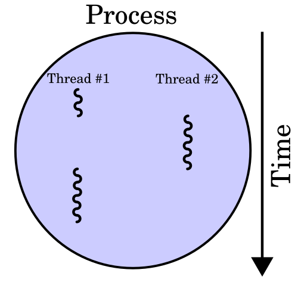
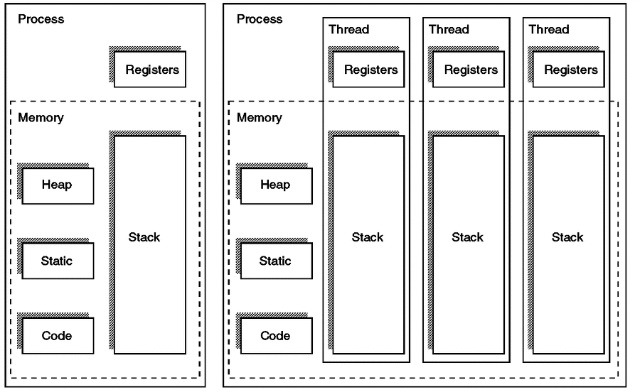
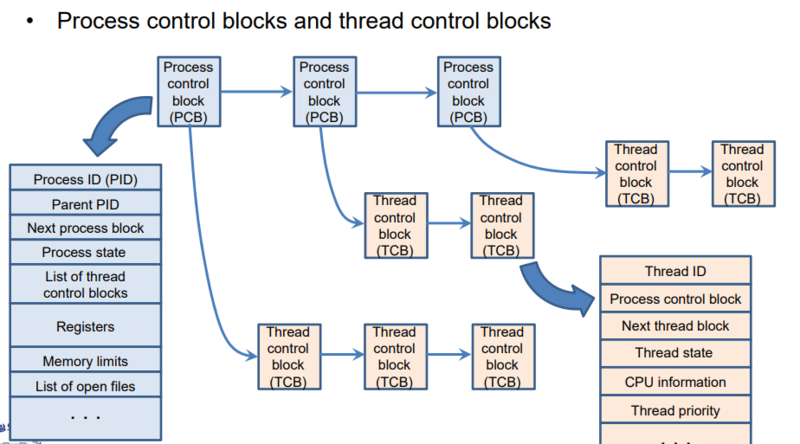

## 쓰레드란?

쓰레드는 프로세스를 구성하는 실행 흐름의 단위를 의미합니다. 

그래서 하나의 프로세스는 1개 이상의 쓰레드를 가집니다.
이로 인해 하나의 프로세스에서 여러 작업을 동시에 수행할 수 있습니다.

> #### 사용자 수준 쓰레드와 커널 수준 쓰레드의 차이 
> 사용자 수준 쓰레드란, 라이브러리를 통해 구현한 쓰레드를 의미합니다. 
> 쓰레드와 관련된 모든 행위를 사용자 영역에서 하기 때문에, 
> 커널은 사용자 수준 쓰레드의 존재를 알지 못하고 쓰레드 교환에 개입하지 않습니다. 
> 커널 수준 쓰레드란, 커널이 직접 생성하고 관리하는 쓰레드를 의미합니다.

## 쓰레드의 메모리 공간

같은 프로세스의 쓰레드는 프로세스로부터 각각의 스택을 나눠갖지만 Code, Data, Heap 메모리 영역을 공유합니다.
하지만, 쓰레드 ID, 스택, PC나 레지스터 같은 쓰레드 컨텍스트에 대해서는 각기 다른 값을 가지고 있습니다.

이렇게 각자의 PC, 레지스터, 스택을 가지고 있기에 쓰레드마다 독립적으로 실행할 수 있습니다.

여기서 중요한 점은 프로세스의 쓰레드들은 실행에 필요한 최소한의 정보(PC, 레지스터, 스택)만을 유지한 채
프로세스 자원을 공유하며 실행된다는 점입니다.

## TCB(쓰레드 제어블록)

쓰레드 또한 프로세스의 PCB(프로세스 제어 블록)처럼 TCB(쓰레드 제어 블록)을 통해 관리됩니다.
TCB는 각 쓰레드에 위치하고, 커널은 TCB를 통해 쓰레드를 관리합니다.

그럼 TCB에는 어떤 정보가 담겨있을까요?
TCB에는 아래와 같은 쓰레드의 메타데이터들이 담겨져 있습니다.

- 쓰레드 번호(TID, Thread ID): 각 쓰레드의 고유 식별 번호입니다.
- 스택 포인터 (Stack Pointer): 쓰레드가 존재하는 프로세스의 PCB에 대한 포인터
- 프로그램 카운터(PC, Program Counter): 이 쓰레드에서 실행될 다음 명령어의 주소를 가리키는 포인터(주소)입니다.
- 쓰레드 상태(Thread State): 쓰레드가 현재 어떤 상태인지를 나타내는 정보(new, ready, running, waiting, end)입니다.
- 레지스터 상태(Register State): 쓰레드의 레지스터 값 세트입니다.

각 프로세스에 대한 중요 정보를 강조하는 특정 정보가 쓰레드 제어 블록에 저장됩니다.

## 프로세스와 쓰레드의 차이

프로세스는 각각 독립된 메모리 영역(Code, Data, Heap, Stack)을 할당받고 고유 프로세스 ID를 가지는 특성으로 인해,
프로세스끼리는 서로의 영역에 접근할 수 없습니다.
그래서 한 프로세스가 다른 프로세스의 자원에 접근하려면 IPC(inter-process communication)을 사용해야 합니다.

하지만, 쓰레드는 IPC와 같은 별도의 통신 방법 없이도 앞서 언급한 것처럼 프로세스의 Code, Data, Heap 메모리 영역을 공유합니다.

이처럼 프로세스들 사이의 통신에 대한 어려움 해소 및 빠른 컨텍스트 스위칭으로 인해 쓰레드가 프로세스보다 더 가벼운 실행 단위로 사용됩니다.
이로 인해 현대에 와서 운영체제의 실행단위는 프로세스에서 쓰레드로 바뀌어 가고 있습니다.

## 동시성 환경에서의 차이

동시성 환경에서는 어떤지 알아볼까요?
여러 프로세스를 동시에 실행하는 멀티 프로세스와 한 프로세스에서 여러 쓰레드를 동시에 실행하는 멀티 쓰레드가 있습니다.

여기서 가장 큰 차이점은 프로세스끼리는 기본적으로 공유하지 않지만, 쓰레드끼리는 같은 프로세스 내의 자원을 공유한다는 점입니다.

즉, 멀티 프로세스는 여러 프로세스를 동시에 실행해 각각의 독립적인 프로세스 간 자원을 공유하지 않기 때문에 프로세스 간 통신 (IPC) 방식을 써야 합니다.
또한, 메모리에 동일한 내용들이 중복해서 존재하기 때문에 메모리에도 부담이 될 수 있습니다.
그러나 한편으로는 자원을 공유하지 않는 덕분에 하나의 프로세스에 문제가 생겨도 다른 프로세스들에는 문제가 발생하지 않는다는 장점이 있기도 합니다.

반면, 멀티 쓰레드는 실행에 필요한 최소한의 정보(PC, 레지스터, 스택)만을 유지한 채 프로세스 자원을 공유하며 실행되기에
커널의 개입 없이 쓰레드간 통신을 할 수 있고, 메모리에도 부담이 덜합니다.
또한 fork로 인한 생성이 공유하는 부분을 제외한 부분만 복사하면 되기 때문에 프로세스보다 빠릅니다.(쓰레드가 접근하는 공유 데이터에 대해 동기화 작업을 수행해야 합니다)
 
하지만, 하나의 쓰레드에 문제가 생기면 같은 프로세스 내의 다른 쓰레드들에도 문제가 발생할 수 있다는 단점이 있습니다.
